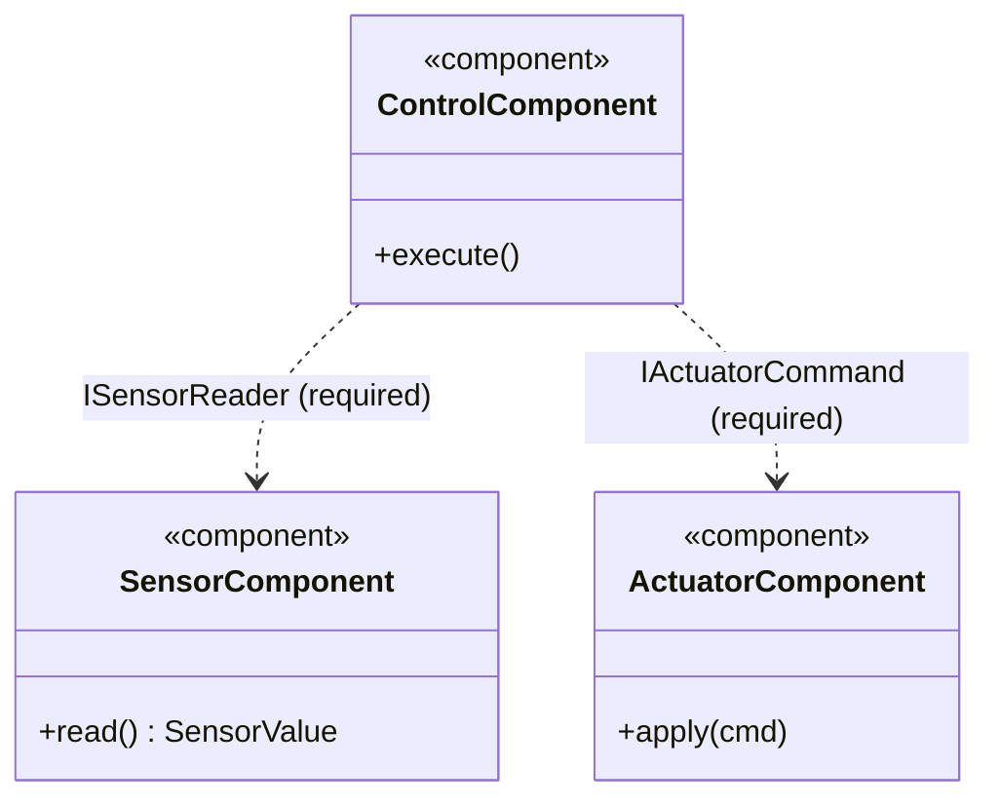
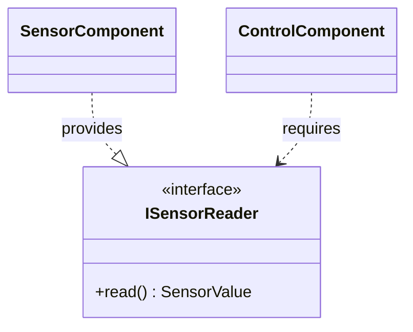
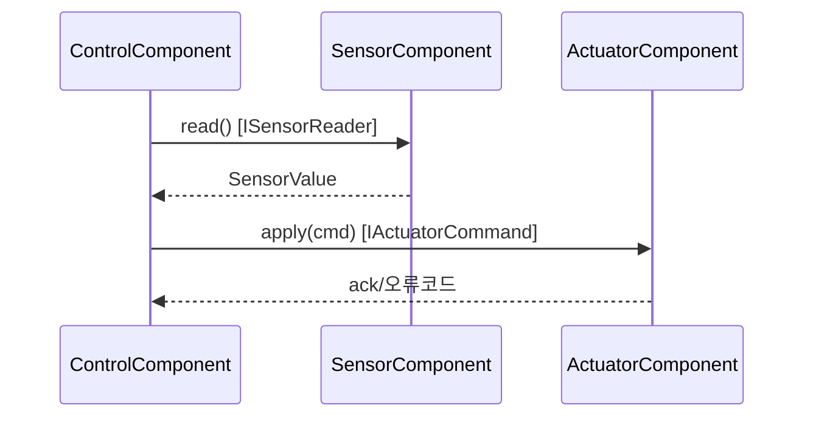
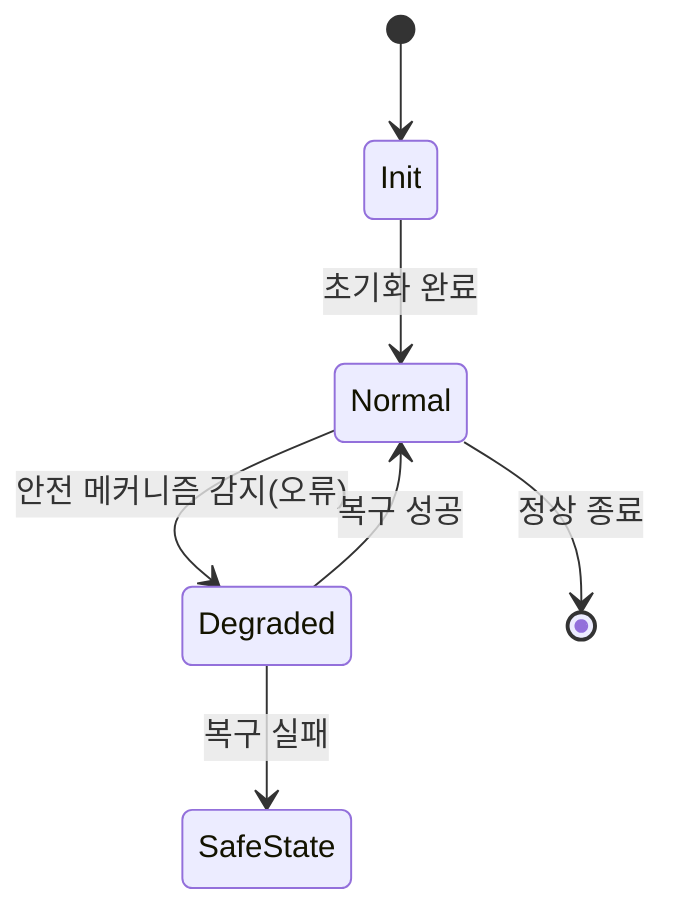
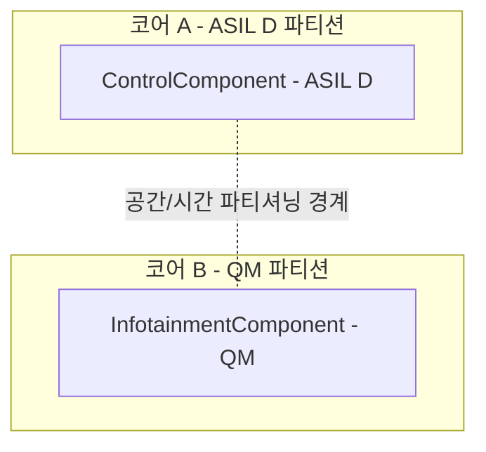

# 아키텍처 다이어그램 가이드 (Mermaid)

별도 도구 설치 없이 마크다운에 바로 렌더링되도록 Mermaid로 표현합니다. SysML 전용 표기는 근사 표현을 사용합니다.

## 1. 컴포넌트/Block Definition Diagram — 정적 구조

- `..>` (점선 의존)로 인터페이스를 통한 의존만 표시하고, 컴포넌트 내부 필드를 직접 참조하는 실선 연관은 사용하지 않습니다(인터페이스 전용 통신 원칙 강제).
- 각 화살표 라벨에 인터페이스 ID/이름을 반드시 표기해 `references/interface-design.md`의 인터페이스 명세 표와 대응시킵니다.

## 2. 인터페이스 다이어그램(근사)

## 3. 동적 뷰 — Sequence Diagram

## 4. 동적 뷰 — State Machine (모드 의존 컴포넌트)

## 5. 배포/파티셔닝 다이어그램 — FFI(간섭으로부터의 자유) 표현

## 다이어그램 작성 규칙

- 모든 컴포넌트 간 연결에는 인터페이스 ID/이름을 표기합니다(인터페이스 없는 연결선 금지).
- 안전 관련(ASIL 상이) 컴포넌트가 섞여 있으면 반드시 배포/파티셔닝 다이어그램으로 FFI 격리 경계를 표시합니다.
- 정적 뷰 하나, 동적 뷰(최소 1개 시나리오의 Sequence), 필요 시 State Machine과 배포 다이어그램을 포함하는 것을 기본으로 합니다.
