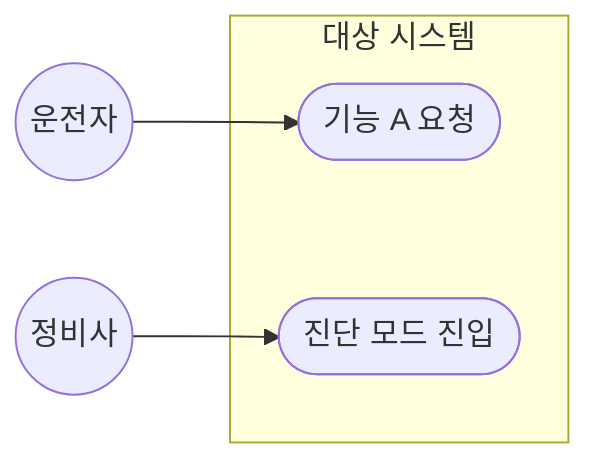
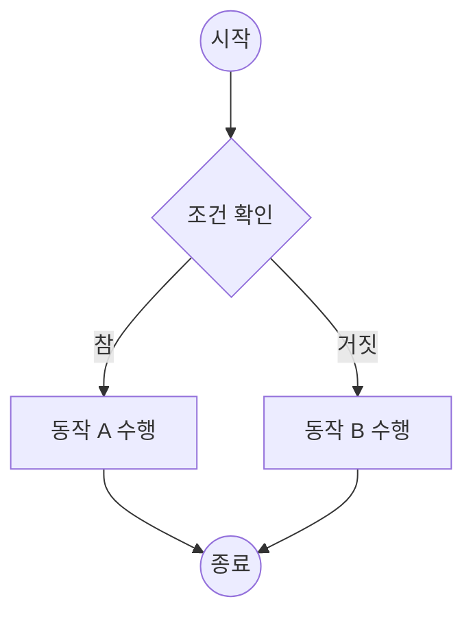
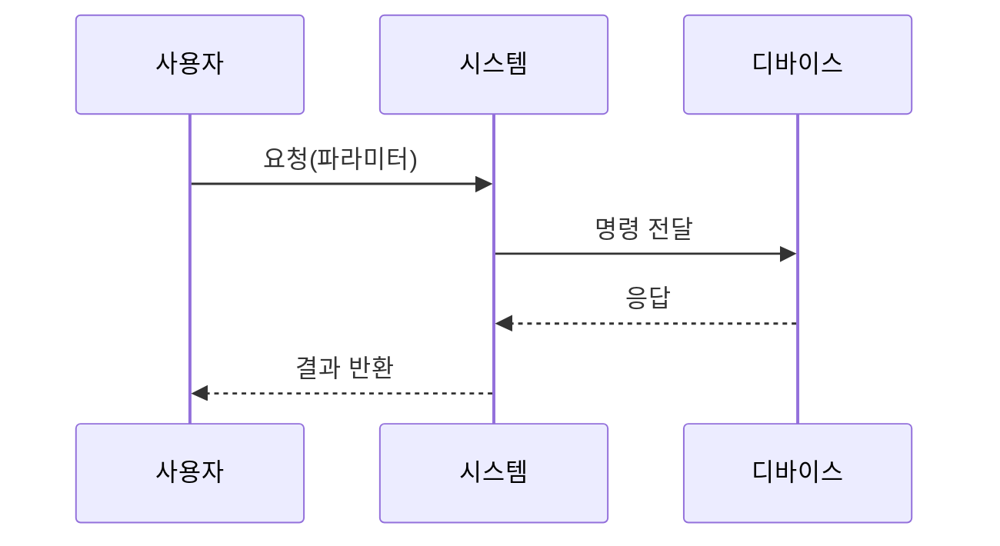
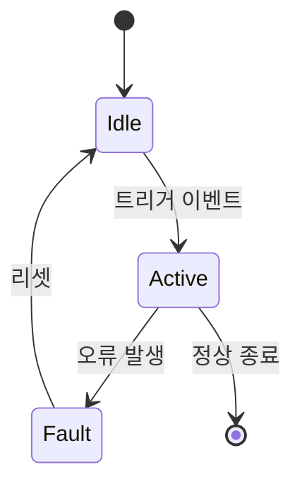
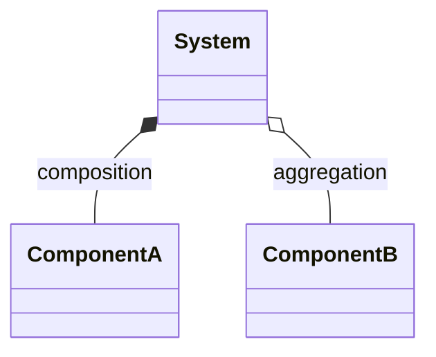
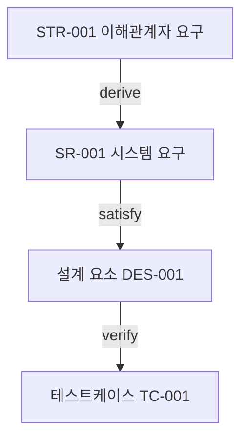

# 기능 요구사항 — UML/SysML 다이어그램 가이드 (Mermaid)

별도 도구 설치 없이 마크다운에 바로 렌더링되도록 Mermaid로 표현합니다. SysML 전용 표기(Requirement Diagram 등)는 Mermaid가 직접 지원하지 않으므로 근사 표현 방식을 사용합니다.

## 1. Use Case Diagram — 액터-시스템 상호작용

## 2. Activity Diagram — 처리 흐름

## 3. Sequence Diagram — 컴포넌트 간 상호작용

## 4. State Machine Diagram — 모드/상태 의존 동작

## 5. SysML Block Definition Diagram(근사) — 구조/구성요소 관계

Mermaid `classDiagram`으로 블록과 구성 관계(composition/aggregation)를 근사 표현합니다.

## 6. SysML Requirement Diagram(근사) — 요구사항 관계

Mermaid에 전용 표기가 없으므로, 요구사항 관계는 표로 명시하거나 `flowchart`로 근사합니다.

| 관계 | 의미 |
|---|---|
| derive | 하위 요구사항이 상위 요구사항으로부터 도출됨 |
| satisfy | 설계/구현 요소가 요구사항을 충족함 |
| verify | 테스트/검증 활동이 요구사항 충족 여부를 확인함 |
| refine | 요구사항을 더 구체화함 |

## 다이어그램 선택 기준 요약

| 요구사항 성격 | 다이어그램 |
|---|---|
| 사용자/외부 시스템과의 상호작용 정의 | Use Case |
| 처리 절차, 분기/반복 로직 | Activity |
| 시간 순서에 따른 메시지 교환 | Sequence |
| 모드/상태별로 달라지는 동작 | State Machine |
| 시스템 구조와 구성요소 관계 | Block Definition (근사) |
| 요구사항 간 도출/충족/검증 관계 | Requirement Diagram (근사) |

하나의 요구사항 문서에는 최소 1개 이상의 다이어그램(대부분 Use Case 또는 State Machine)과, 복잡한 상호작용이 있는 경우 Sequence Diagram을 추가로 포함하는 것을 권장합니다.
