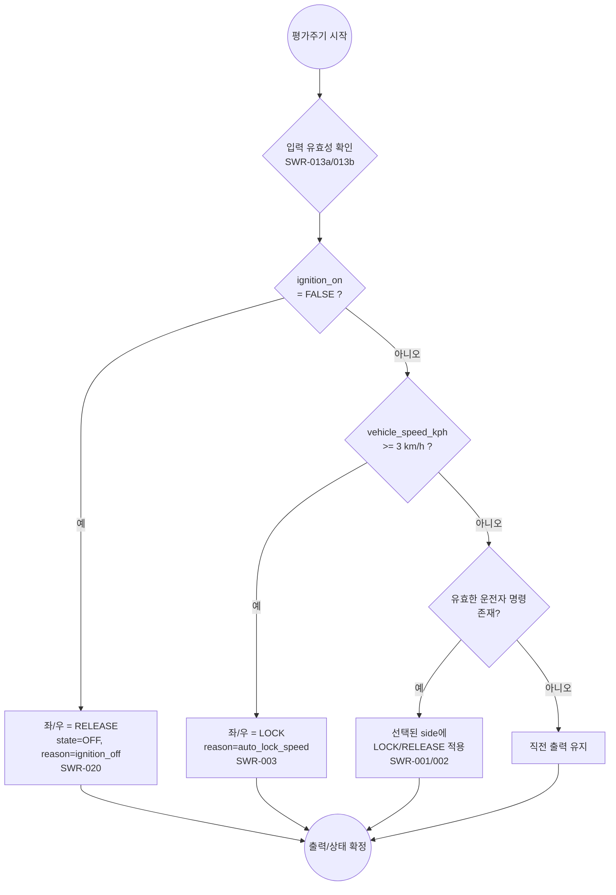
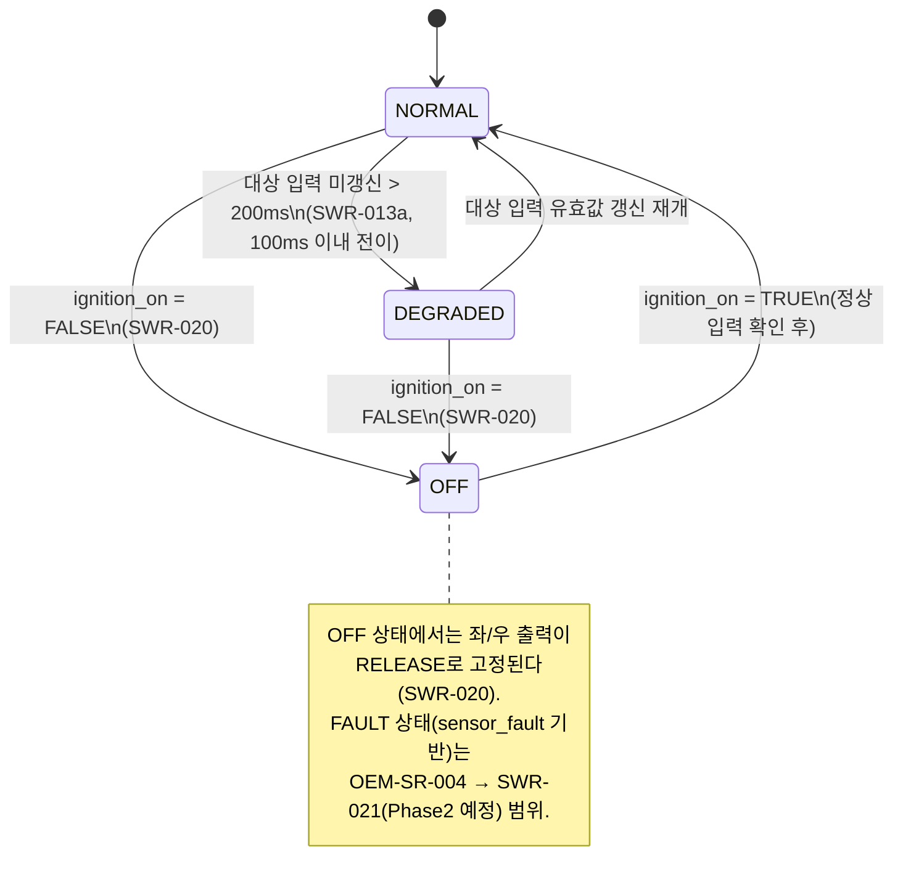
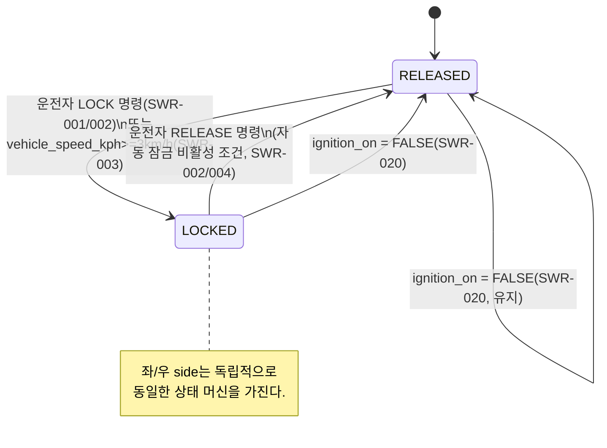
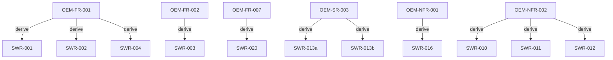

# SWR-001 SW 요구사항 명세서

> ⚠️ 본 문서는 **교육용 가상 프로젝트 산출물**이다. 상위 입력인
> `OEM_Sample/OEM-SWR-001_OEM SW 요구사항 사양서.docx`(가상 OEM-A, 교육 시나리오 베이스라인)를
> 근거로 작성되었으며, 실제 현대자동차·Tesla 또는 다른 제작사의 사양을 나타내지 않는다.
> HARA/ASIL 도출 근거를 재구성하지 않고, 준수·적합성평가·인증을 주장하지 않는다(OEM 원문 §2 원칙 승계).
> **문서 상태: 미승인(Draft) — 실제 승인 미수행.**

## 문서 통제

| 항목 | 값 |
|---|---|
| 문서 ID / 문서명 | SWR-001_SW요구사항명세서 |
| Revision | 1.0 (Phase 1 baseline) — 본 문서는 프로젝트 전체를 아우르는 누적 문서이며, 이번 개정은 Phase 1 범위만 상세화함 |
| 프로세스 | SWE.1 소프트웨어 요구사항 분석 |
| 상위 입력 | OEM-SWR-001 (Revision 1.0, BL-OEM-1.0) |
| 베이스라인(목표) | BL-SWR-1.0 (G1 요구사항 게이트, 미도달) |
| 작성 조직 | Volsojoda(가상 공급자) 요구사항 분석 담당 |
| 작성일 | 2026-09-18 |
| 문서 상태 | 교육 시나리오 초안 — 실제 승인 미수행 |

### 변경 이력

| 버전 | 일자 | 변경 내용 | 변경자 |
|---|---|---|---|
| 1.0 (Phase 1 baseline) | 2026-09-18 | 최초 작성. Phase 1 범위(§ 아래 "적용 경계") SWR 11건 상세화, Phase 2/3 대상은 계획 항목으로만 등록 | requirements-analyst 서브에이전트 |

### 작성-검토-승인 상태

| 역할 | 담당(가상) | 상태 |
|---|---|---|
| 작성 | requirements-analyst 서브에이전트 | 완료(초안) |
| 검토 | 미지정 | 미수행 |
| 승인 | OEM-A SW Requirements Owner(가상) | 미수행 |

---

## 1. 목적 및 적용범위

### 1.1 목적

가상 OEM-A가 OEM-SWR-001로 공급자 입력한 요구사항 중 이번 Phase 1에서 다루기로 합의된
항목을 SWE.1 수준의 소프트웨어 요구사항(SWR)으로 상세화한다. 각 SWR은 EARS 패턴, 원자성,
측정 가능한 수용기준과 실행 가능한 검증 방법을 갖추어 SWE.2(아키텍처 설계) 이후 단계의
입력으로 사용할 수 있도록 한다.

### 1.2 적용범위

본 문서는 전자식 차일드락 제어 SW(후석 좌/우) 프로젝트의 SWE.1 산출물이며, 3개 Phase로
증분 개발되는 프로젝트 전체를 아우르는 **누적 문서**로 유지한다. 이번 개정(Revision 1.0)은
아래 "Phase 1 적용 경계"에 해당하는 OEM 요구사항만 4~9장에 상세 반영하고, 그 외 항목은
8장 및 9장에 "계획/미착수" 상태로만 등록해 누락을 방지한다.

### 1.3 적용 경계

**Phase 1 적용 경계 (이번 개정에서 상세화한 OEM 요구사항)**

| 구분 | OEM 요구 ID |
|---|---|
| 인터페이스 | OEM-IF-001 ~ OEM-IF-009 (외부 인터페이스 계약 전체) |
| 안전 관련(ASIL B) | OEM-SR-003 (입력 유효성/freshness) |
| 기능(QM) | OEM-FR-001 (4-source 잠금/해제 명령), OEM-FR-002 (주행 시 자동 잠금), OEM-FR-007 (ignition-off 시 해제) |
| 비기능(QM) | OEM-NFR-001 (결정론적 재생), OEM-NFR-002 (이벤트 이력 보존, PII 금지) |

**Phase 2/3 예정 (이번 개정에서 SWR로 상세화하지 않음, 8장/9장/11장에 계획 행만 등록)**

| Phase | OEM 요구 ID |
|---|---|
| Phase 2 | OEM-SR-001, OEM-SR-002, OEM-SR-004, OEM-FR-003, OEM-FR-005, OEM-FR-006 |
| Phase 3 | OEM-FR-004, OEM-IF-006의 표시 동작(데이터 계약 자체는 본 개정 6장에 포함 — 근거는 8.3절) |

프로젝트 공통 경계(HIL, 실차, 타깃 ECU, 시스템/HW 개발, Part 3 HARA, 공식 심사·인증 제외,
Python 기반 PC/SIL 및 Web 검증만 다룸)는 OEM 원문 §1.3을 그대로 승계하며, 실행 환경의
Python 버전은 **3.14**로 확정한다(OEM 원문의 3.12는 OEM 입력 시나리오상 수치이며,
`CLAUDE.md` 프로젝트 정책에 따라 3.14로 대체함 — 8.6절 참고).

---

## 2. 요구사항 작성 및 판정 규칙

### 2.1 식별 및 상태 규칙

- ID 체계: `SWR-nnn`(3자리 이상 zero-padded), 공식 추적성 매트릭스(`references/traceability.md` §1)의
  체계를 따른다. 삭제된 ID는 재사용하지 않고 "Obsolete"로만 표기한다.
- 상태값: Draft / Reviewed / Approved / Verified. 본 개정의 모든 SWR은 **Draft**이다(2.1 표 참고,
  검토·승인 미수행).
- ASIL 표기: QM 또는 A/B/C/D. 안전 관련 SWR은 4.2절에 별도 배치하고 ASIL 등급과 상위 근거를 명시한다.

### 2.2 품질 판정 기준

각 SWR은 다음을 모두 만족해야 통과로 판정한다(스킬 `references/requirement-writing-rules.md` 체크리스트 적용).

1. EARS 패턴(Ubiquitous/Event-driven/State-driven/Unwanted behavior/Optional feature) 중 하나 이상 준수
2. 원자성: 요구사항 1건 = 요구 1개("그리고/또는"으로 여러 요구를 묶지 않음)
3. 모호한 수식어("적절히", "충분히" 등) 미사용, 정량적 기준으로 치환
4. 의무 표현 "~해야 한다" 통일
5. 측정 가능한 수용기준과 실행 가능한 검증 방법(도구/절차/합격기준) 포함
6. 상위 요구(OEM ID) 및 하위 추적(공식 매트릭스) 연결 가능

---

## 3. 상태와 우선순위

| 상태 | 의미 |
|---|---|
| Draft | 작성 완료, 검토 전 |
| Reviewed | 리뷰 완료, 결함 조치 중 또는 완료 |
| Approved | OEM-A SW Requirements Owner(가상) 승인 |
| Verified | SWE.4~SWE.6 검증 완료 및 결과 연결 |

| 우선순위 | 의미 |
|---|---|
| 필수(Mandatory) | G1 게이트 통과를 위해 이번 Phase에 반드시 구현 |
| 권고(Recommended) | 이번 Phase 권장이나 지연 시 다음 Phase로 이월 가능 |
| 선택(Optional) | 검증/디버그 편의를 위한 부가 기능 |

본 개정의 SWR은 모두 **우선순위: 필수**이며, 상태는 모두 **Draft**이다(3장 표는 향후 Phase에서
갱신).

---

## 4. 기능 및 안전 관련 SW 요구사항

### 4.0 우선순위 해석(평가주기 결정 순서)

Phase 1 SWR 간 상호작용을 명확히 하기 위해, 매 평가주기의 결정 순서를 아래와 같이 고정한다.
이 순서는 OEM 원문에 명시적 문장은 없으나, OEM-FR-007("ignition-off 시 무조건 초기 해제")과
OEM-FR-002("주행 시 자동 잠금이 해제 명령보다 우선하도록 요구되는 정황")의 수용기준을
모순 없이 동시에 만족시키기 위해 도출한 해석이다(8.7절 "확인 필요" 참고).

우선순위(높음→낮음): **ignition-off(SWR-020) > 자동 잠금(SWR-003, SWR-004) > 운전자 명령(SWR-001, SWR-002) > 직전 출력 유지**.

### 4.1 기능 요구사항

#### SWR-001 — 4-source 잠금/해제 명령의 수신 및 필드 유효성 확인

| 필드 | 내용 |
|---|---|
| ID | SWR-001 |
| 제목 | 4-source 잠금/해제 명령의 수신 및 필드 유효성 확인 |
| 설명 | 물리 버튼(physical_button), AVN(avn), 음성(voice) 또는 모바일 앱(mobile_app) 중 하나의 source로부터 잠금/해제 명령이 수신되면, SW는 그 명령의 side, action, source 필드가 OEM-IF-004에 정의된 값(side: left/right/all; action: lock/unlock; source: physical_button/avn/voice/mobile_app)에 해당하는지 확인해야 한다. 하나 이상의 필드가 누락되었거나 정의된 값에 해당하지 않으면, SW는 그 명령을 후속 처리(SWR-002)에 적용하지 않고 거절 사유를 기록해야 한다. |
| EARS 패턴 | Event-driven + Unwanted behavior(복합) |
| 출처(상위 요구) | OEM-FR-001; 입력 계약 OEM-IF-004 |
| 관련 다이어그램 | 4.0절 평가주기 흐름도, UC-001 §4.1 시퀀스 다이어그램 |
| 우선순위 | 필수 |
| 안전 관련 여부 | 아니오 (QM) |
| 수용기준 | (1) source×action×side의 정상 조합 4×2×3=24가지를 각각 주입 시 모두 유효 명령으로 인식된다. (2) side/action/source 중 하나라도 누락되거나 정의되지 않은 값(예: 빈 문자열, 대소문자 오기, 미등록 문자열)을 포함한 명령을 4개 source 각각에서 주입 시, 해당 평가주기 및 이후 평가주기에도 그 명령이 출력에 반영되지 않고 거절 사유(reason_code=INVALID_COMMAND)가 기록된다. |
| 검증 방법 | PC/SIL 자동시험(unittest 기반). 정상 조합 24케이스 전수, 오류주입 케이스(source당 최소 1건, side/action 각 최소 1건) 실행 후 로그의 반영 여부·reason_code를 assert. |
| 하위 추적 | TRC-001 SWR-001 행 |
| 상태 | Draft |

#### SWR-002 — 선택된 side에 한정한 명령 적용

| 필드 | 내용 |
|---|---|
| ID | SWR-002 |
| 제목 | 선택된 side(LEFT/RIGHT/ALL)에 한정한 명령 적용 |
| 설명 | SWR-001에 의해 유효로 판정된 명령이 있으면, SW는 side가 LEFT이면 좌측 출력에만, RIGHT이면 우측 출력에만, ALL이면 좌측과 우측 출력 모두에 action(LOCK 또는 RELEASE)을 적용해야 한다. 이때 선택되지 않은 side의 출력은 변경하지 않아야 한다. |
| EARS 패턴 | Event-driven |
| 출처(상위 요구) | OEM-FR-001; 출력 계약 OEM-IF-005 |
| 관련 다이어그램 | 4.0절 평가주기 흐름도, 4.3절 상태 머신 |
| 우선순위 | 필수 |
| 안전 관련 여부 | 아니오 (QM) |
| 수용기준 | 차량 정지(vehicle_speed_kph < 3) 및 입력 정상(state=NORMAL) 조건에서, LEFT/RIGHT/ALL 각각에 대해 LOCK, RELEASE를 주입하는 6개 시나리오 모두에서 선택된 side만 지시된 값으로 변경되고 비선택 side는 직전 값을 유지한다. |
| 검증 방법 | PC/SIL 자동시험. 6개 시나리오(3 side × 2 action) 각각 사전/사후 좌우 출력값 비교 assert. |
| 하위 추적 | TRC-001 SWR-002 행 |
| 상태 | Draft |

#### SWR-003 — 주행 시작에 따른 자동 잠금

| 필드 | 내용 |
|---|---|
| ID | SWR-003 |
| 제목 | 주행 시작에 따른 자동 잠금 |
| 설명 | 유효한 vehicle_speed_kph 값이 3 km/h 이상이 되면, SW는 그 값이 확인된 평가주기부터 좌측 및 우측 출력을 LOCK으로 설정해야 한다. |
| EARS 패턴 | Event-driven |
| 출처(상위 요구) | OEM-FR-002; 입력 계약 OEM-IF-001(vehicle_speed_kph) |
| 관련 다이어그램 | 4.0절 평가주기 흐름도 |
| 우선순위 | 필수 |
| 안전 관련 여부 | 아니오 (QM) |
| 수용기준 | vehicle_speed_kph가 3 km/h 미만에서 3 km/h 이상으로 전이되는 첫 평가주기에 좌·우 출력이 모두 LOCK이고 reason_code=AUTO_LOCK_SPEED가 기록된다. |
| 검증 방법 | PC/SIL 자동시험. 속도 시퀀스(0→2.9→3.0→3.1 km/h) 주입 후 각 평가주기의 출력 assert. |
| 하위 추적 | TRC-001 SWR-003 행 |
| 상태 | Draft |

#### SWR-004 — 자동 잠금 활성 중 해제 명령 거부(일반 해제 허용조건)

| 필드 | 내용 |
|---|---|
| ID | SWR-004 |
| 제목 | 자동 잠금 활성 중 해제 명령 거부(일반 해제 허용조건) |
| 설명 | SWR-003의 자동 잠금 조건(vehicle_speed_kph ≥ 3 km/h)이 활성 상태인 동안, SW는 그 side에 대한 RELEASE 명령을 적용하지 않고 LOCK 출력을 유지해야 한다. |
| EARS 패턴 | State-driven |
| 출처(상위 요구) | OEM-FR-001의 수용기준 "정지, 정상입력에서... 적용" 문구, OEM-FR-002와의 상호작용(4.0절 근거) |
| 관련 다이어그램 | 4.0절 평가주기 흐름도 |
| 우선순위 | 필수 |
| 안전 관련 여부 | 아니오 (QM) |
| 수용기준 | vehicle_speed_kph ≥ 3 km/h 상태에서 임의 side에 대한 RELEASE 명령을 주입하면, 해당 평가주기 및 이후 자동 잠금 조건이 해제되기 전까지 그 side 출력이 LOCK으로 유지되고 reason_code=RELEASE_BLOCKED_AUTO_LOCK이 기록된다. vehicle_speed_kph가 3 km/h 미만으로 복귀한 뒤 동일 RELEASE 명령을 재입력하면 SWR-002에 따라 정상 적용된다. |
| 검증 방법 | PC/SIL 자동시험. 주행 중 RELEASE 명령 주입 → 거부 확인 → 정차 후 재입력 → 적용 확인의 순차 시나리오. |
| 하위 추적 | TRC-001 SWR-004 행 |
| 상태 | Draft |
| 비고 | OEM 문서 9장 예고 매핑은 OEM-FR-001 → {SWR-001, SWR-002, SWR-004}였다. 본 개정은 이 3개 번호를 그대로 사용하되, SWR-004의 실제 내용을 "일반 해제 허용조건"(원자성 확보를 위해 자동 잠금과의 우선순위 규칙으로 구체화)으로 정의했다 — 5절 "SWR ID 배정" 참고. |

#### SWR-020 — ignition-off 시 초기 해제(최우선순위)

| 필드 | 내용 |
|---|---|
| ID | SWR-020 |
| 제목 | ignition-off 시 초기 해제 및 OFF 상태 전이 |
| 설명 | ignition_on이 FALSE로 확인되면, SW는 그 평가주기부터 다른 활성 조건(자동 잠금 포함)과 무관하게 좌측 및 우측 출력을 RELEASE로 전환하고, 상태를 OFF로, 이유코드를 ignition_off로 설정해야 한다. |
| EARS 패턴 | Event-driven |
| 출처(상위 요구) | OEM-FR-007; 입력 계약 OEM-IF-009(ignition_on) |
| 관련 다이어그램 | 4.0절 평가주기 흐름도, 4.3절 상태 머신 |
| 우선순위 | 필수 |
| 안전 관련 여부 | 아니오 (QM) |
| 수용기준 | ignition_on=FALSE인 첫 평가주기에 좌·우 출력이 RELEASE이고 state=OFF, reason_code=ignition_off가 제공된다. 직전 평가주기에 자동 잠금(SWR-003)으로 LOCK 상태였던 경우에도 동일하게 RELEASE로 전환된다. |
| 검증 방법 | PC/SIL 자동시험. (a) 정상 정지 상태에서 ignition_on=FALSE, (b) vehicle_speed_kph≥3km/h로 LOCK된 상태에서 ignition_on=FALSE 전환, 두 시나리오 모두 RELEASE/OFF 전이를 assert. |
| 하위 추적 | TRC-001 SWR-020 행 |
| 상태 | Draft |

### 4.2 안전 관련 SW 요구사항 (ASIL B)

> OEM 원문은 OEM-SR-003을 "ASIL B 입력"으로 분류했으나, HARA/ASIL 도출 근거(안전목표 ID 등)는
> 문서 범위 밖으로 명시하고 있다(OEM 원문 §1.2, §2). 본 SWR은 이 ASIL B 분류를 **입력으로만
> 승계**하며, 공급자가 HARA를 재구성하지 않는다는 원칙(OEM 원문 §2)을 따른다. 상위 Safety Goal
> ID는 OEM 문서에 제공되지 않아 "미제공 — 확인 필요"로 표기한다(8.5절).

#### SWR-013a — 안전 관련 필수 입력의 freshness 상실 시 DEGRADED 전이

| 필드 | 내용 |
|---|---|
| ID | SWR-013a |
| 제목 | 안전 관련 필수 입력의 freshness 상실 시 DEGRADED 전이 |
| 설명 | 안전 관련 필수 입력(범위는 아래 "적용 입력" 참고)의 source_timestamp_s 기준 미갱신 경과시간이 200 ms를 초과하면, SW는 100 ms 이내에 시스템 상태를 DEGRADED로 전이해야 한다. |
| 적용 입력 | OEM-IF-001(vehicle_speed_kph, gear), OEM-IF-002(crash_status), OEM-IF-003(rear_left/right_approach_risk), OEM-IF-007(fire_detected, overtemperature_detected, adult_present), OEM-IF-008(isofix_left/right), OEM-IF-009(ignition_on, sensor_fault) — 8.4절 "확인 필요" 참고(범위 확대 해석에 대한 근거·리스크 기록) |
| EARS 패턴 | Unwanted behavior |
| ASIL | B (OEM-SR-003 입력 승계) |
| 상위 Safety Goal | 미제공 — 확인 필요(8.5절) |
| 출처(상위 요구) | OEM-SR-003 |
| 관련 다이어그램 | 4.3절 상태 머신 |
| 우선순위 | 필수 |
| 수용기준 | 대상 입력의 갱신이 정지된 시점 기준 200 ms 초과 300 ms 이내(즉 정지 후 100 ms 이내)에 state=DEGRADED로 전이하고 reason_code=STALE_INPUT과 대상 입력명이 기록된다. 199 ms 시점에는 DEGRADED로 전이하지 않는다(경계값). |
| 검증 방법 | 단위시험(고정 시계 mock, 199/200/201/300/301 ms 경계값) + PC/SIL 자동시험(입력 소스별 개별 정지 시나리오). |
| 하위 추적 | TRC-001 SWR-013a 행 |
| 상태 | Draft |

#### SWR-013b — 형식/범위 오류 입력의 평가 전 거절

| 필드 | 내용 |
|---|---|
| ID | SWR-013b |
| 제목 | 형식/범위 오류 입력의 평가 전 거절 |
| 설명 | Vehicle→SW 입력 신호가 해당 인터페이스 계약(OEM-IF-001, 002, 003, 007, 008, 009)에 정의된 형식 또는 범위를 벗어나면, SW는 그 평가주기의 판단 로직에 해당 입력값을 반영하지 않고 그 입력을 INVALID로 표시해야 한다. |
| EARS 패턴 | Unwanted behavior |
| ASIL | B (OEM-SR-003 입력 승계) |
| 상위 Safety Goal | 미제공 — 확인 필요(8.5절) |
| 출처(상위 요구) | OEM-SR-003 |
| 관련 다이어그램 | 4.3절 상태 머신 |
| 우선순위 | 필수 |
| 수용기준 | 범위 밖 값(예: vehicle_speed_kph=-5 또는 301, gear="X", crash_status="UNKNOWN", boolean 필드에 비boolean 값) 주입 시 해당 평가주기에 그 입력이 판단 로직에 반영되지 않고 input_validity=INVALID로 표시된다. 동일 입력이 200 ms를 초과해 유효값으로 갱신되지 않으면 SWR-013a에 따라 DEGRADED로 전이한다. |
| 검증 방법 | 단위시험(경계값/동등분할: 범위 하한 미만, 상한 초과, 타입 불일치) + PC/SIL 오류주입 시나리오. |
| 하위 추적 | TRC-001 SWR-013b 행 |
| 상태 | Draft |
| 비고(ID 배정 근거) | OEM 문서 9장 예고 매핑은 OEM-SR-003 → SWR-013 단일 항목이었다. 본 개정은 "freshness 상실 시 DEGRADED 전이"와 "형식/범위 오류의 평가 전 거절"이 서로 다른 트리거·응답을 가지는 별개 요구이므로(2.2절 원자성 판정 기준), 원자성 확보를 위해 SWR-013a/013b로 분리했다. 이는 예고 매핑과 다르게 배정한 사례이며, 예고되지 않은 번호(SWR-014 등 Phase2/3 예약 번호)를 침범하지 않도록 접미사(a/b)를 사용했다. |

### 4.3 참고 — 상태 머신 (Phase 1 범위)

---

## 5. 입력 데이터 사전

| 신호명 | 출처 인터페이스 | 타입/범위 | freshness 규칙 | 오류 처리 | 소비 SWR(Phase1) |
|---|---|---|---|---|---|
| vehicle_speed_kph | OEM-IF-001 | float, 0.0~300.0 km/h | source_timestamp_s 기준 200ms 초과 시 DEGRADED(SWR-013a) | 범위/형식 오류 INVALID(SWR-013b) | SWR-003, SWR-004, SWR-013a/b |
| gear | OEM-IF-001 | enum {P,N,D,R} | 상동 | 상동 | 없음 — Phase1 미소비, 신호 정의만 반영(8.2절) |
| source_timestamp_s | OEM-IF-001 | float, 초 단위 | freshness 판정 기준 시각 그 자체 | 누락/형식 오류 INVALID | SWR-013a, IF-004 요청시각 기준 |
| crash_status | OEM-IF-002 | enum {NONE,PENDING,CONFIRMED} | SWR-013a 적용 대상(값) | 미정 값 INVALID(SWR-013b) | 없음 — Phase1 미소비(OEM-SR-001, Phase2 예정), 인터페이스 계약만 반영 |
| rear_left_approach_risk | OEM-IF-003 | boolean | SWR-013a 적용 대상 | 누락/형식 오류 INVALID | 없음 — Phase1 미소비(OEM-SR-002, Phase2 예정) |
| rear_right_approach_risk | OEM-IF-003 | boolean | SWR-013a 적용 대상 | 누락/형식 오류 INVALID | 없음 — Phase1 미소비(OEM-SR-002, Phase2 예정) |
| side / action / source | OEM-IF-004 | enum(§4.1 SWR-001) | 해당 명령은 VehicleSnapshot.timestamp_s(=source_timestamp_s)를 요청 시각으로 사용 | 누락/형식/미등록 enum 거절(SWR-001) | SWR-001, SWR-002 |
| lock_left / lock_right | OEM-IF-005(출력) | enum {LOCK,RELEASE} | 해당 없음(SW→Actuator model 출력) | 해당 없음 | SWR-002, SWR-003, SWR-004, SWR-020 |
| state / priority_reason / reason_code / input_validity | OEM-IF-006(출력) | enumeration/string | 해당 없음 | 직렬화 실패 HTTP 500(소비 로직은 Phase3, 8.3절) | SWR-003/004/013a/013b/020(생성 측), 조회 소비는 Phase3 |
| fire_detected / overtemperature_detected / adult_present | OEM-IF-007 | boolean | SWR-013a 적용 대상 | 누락/형식 오류 INVALID | 없음 — Phase1 미소비(OEM-FR-005, Phase2 예정) |
| isofix_left / isofix_right | OEM-IF-008 | boolean | SWR-013a 적용 대상 | 누락/형식 오류 INVALID | 없음 — Phase1 미소비(OEM-FR-006, Phase2 예정) |
| ignition_on | OEM-IF-009 | boolean | SWR-013a 적용 대상 | 누락/형식 오류 INVALID | SWR-020 |
| sensor_fault | OEM-IF-009 | boolean | SWR-013a 적용 대상 | 누락/형식 오류 INVALID | 없음 — Phase1 미소비(OEM-SR-004, Phase2 예정) |

이벤트 이력 레코드(6/7장 NFR 관련)의 허용 필드는 7.2절(SWR-011)에서 별도로 정의한다(원본
영상/음성, 개인 식별정보 저장 금지 — OEM 원문 §2 "프로젝트 제약").

---

## 6. 외부 인터페이스 요구

OEM 원문 6장의 외부 인터페이스 계약 9건(OEM-IF-001~009)을 그대로 승계한다. 각 인터페이스를
어떤 SWR(들)의 입력/출력으로 반영했는지, 그리고 Phase1에 포함/보류한 근거는 아래 표 및
각주와 같다.

| 인터페이스 ID | 방향 | 주요 데이터 | 단위/범위 | 오류 처리 | Phase1 반영 SWR | 비고 |
|---|---|---|---|---|---|---|
| OEM-IF-001 | Vehicle→SW | vehicle_speed_kph, gear, source_timestamp_s | km/h 0.0~300.0; P/N/D/R; s | 누락/형식/범위 오류 INVALID | SWR-003, SWR-013a/b | gear는 계약만 반영, 소비 로직 없음(8.2절) |
| OEM-IF-002 | Vehicle→SW | crash_status | NONE/PENDING/CONFIRMED | 미정 값 INVALID | SWR-013a/b(freshness/형식만) | 소비 로직(OEM-SR-001)은 Phase2 |
| OEM-IF-003 | Vehicle→SW | rear_left/right_approach_risk | boolean | 누락/형식 오류 INVALID | SWR-013a/b(freshness/형식만) | 소비 로직(OEM-SR-002)은 Phase2 |
| OEM-IF-004 | Driver→SW | side, action, source | 위 §5 enum | 누락/형식/미등록 enum 거절 | SWR-001, SWR-002 | 요청 시각은 IF-001의 source_timestamp_s(VehicleSnapshot.timestamp_s) 사용 |
| OEM-IF-005 | SW→Actuator model | lock_left/right | LOCK/RELEASE | PC/SIL 논리 출력까지만 검증 | SWR-002, SWR-003, SWR-004, SWR-020 | 적용 feedback은 범위 밖(OEM 원문 승계) |
| OEM-IF-006 | SW→Display | state, priority_reason, reason_code, input_validity | enumeration/string | 직렬화 실패 HTTP 500 | 생성 측 데이터는 SWR-003/004/013a/013b/020 | 조회/공개 API 동작(OEM-FR-004)은 Phase3 — 근거는 8.3절 |
| OEM-IF-007 | Vehicle→SW | fire_detected, overtemperature_detected, adult_present | boolean | 누락/형식 오류 INVALID | SWR-013a/b(freshness/형식만) | 소비 로직(OEM-FR-005)은 Phase2 |
| OEM-IF-008 | Vehicle→SW | isofix_left/right | boolean | 누락/형식 오류 INVALID | SWR-013a/b(freshness/형식만) | 소비 로직(OEM-FR-006)은 Phase2 |
| OEM-IF-009 | Vehicle→SW | ignition_on, sensor_fault | boolean | 누락/형식 오류 INVALID | SWR-020(ignition_on), SWR-013a/b(양쪽 freshness/형식) | sensor_fault 소비 로직(OEM-SR-004)은 Phase2 |

---

## 7. 비기능 및 환경 제약

### 7.1 SWR-010 — 이벤트 이력 순환 보존(최근 100건)

| 필드 | 내용 |
|---|---|
| ID | SWR-010 |
| 제목 | 이벤트 이력 순환 보존(최근 100건) |
| ISO 25010 특성 | 성능 효율성 — 용량(Capacity) |
| 설명 | 제어결정이 확정될 때마다, SW는 그 결정을 이벤트 이력 저장소에 추가하고 저장소가 100건을 초과하면 가장 오래된 레코드부터 제거하여 항상 최근 100건 이하로 유지해야 한다. |
| 목표치 | 저장 레코드 수 상한 100건, FIFO(선입선출) 제거 |
| EARS 패턴 | Event-driven |
| 검증 방법 | 단위시험: 101건의 서로 다른 결정을 순차 주입 후 조회 API 결과가 정확히 최신 100건이며 입력 순서와 동일한 순서로 반환되는지 assert(unittest, 100% 분기 커버리지). |
| 안전 관련 여부 | 아니오 (QM) |
| 상위/하위 추적 | OEM-NFR-002 → TRC-001 SWR-010 행 |
| 상태 | Draft |

### 7.2 SWR-011 — 이벤트 레코드 허용 필드 스키마(PII·원본 데이터 금지)

| 필드 | 내용 |
|---|---|
| ID | SWR-011 |
| 제목 | 이벤트 레코드 허용 필드 스키마(PII·원본 데이터 금지) |
| ISO 25010 특성 | 보안성 — 기밀성(Confidentiality) |
| 설명 | SW가 생성하는 각 이벤트 레코드는 사전 정의된 허용 필드(잠정: event_id, timestamp_s, lock_left, lock_right, state, reason_code, input_validity)만 포함해야 하며, 영상·음성 원본 데이터 및 개인 식별정보(이름, 생체정보, 차량번호 등)를 포함해서는 안 된다. |
| 목표치 | 허용 필드 외 필드 발생 0건, 성인 존재 등 인체 관련 신호는 불리언 시험신호로만 저장(OEM 원문 §2 제약 승계) |
| EARS 패턴 | Ubiquitous |
| 검증 방법 | 단위시험: 이벤트 레코드 생성 후 필드 화이트리스트 assert(허용 목록 외 키 발생 시 실패) + 정적 검토(코드 리뷰 체크리스트)로 영상/음성 버퍼 미참조 확인. |
| 안전 관련 여부 | 아니오 (QM) |
| 상위/하위 추적 | OEM-NFR-002 → TRC-001 SWR-011 행 |
| 상태 | Draft |
| 비고 | 잠정 허용 필드 목록은 8.4절 "확인 필요" 항목이며, 아키텍처/상세설계 단계에서 최종 확정 필요. |

### 7.3 SWR-012 — 이벤트 이력 저장소의 휘발성(비영속)

| 필드 | 내용 |
|---|---|
| ID | SWR-012 |
| 제목 | 이벤트 이력 저장소의 휘발성(비영속) |
| ISO 25010 특성 | 보안성 — 기밀성(Confidentiality), 데이터 잔존 위험 제거 |
| 설명 | SW는 이벤트 이력을 프로세스 메모리 내에서만 보관해야 하며, 프로세스가 재시작되면 이전 이벤트 이력이 조회되지 않아야 한다. |
| 목표치 | 재기동 후 조회 결과 0건 |
| EARS 패턴 | Ubiquitous |
| 검증 방법 | 통합시험: 이벤트 100건 적재 → 프로세스 재기동 → 조회 API 호출 → 결과 0건 assert. 디스크/외부 저장소 파일 미생성 여부도 함께 확인. |
| 안전 관련 여부 | 아니오 (QM) |
| 상위/하위 추적 | OEM-NFR-002 → TRC-001 SWR-012 행 |
| 상태 | Draft |

### 7.4 SWR-016 — 결정론적 재생(재현성)

| 필드 | 내용 |
|---|---|
| ID | SWR-016 |
| 제목 | 결정론적 재생(재현성) |
| ISO 25010 특성 | 기능 적합성 — 정확성(Correctness); 부차적으로 유지보수성 — 시험성(Testability)에도 기여 |
| 설명 | 동일한 입력 순서와 동일한 초기 상태가 주어지면, SW는 매 재생 시 동일한 공개 제어결과(좌/우 출력, state, reason_code 시퀀스)를 생성해야 한다. |
| 목표치 | 고정 시계(fixed/mock clock) 조건에서 동일 입력 벡터 1,000회 재생 시 공개 결과 시퀀스의 해시(SHA-256) 불일치 0건 |
| EARS 패턴 | Ubiquitous |
| 검증 방법 | PC/SIL 자동시험(unittest 하네스): 고정 시계를 주입하는 결정론적 재생 스크립트로 동일 입력 벡터를 1,000회 반복 실행하고, 각 회차 출력 시퀀스의 SHA-256 해시를 계산하여 전량 일치 여부를 assert. 도구·조건·합격기준이 모두 명시된 실행 가능한 방법이다. |
| 안전 관련 여부 | 아니오 (QM) |
| 상위/하위 추적 | OEM-NFR-001 → TRC-001 SWR-016 행 |
| 상태 | Draft |

---

## 8. 분석 결과와 가정

### 8.1 "안전 관련 입력"(OEM-SR-003) 범위 해석

OEM 원문은 OEM-SR-003에서 "안전 관련 입력"의 범위를 명시적으로 열거하지 않았다. 본 개정은
SWR-013a/013b의 적용 대상을 모든 Vehicle→SW 인터페이스(IF-001, 002, 003, 007, 008, 009)로
확대 해석했다 — 이유: (1) 입력 검증 계층을 신호별로 분리하지 않고 공통 계층으로 한 번에
구현하는 것이 아키텍처적으로 합리적이고, (2) OEM-SR-003 자체가 ASIL B로 분류되어 있어
과소적용보다 과대적용이 안전 측면에서 보수적이기 때문이다. **확인 필요**: OEM-A가 실제로는
crash_status/approach_risk 등 ASIL 관련 신호로만 범위를 한정하려 했는지 확인 필요.

### 8.2 gear 필드의 Phase 1 미소비

OEM-IF-001의 gear 필드는 Phase 1의 어떤 SWR에도 소비되지 않는다. Phase 2/3의 강제 잠금/해제
로직(OEM-FR-005/006, OEM-SR-001/002 등)에서 사용될 가능성이 있으나 현재 OEM 문서에는 명시적
연결이 없다. 인터페이스 계약(6장)에는 반영했으나 소비 로직은 미정으로 남긴다.

### 8.3 OEM-IF-006(Display) 데이터 계약을 Phase1에 포함한 근거

OEM-IF-006의 소비 Use Case(OEM-FR-004, 상태조회 응답)는 Phase 3 예정이다. 그러나 그 응답이
담는 데이터 필드(state, priority_reason/reason_code, input_validity)는 이미 Phase 1의
SWR-003/004/013a/013b/020이 매 평가주기 생성하는 값이다. 인터페이스의 **데이터 계약**만
Phase 1 문서에 확정해 두면 (a) Phase 3에서 필드를 소급 변경할 필요가 없고 (b) Phase 1
아키텍처가 이 값들을 내부에 보관하도록 설계할 근거가 된다. 따라서 6장에는 계약을 포함하되,
조회 API/직렬화/HTTP 500 처리 등 **동작**은 Phase 3 SWR로 남긴다.

### 8.4 이벤트 레코드 허용 필드 목록(SWR-011) 잠정안

OEM 원문은 "허용 필드만 존재"라고만 요구하고 구체적 필드 목록을 제공하지 않는다. 7.2절의
잠정 목록(event_id, timestamp_s, lock_left, lock_right, state, reason_code, input_validity)은
본 분석 단계의 제안이며, 아키텍처/상세설계 단계에서 확정이 필요하다. **확인 필요**.

### 8.5 OEM-SR-003의 상위 Safety Goal ID 미제공

OEM 원문은 HARA/ASIL 도출 근거를 문서 범위 밖으로 명시했고(§1.2, §2), Safety Goal ID를
제공하지 않는다. 4.2절 SWR-013a/013b는 상위 Safety Goal을 "미제공"으로 표기했다. **확인 필요**:
아키텍처 설계(SWE.2) 진행 전 OEM-A(가상)로부터 SG ID 제공 여부 확인 필요 — 없으면 교육
시나리오 특성상 "SG 미도출 상태로 ASIL만 입력받아 진행"을 문서화하고 진행.

### 8.6 실행 환경 Python 버전

OEM 원문 §3 제품 경계 표는 "Python 3.12 PC/SIL"을 명시하나, 본 프로젝트의 `CLAUDE.md`
정책에 따라 구현 언어 버전은 **Python 3.14**로 확정한다. 이는 사용자가 이번 작업 지시에서
명시적으로 확정한 사항이며 모순이 아니라 프로젝트 결정 사항으로 기록한다.

### 8.7 SWR 간 우선순위(4.0절)의 해석 근거

OEM 원문은 ignition-off(OEM-FR-007)와 자동 잠금(OEM-FR-002), 운전자 명령(OEM-FR-001) 간의
동시 발생 시 우선순위를 명시적으로 기술하지 않는다. 4.0절의 순서(ignition-off > 자동 잠금 >
운전자 명령)는 아래 근거로 도출한 해석이다.

- ignition-off는 차량이 꺼진 상태이므로 물리적으로 주행 중일 수 없어 자동 잠금과 상시
  동시 발생하지 않지만, 상태 전이 과도기(예: 주행 후 정차·시동 오프 순간)에는 두 조건이
  같은 평가주기에 함께 참일 수 있다. 이때 "초기 해제 상태로 전환"(OEM-FR-007 수용기준)이
  더 강한 의무("전환해야 한다")로 서술되어 있어 자동 잠금보다 우선한다고 해석했다.
- 자동 잠금과 운전자 명령의 우선순위는 OEM-FR-001 수용기준의 "정지, 정상입력에서"라는
  전제조건이 암시적으로 자동 잠금이 활성화되지 않은 상태를 가정한다고 보아, 자동 잠금이
  운전자 명령보다 우선한다고 해석했다.

**확인 필요**: 이 우선순위 해석을 OEM-A(가상) 승인 프로세스에서 명시적으로 확인/승인받을
필요가 있다.

### 8.8 "정지" 임계값 해석

OEM-FR-001 수용기준의 "정지"를 OEM-FR-002의 자동 잠금 비활성 임계값(vehicle_speed_kph < 3
km/h)과 동일한 것으로 해석했다(SWR-004). **확인 필요**: "정지"가 문자 그대로 0 km/h만을
의미하는지, 아니면 3 km/h 미만 전체를 포함하는지 OEM 원문에 명시되어 있지 않다.

### 8.9 Phase 2/3 예정 항목 요약(누락 방지용)

| Phase | OEM 요구 ID | 예고된 SWR 번호(OEM 9장) | 비고 |
|---|---|---|---|
| Phase 2 | OEM-SR-001 | SWR-007, SWR-008 | 미착수 |
| Phase 2 | OEM-SR-002 | SWR-005, SWR-006, SWR-009 | 미착수 |
| Phase 2 | OEM-SR-004 | SWR-021 | 미착수 |
| Phase 2 | OEM-FR-003 | SWR-006(OEM-SR-002와 중복 예고 — OEM 원문 9장 원문 그대로, 정정하지 않음) | 미착수 |
| Phase 2 | OEM-FR-005 | SWR-017 | 미착수 |
| Phase 2 | OEM-FR-006 | SWR-018 | 미착수 |
| Phase 3 | OEM-FR-004 | SWR-014, SWR-015 | 미착수 |
| Phase 3 | OEM-IF-006의 조회/직렬화 동작 | (OEM-FR-004에 종속) | 미착수, 데이터 계약은 본 개정 6장에 선반영 |

> 참고: OEM 원문 9장 표에서 OEM-FR-003과 OEM-SR-002가 모두 SWR-006을 가리키는 것으로
> 보이는 중복이 원문 자체에 존재한다. 본 개정에서는 이를 임의로 정정하지 않고 원문 그대로
> 인용했으며, Phase 2 상세화 시점에 재확인이 필요하다(확인 필요).

---

## 9. 하향 할당 및 검증 계획

| OEM 요구 ID | 분류 | 하위 SWR(Phase1) | 검증 수준(OEM 원문 승계) |
|---|---|---|---|
| OEM-FR-001 | QM | SWR-001, SWR-002, SWR-004 | PC/SIL/Web |
| OEM-FR-002 | QM | SWR-003 | PC/SIL |
| OEM-FR-007 | QM | SWR-020 | PC/SIL/Web |
| OEM-SR-003 | ASIL B 입력 | SWR-013a, SWR-013b | 단위 및 PC/SIL |
| OEM-NFR-001 | QM | SWR-016 | PC/SIL |
| OEM-NFR-002 | QM | SWR-010, SWR-011, SWR-012 | 단위 및 통합 |

할당 근거는 4~7장 각 SWR 항목의 "출처(상위 요구)" 필드를 참조한다. 상세 검증 케이스는
SWE.4(단위)/SWE.5(통합)/SWE.6(시스템) 단계 산출물에서 정의하며, 본 문서는 검증 수준(어느
단계에서 검증되어야 하는지)만 계획한다.

---

## 10. 범위 밖 주장

본 문서와 이후 산출물은 다음을 주장하지 않는다(OEM 원문 §1.2, §2, §7, §10 원칙 승계).

- HARA, ASIL 도출 근거의 재구성 또는 검증
- ISO 26262 Part 3(개념 단계), HW/ECU 개발, HIL, 실차 시험, 공식 심사 및 인증
- 대한민국 법규(자동차관리법, 자동차규칙 등)에 대한 적용성 확정 또는 적합성 인증 — 7장(대한차 법규 후보)은 OEM 원문의 "후보" 지위 그대로 인용하며 확정하지 않는다
- 실제 현대자동차, Tesla 또는 다른 제작사의 사양 준수
- 이번 개정에서 다루지 않은 Phase 2/3 요구(8.9절)에 대한 구현 또는 검증 완료
- 실제 승인(문서 상태: 미승인)

---

## 11. 추적성

양방향 추적성 상세는 공식 매트릭스 `WorkProducts/Traceability/TRC-001_추적성매트릭스.md`를
참조한다(설계/코드/테스트 단계 열은 해당 산출물 작성 시 채워짐). 아래는 본 문서 기준
OEM 요구 ↔ SWR 요약이다.

---

## 12. 참고자료

| 식별자 | 참고 목적, 경계 |
|---|---|
| OEM-SWR-001 | 본 문서의 상위 입력(가상 OEM-A, BL-OEM-1.0, 교육 시나리오) |
| SRC-ISO-001 | ISO 26262-6:2018 공식 카탈로그 — 선정 SW 활동 경계(표준 원문 복제·전체 준수 주장 금지, OEM 원문 승계) |
| SRC-LAW-KMVSS-001, SRC-LAW-KMVSS-A14-001 | 차량기준/충돌 제약 후보(OEM 원문 승계, 적용성 미확정) |
| `.claude/skills/requirements-analyst/references/*.md` | 본 문서 작성에 사용한 요구공학 절차·체크리스트 |
| `WP_Templates/Engineering/SoftwareRequirementsAnalysis/TPL-SWE1-001_*.docx` | 본 문서가 따르는 공식 절 구조(장 제목·순서) |
