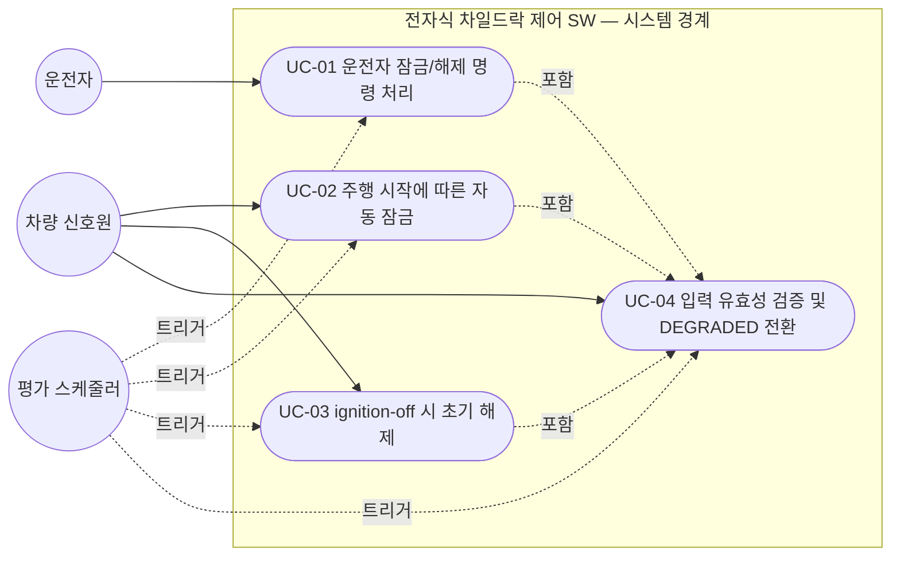
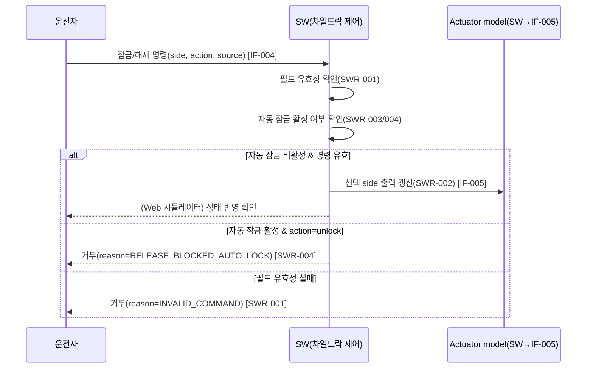
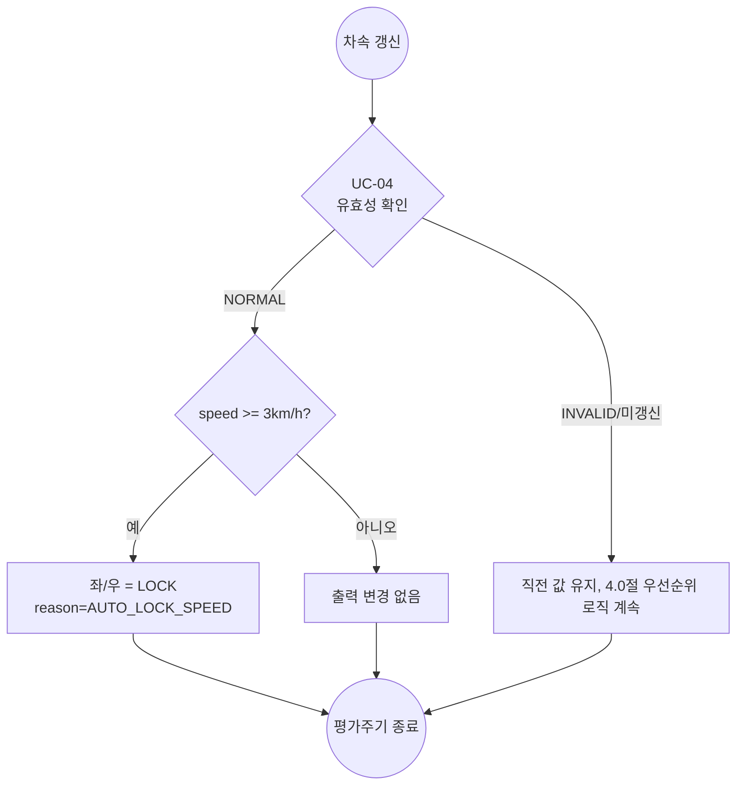
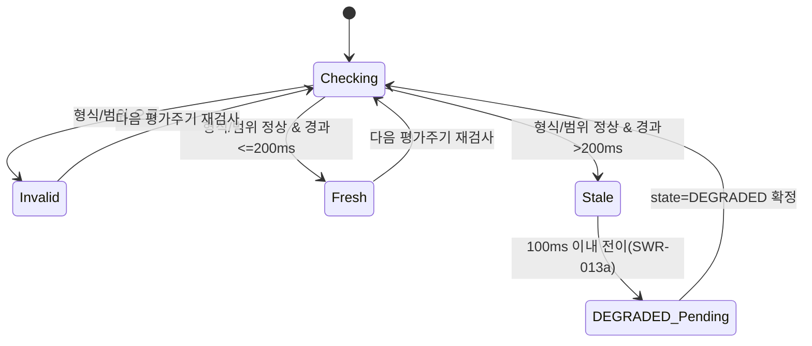

# UC-001 Use Case 명세서

> ⚠️ 교육용 가상 프로젝트 산출물. 상위 SWR 문서: `WorkProducts/01_Requirements/SWR-001_SW요구사항명세서.md`
> (Revision 1.0, Phase 1 baseline). 문서 상태: 미승인(Draft).

## 문서 통제

| 항목 | 값 |
|---|---|
| 문서 ID / 문서명 | UC-001_UseCase명세서 |
| Revision | 1.0 (Phase 1 baseline) |
| 상위 문서 | SWR-001 (Phase 1 SWR 전체) |
| 작성일 | 2026-09-18 |
| 문서 상태 | 교육 시나리오 초안 — 실제 승인 미수행 |

### 변경 이력

| 버전 | 일자 | 변경 내용 | 변경자 |
|---|---|---|---|
| 1.0 (Phase 1 baseline) | 2026-09-18 | 최초 작성. Phase 1 범위 Use Case 4건 | requirements-analyst 서브에이전트 |

---

## 1. 목적 및 적용범위

### 1.1 목적

SWR-001 문서의 Phase 1 기능 요구사항(SWR-001~004, SWR-013a/b, SWR-020)이 실제 상호작용
시나리오에서 어떻게 발현되는지를 액터-시스템 관점에서 명세하여, 설계 단계(SWE.2/SWE.3)와
시스템 시험 단계(SWE.6)의 시나리오 기반 자료로 사용한다.

### 1.2 적용범위

Phase 1 범위인 (1) 운전자 명령 처리, (2) 자동 잠금, (3) ignition-off 시 해제,
(4) 입력 유효성/degraded 처리 4개 Use Case를 다룬다. Phase 2/3 대상(충돌 해제, 접근위험
억제, 강제해제, ISOFIX, 상태조회/Display)은 5장 "비대상 시나리오"에 등록만 하고 상세화하지
않는다.

### 1.3 적용 경계

SWR-001 문서 1.3절의 적용 경계(프로젝트 공통 경계, HIL/실차/인증 제외, PC/SIL 및 Web 검증만
다룸)를 그대로 승계한다.

---

## 2. 액터와 시스템 경계

| 액터 | 유형 | 설명 |
|---|---|---|
| 운전자(Driver) | 인간 액터 | 물리 버튼, AVN, 음성, 모바일 앱 4개 채널 중 하나로 잠금/해제 명령을 입력. 채널 구분이 필요한 경우 "운전자(물리 버튼)" 등으로 표기 |
| 차량 신호원(Vehicle) | 외부 시스템 액터 | vehicle_speed_kph, gear, ignition_on 등 OEM-IF-001/009 등 차량 신호를 제공(Phase1은 이 중 vehicle_speed_kph, ignition_on을 소비) |
| 평가 스케줄러(Evaluation Scheduler) | 시스템 내부 트리거(경계선 액터로 표기) | 고정 주기로 평가주기를 실행시키는 트리거. PC/SIL 환경에서는 시험 하네스가 이 역할을 겸함 |

(UC-01/02/03은 매 평가주기 UC-04의 입력 유효성 검증을 선행 조건으로 포함(include)한다 —
4.0절 우선순위 흐름과 일치.)

---

## 3. Use Case 목록

| ID | 이름 | 관련 SWR | 우선순위 |
|---|---|---|---|
| UC-01 | 운전자 잠금/해제 명령 처리 | SWR-001, SWR-002, SWR-004 | 필수 |
| UC-02 | 주행 시작에 따른 자동 잠금 | SWR-003 | 필수 |
| UC-03 | ignition-off 시 초기 해제 | SWR-020 | 필수 |
| UC-04 | 입력 유효성 검증 및 DEGRADED 전환 | SWR-013a, SWR-013b | 필수 |

---

## 4. Use Case 상세

### 4.1 UC-01 운전자 잠금/해제 명령 처리

#### 4.1.1 기본 정보

| 필드 | 내용 |
|---|---|
| ID | UC-01 |
| 이름 | 운전자 잠금/해제 명령 처리 |
| 관련 SWR | SWR-001, SWR-002, SWR-004 |
| 액터 | 운전자(주 액터), 평가 스케줄러 |

#### 4.1.2 사전조건/트리거

- 사전조건: SW가 NORMAL 상태이며 OFF 상태(ignition_on=FALSE)가 아니다.
- 트리거: 운전자가 물리 버튼, AVN, 음성 또는 모바일 앱 중 하나로 잠금/해제 명령을 입력한다.

#### 4.1.3 기본 흐름

1. 운전자가 side(left/right/all), action(lock/unlock)을 선택해 4개 채널 중 하나로 명령을 전송한다.
2. SW는 UC-04(입력 유효성 검증)를 수행해 vehicle_speed_kph 등 관련 입력이 NORMAL임을 확인한다.
3. SW는 명령의 side/action/source 필드를 OEM-IF-004 계약에 따라 검사한다(SWR-001).
4. 필드가 모두 유효하면, SW는 vehicle_speed_kph < 3 km/h(자동 잠금 비활성)인지 확인한다.
5. 자동 잠금이 비활성이면, SW는 선택된 side에만 action을 적용하고 비선택 side는 유지한다(SWR-002).
6. SW는 결과를 OEM-IF-005(Actuator model)로 출력하고 이벤트 이력에 기록한다(SWR-010/011).

#### 4.1.4 대안 흐름

- A1 (전체 선택): side=all인 경우 기본 흐름 5단계에서 좌/우 출력이 모두 갱신된다(SWR-002).

#### 4.1.5 예외 흐름

- E1 (필드 오류): 기본 흐름 3단계에서 side/action/source 중 하나라도 유효하지 않으면, SW는
  명령을 반영하지 않고 reason_code=INVALID_COMMAND를 기록한다(SWR-001).
- E2 (자동 잠금 중 해제 거부): 기본 흐름 4단계에서 vehicle_speed_kph ≥ 3 km/h이고 action=unlock이면,
  SW는 명령을 반영하지 않고 LOCK을 유지하며 reason_code=RELEASE_BLOCKED_AUTO_LOCK을
  기록한다(SWR-004).
- E3 (DEGRADED 중): UC-04에서 관련 입력이 DEGRADED로 판정되면, 본 Use Case는 계속 진행하되
  판정 로직이 직전 유효값을 사용한다(SWR-013a/b, 8.1절 참고).

#### 4.1.6 사후조건

- 성공 시: 선택된 side의 출력이 갱신되고 이벤트 이력에 1건이 추가된다.
- 거부 시: 출력은 변경되지 않고 거부 사유가 기록된다.

---

### 4.2 UC-02 주행 시작에 따른 자동 잠금

#### 4.2.1 기본 정보

| 필드 | 내용 |
|---|---|
| ID | UC-02 |
| 이름 | 주행 시작에 따른 자동 잠금 |
| 관련 SWR | SWR-003 |
| 액터 | 차량 신호원(주 액터), 평가 스케줄러 |

#### 4.2.2 사전조건/트리거

- 사전조건: SW가 OFF 상태가 아니다(ignition_on=TRUE).
- 트리거: 평가 스케줄러가 새 평가주기를 시작하고, vehicle_speed_kph가 유효값으로 갱신된다.

#### 4.2.3 기본 흐름

1. 차량 신호원이 vehicle_speed_kph를 갱신 전송한다(OEM-IF-001).
2. SW는 UC-04를 통해 값의 유효성/freshness를 확인한다.
3. SW는 vehicle_speed_kph ≥ 3 km/h인지 판정한다.
4. 조건이 참이면, SW는 좌·우 출력을 LOCK으로 설정하고 reason_code=AUTO_LOCK_SPEED를 기록한다.

#### 4.2.4 대안 흐름

없음(단일 조건 판정).

#### 4.2.5 예외 흐름

- E1: vehicle_speed_kph가 DEGRADED/INVALID이면 SWR-013a/b에 따라 상태만 전이하고, 자동 잠금
  판정은 직전 유효값 기준으로 유지한다(8.1절 SWR 문서 참고, 확인 필요 사항 포함).

#### 4.2.6 사후조건

- vehicle_speed_kph ≥ 3 km/h 도달 이후에는 좌·우 출력이 LOCK으로 유지된다(UC-01의 해제
  명령은 UC-01 E2에 의해 거부됨).

---

### 4.3 UC-03 ignition-off 시 초기 해제

#### 4.3.1 기본 정보

| 필드 | 내용 |
|---|---|
| ID | UC-03 |
| 이름 | ignition-off 시 초기 해제 |
| 관련 SWR | SWR-020 |
| 액터 | 차량 신호원(주 액터), 평가 스케줄러 |

#### 4.3.2 사전조건/트리거

- 사전조건: 없음(임의 상태에서 발생 가능 — LOCKED 상태 포함).
- 트리거: ignition_on 신호가 FALSE로 확인된다(OEM-IF-009).

#### 4.3.3 기본 흐름

1. 차량 신호원이 ignition_on=FALSE를 전송한다.
2. SW는 UC-04를 통해 신호 유효성을 확인한다.
3. SW는 직전 상태(자동 잠금 LOCK 여부 등)와 무관하게 좌·우 출력을 RELEASE로 전환한다.
4. SW는 state=OFF, reason_code=ignition_off로 설정하고 이벤트 이력에 기록한다.

#### 4.3.4 대안 흐름

- A1: 이미 RELEASED 상태였던 경우에도 state=OFF 전이와 이벤트 기록은 동일하게 수행된다
  (출력값 자체는 변경 없음이나 상태/사유는 갱신됨).

#### 4.3.5 예외 흐름

- E1: ignition_on 신호가 INVALID/DEGRADED로 판정된 평가주기에는 SWR-020이 트리거되지 않고
  직전 상태를 유지한다(4.0절 우선순위 로직의 전제조건).

#### 4.3.6 사후조건

- 좌·우 출력이 RELEASE, state=OFF로 확정된다. ignition_on=TRUE로 복귀하고 입력이 NORMAL로
  판정되기 전까지 OFF 상태가 유지된다(4.3절 상태 머신 참고).

---

### 4.4 UC-04 입력 유효성 검증 및 DEGRADED 전환

#### 4.4.1 기본 정보

| 필드 | 내용 |
|---|---|
| ID | UC-04 |
| 이름 | 입력 유효성 검증 및 DEGRADED 전환 |
| 관련 SWR | SWR-013a, SWR-013b |
| 액터 | 차량 신호원(주 액터), 평가 스케줄러 |
| 성격 | UC-01/02/03에 매 평가주기 포함(include)되는 공통 Use Case |

#### 4.4.2 사전조건/트리거

- 사전조건: 없음.
- 트리거: 매 평가주기 시작(평가 스케줄러) 또는 새 입력 수신.

#### 4.4.3 기본 흐름

1. 평가 스케줄러가 평가주기를 시작한다.
2. SW는 대상 입력(§5 SWR 문서 입력 데이터 사전) 각각에 대해 형식/범위를 검사한다.
3. 형식/범위가 유효하면, SW는 source_timestamp_s 기준 경과시간을 계산한다.
4. 경과시간이 200 ms 이하이면 해당 입력을 NORMAL로 유지한다.
5. 경과시간이 200 ms를 초과하면, SW는 100 ms 이내에 상태를 DEGRADED로 전이한다(SWR-013a).

#### 4.4.4 대안 흐름

없음.

#### 4.4.5 예외 흐름

- E1 (형식/범위 오류): 입력이 정의된 형식/범위를 벗어나면, SW는 그 평가주기의 판단 로직에
  해당 값을 반영하지 않고 INVALID로 표시한다(SWR-013b). 이는 DEGRADED 전이와 별개로 매
  평가주기 독립적으로 판정된다.

#### 4.4.6 사후조건

- 각 대상 입력의 input_validity가 NORMAL/DEGRADED/INVALID 중 하나로 확정되어 UC-01/02/03의
  선행 조건으로 제공된다.

---

## 5. 비대상 시나리오 (Phase 2/3 예정 — 본 문서에서 상세화하지 않음)

| OEM 요구 ID | 시나리오 개요 | 예정 Phase |
|---|---|---|
| OEM-SR-001 | 충돌 CONFIRMED 시 긴급 해제 | Phase 2 |
| OEM-SR-002 | 접근위험 도어 잠금 및 해제 억제 | Phase 2 |
| OEM-SR-004 | sensor_fault 시 직전 출력 유지(FAULT) | Phase 2 |
| OEM-FR-003 | 접근위험 경고 후 10초 이내 재입력 override | Phase 2 |
| OEM-FR-005 | 화재/과온/성인탑승 강제 해제 | Phase 2 |
| OEM-FR-006 | ISOFIX 강제 잠금 | Phase 2 |
| OEM-FR-004 | 상태조회 및 Display 표시 응답 | Phase 3 |

---

## 6. 추적성

상세 양방향 추적은 `WorkProducts/Traceability/TRC-001_추적성매트릭스.md`를 참조한다.
Use Case ↔ SWR 매핑은 3장 표를 기준으로 한다.

---

## 7. 참고자료

| 식별자 | 참고 목적 |
|---|---|
| SWR-001 | 본 문서의 상위 SWR 문서(Phase 1 baseline) |
| OEM-SWR-001 | 최상위 OEM 입력 문서 |
| `WP_Templates/Engineering/SoftwareRequirementsAnalysis/TPL-SWE1-002_*.docx` | 본 문서가 따르는 공식 절 구조 |
