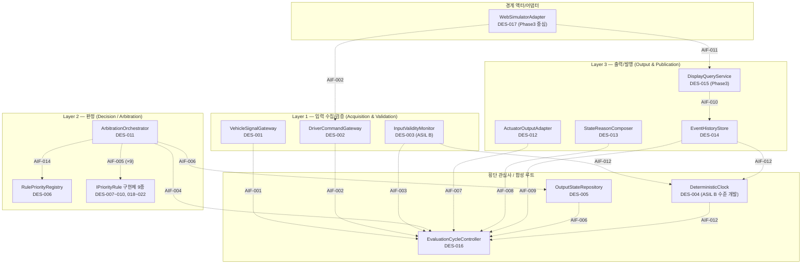
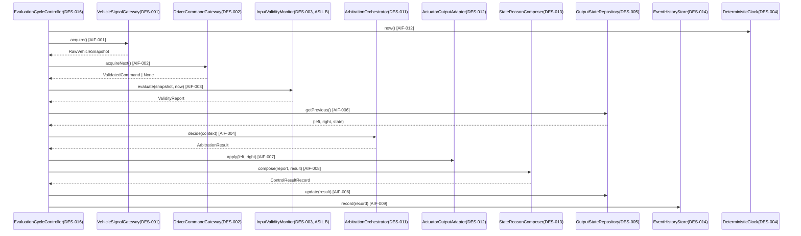
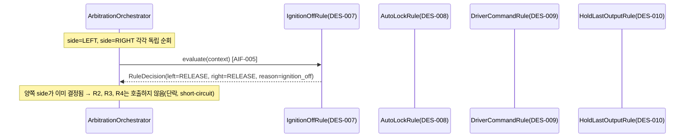
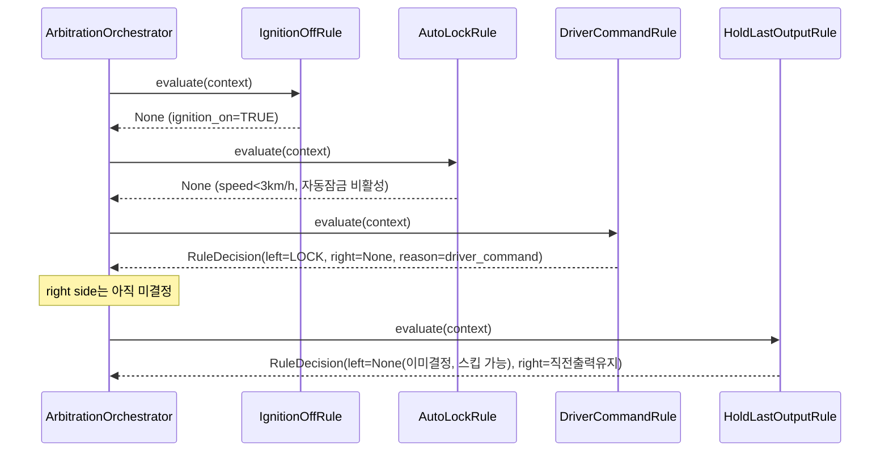
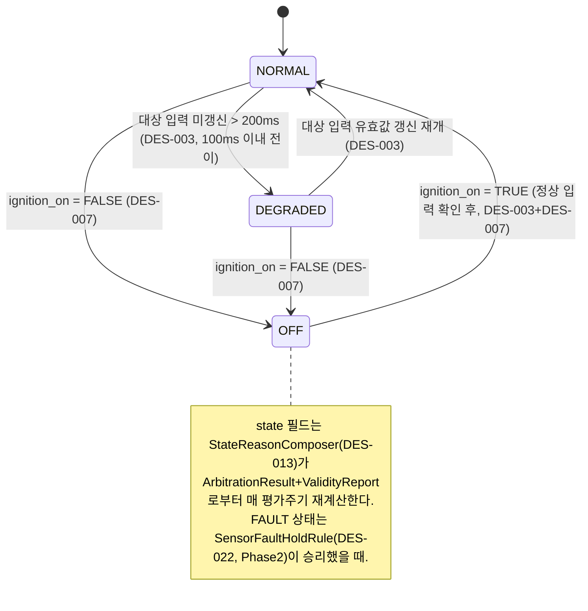
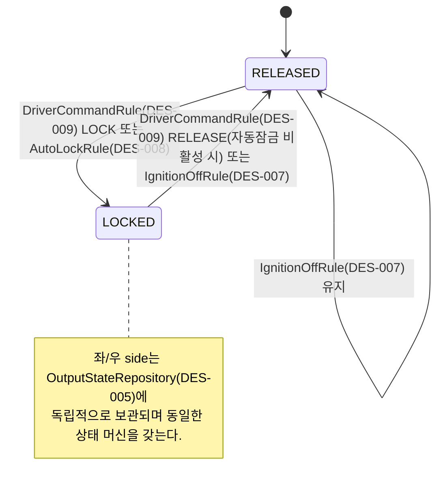
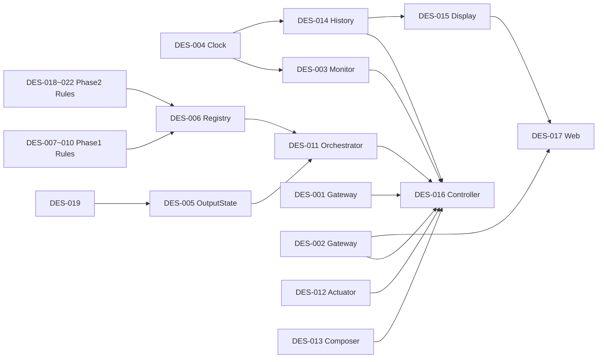

# SWA-001 SW 아키텍처 설계서

> ⚠️ 본 문서는 **교육용 가상 프로젝트 산출물**이다. 상위 입력인 `SWR-001_SW요구사항명세서.md`
> (Phase 1 baseline)와 `UC-001_UseCase명세서.md`를 근거로 작성되었으며, 실제 현대자동차·Tesla
> 또는 다른 제작사의 사양을 나타내지 않는다. HARA/ASIL 도출 근거를 재구성하지 않고,
> 준수·적합성평가·인증을 주장하지 않는다. **문서 상태: 미승인(Draft) — 실제 승인 미수행.**
>
> ⚠️ **사용자 지정 아키텍처 설계서 양식 미제공** — `.claude/skills/architecture-design/references/architecture-template.md`가
> `TEMPLATE STATUS: PENDING`이므로, 스킬의 기본 임시 양식(장 구조)을 사용해 작성했다. 공식
> `WP_Templates/Engineering/SoftwareArchitecturalDesign/TPL-SWE2-001_*.docx`가 열리지 않아
> 그 장 구조를 직접 대조하지 못했으며, 사용자가 공식 양식을 제공하면 이 문서의 장 구조를
> 재구성할 것을 제안한다(Phase 종료 시 공식 docx로 변환하기로 이미 확정됨).

## 문서 통제

| 항목 | 값 |
|---|---|
| 문서 ID / 문서명 | SWA-001_SW아키텍처설계서 |
| Revision | 1.1 (평가주기 20ms 확정 반영) — 프로젝트 전체 범위를 Rev 1.0에서 한 번에 설계하고, Phase2/3에서는 본 문서의 컴포넌트를 상세설계·구현만 함(필요 시 개정판 발행) |
| 프로세스 | SWE.2 소프트웨어 아키텍처 설계 (SYS.3 관점 일부 포함) |
| 상위 입력 | SWR-001_SW요구사항명세서(Rev 1.0), UC-001_UseCase명세서(Rev 1.0) |
| 베이스라인(목표) | BL-SWA-1.0 (G2 설계 게이트, 미도달) |
| 작성 조직 | Volsojoda(가상 공급자) 아키텍처 설계 담당 |
| 작성일 | 2026-09-18 |
| 문서 상태 | 교육 시나리오 초안 — 실제 승인 미수행 |

### 변경 이력

| 버전 | 일자 | 변경 내용 | 변경자 |
|---|---|---|---|
| 1.0 | 2026-09-18 | 최초 작성. Phase1~3 전체 범위 아키텍처를 한 번에 설계. 후보 A(계층형)/B(컴포넌트기반+규칙체인)/C(파이프-필터)/D(이벤트기반) 중 사용자가 "A+B 하이브리드"로 확정, 상세설계 진행 | architecture-design 서브에이전트 |
| 1.1 | 2026-09-18 | §12 확인 필요 항목 #2(평가주기 고정값) 사용자 확정 반영: 평가주기(tick) **20 ms 고정**. §1.3, §4.2(AIF-015), §7.5(신설, 타이밍 여유 분석표), §8.1, §12-2 갱신. 그 외 확인 필요 항목(#1,#3~#6)은 기존 상태(잠정안/유보/이관 권고) 유지 | architecture-design 서브에이전트 |

### 작성-검토-승인 상태

| 역할 | 담당(가상) | 상태 |
|---|---|---|
| 작성 | architecture-design 서브에이전트 | 완료(초안) |
| 검토 | 미지정 | 미수행 |
| 승인 | OEM-A SW Requirements Owner(가상) | 미수행 |

### 선택된 아키텍처 구조와 선택 사유 (§2 후보 비교 결과 요약)

**확정: 후보 A(계층형) + 후보 B(컴포넌트 기반/우선순위 규칙 체인) 하이브리드.**
최상위 배치는 계층형(입력수집·검증 → 판정 → 출력/발행)을 따르되, 판정(Decision) 계층
내부는 각 안전/기능 규칙을 `IPriorityRule` 인터페이스를 구현하는 독립 컴포넌트로 캡슐화하고
`ArbitrationOrchestrator`가 고정 우선순위 순서로 순회하는 체인(Chain of Responsibility)으로
구성한다. 선정 사유:

1. 사용자 지시(4번)의 "우선순위 체인/규칙 엔진 패턴, 과설계 금지"와 정확히 일치.
2. 신규 규칙(Phase2/3 강제잠금·강제해제·접근위험억제·센서고장) 추가 시 기존 컴포넌트를
   수정하지 않고 `IPriorityRule` 구현체 추가 + 우선순위 목록 등록만으로 확장 가능(OCP).
3. ASIL B 컴포넌트(`InputValidityMonitor`)를 QM 규칙 컴포넌트들과 인터페이스로 완전히
   분리해 논리적 FFI 논증이 가장 단순함(§7).
4. SWR-016(결정론적 재생)이 `ArbitrationOrchestrator`의 고정 순회 순서로 자연스럽게 보장됨.

사용자 확인 결과(2026-09-18) 반영 사항:
- Phase2 규칙 간 상대 우선순위는 지금 확정하지 않고 잠정안을 "확인 필요"로 표기(§9.2, §12-1).
- ASIL B 논리적 FFI 근거는 "표준 원문 확인 필요"로 명시(§7.3).
- `EventHistoryStore`(SWR-011) 허용 필드 목록은 잠정안을 그대로 확정 채택(§3.2, §4).
- 산출물은 `.md`로 작성하고 Phase 종료 시 공식 docx/xlsx로 변환(기 결정 사항 유지).

---

## 1. 개요 및 설계 제약

### 1.1 설계 범위

전자식 차일드락 제어 SW(후석 좌/우)의 **Phase1~3 전체 범위**를 이번 개정에서 한 번에
설계한다. Phase1(SWR-001/002/003/004/020, SWR-013a/013b, SWR-010/011/012/016)은 상세
설계까지 포함하고, Phase2(OEM-SR-001/002/004, OEM-FR-003/005/006)/Phase3(OEM-FR-004,
OEM-IF-006 조회 동작)는 컴포넌트/인터페이스 수준의 확장 자리(스텁)만 마련한다.

### 1.2 참조 요구사항

| 문서 | 참조 범위 |
|---|---|
| SWR-001_SW요구사항명세서 Rev 1.0 | 4~9장 SWR 전체, 8장 분석결과/가정, 4.0절 우선순위 흐름 |
| UC-001_UseCase명세서 Rev 1.0 | UC-01~04 상세, 5장 비대상 시나리오(Phase2/3) |
| TRC-001_추적성매트릭스 Rev 1.0 | OEM↔SWR 매핑, Phase2/3 미착수 항목 |

### 1.3 주요 제약

| 구분 | 내용 |
|---|---|
| ASIL | OEM-SR-003(입력 유효성/freshness) → SWR-013a/013b만 **ASIL B**. 그 외 전 SWR은 **QM**. 상위 Safety Goal ID는 SWR-001 §8.5에 따라 "미제공 — 확인 필요" |
| 실행 환경 | Python 3.14, 단일 프로세스. PC/SIL 참조 구현(결정론적) + Web 시뮬레이터(표시/조작, IF-006). RTOS/HIL/실차/타깃 ECU는 범위 밖 |
| 성능/타이밍 | SWR-013a: 입력 미갱신 200ms 초과 시 100ms 이내 DEGRADED 전이(경계값 199/200/201/300/301ms). 평가주기(tick) 고정값은 **20 ms로 확정**(초당 50회, 100ms 예산 대비 5배·300ms 예산 대비 15배 여유 — 근거는 §7.5) |
| 신뢰성/재현성 | SWR-016: 고정 시계 조건에서 동일 입력 1,000회 재생 시 출력 해시 전량 일치 |
| 보안/데이터 | SWR-011/012: 이벤트 이력은 허용 필드만, 휘발성(비영속), PII/원본 데이터 금지 |
| 품질 지표(CLAUDE.md) | 함수 순수코드 50라인 이하, 순환복잡도 10 이하, 중복 7라인 허용, Doxygen 주석 20% 이상 — 상세설계/구현 단계에서 준수하되, 본 아키텍처는 각 컴포넌트 책임을 좁게 유지해(단일 규칙 = 하나의 클래스) 이 지표 달성을 구조적으로 지원 |

---

## 2. 후보 아키텍처 비교 (제안 단계 산출물, 사용자 확정 완료)

### 2.1 후보 요약

| 후보 | 핵심 아이디어 | 응집도/결합도 | SOLID(특히 OCP) | 변경 유연성 | ISO26262 FFI | A-SPICE 산출물 난이도 | 구현/통합 복잡도 |
|---|---|---|---|---|---|---|---|
| A. 계층형 | 입력→판정→출력 3계층, 판정은 절차 코드 | 중 | 하~중(규칙추가 시 내부수정) | 중 | 중 | 쉬움 | 낮음 |
| **B. 컴포넌트기반+규칙체인** | 규칙별 `IPriorityRule` 구현 + 고정순회 오케스트레이터 | 상 | **상**(신규 규칙=신규 클래스) | **상** | **상**(검증모니터 완전 격리) | 중간 | 중간 |
| C. 파이프-필터 | 검증→규칙1→규칙2→...→출력 순차 변환 | 중 | 중(우회로직 필요) | 중 | 중 | 중간 | 중간 |
| D. 이벤트기반/Pub-Sub | 규칙이 이벤트 구독·반응, 출력은 이벤트 병합 | 상(개별)/추적성 낮음 | 중(LSP/계약관리 어려움) | 상(예측 어려움) | 하(순서/타이밍 보장 어려움) | 어려움 | 높음 |

### 2.2 사용자 결정

**A+B 하이브리드로 확정** (2026-09-18, 코디네이터를 통한 사용자 확인). 최상위는 계층형
배치, Decision 계층 내부는 `IPriorityRule` 컴포넌트 체인. 상세 근거는 문서 통제 섹션의
"선택된 아키텍처 구조와 선택 사유" 참고.

---

## 3. 정적 뷰 (Static View)

### 3.1 계층 구조 개관



이 다이어그램은 "정적 구조" 관점이며, 화살표는 모두 §4 인터페이스 명세 표의 ID와
1:1 대응한다(인터페이스 없는 직접 연결 없음). `EvaluationCycleController`(DES-016)가
합성 루트(composition root)로서 매 평가주기마다 각 계층 컴포넌트를 고정 순서로 호출하는
**중재자(Mediator)** 역할을 하며, 계층 간 컴포넌트는 서로를 직접 호출하지 않고
Controller를 통해서만 조율된다(단, Decision 계층 내부의 Orchestrator↔Rule은 체인
패턴의 본질적 구조이므로 예외).

### 3.2 컴포넌트 목록 및 책임 (SRP 근거 포함)

| DES ID | 컴포넌트명 | ASIL | 책임(단일 문장) | 응집도 근거 |
|---|---|---|---|---|
| DES-001 | VehicleSignalGateway | QM | Vehicle→SW 원시 신호(OEM-IF-001/002/003/007/008/009)를 수집해 `RawVehicleSnapshot`으로 변환한다 | 파싱/어댑팅만 수행, 판단 로직 없음 — 변경 사유는 "신호원 프로토콜 변경" 하나뿐 |
| DES-002 | DriverCommandGateway | QM | 4-source 명령(OEM-IF-004)을 수집하고 필드 유효성(SWR-001)을 확인해 `ValidatedCommand`/거절을 산출한다 | 명령 채널 어댑팅+필드검증이라는 하나의 응집된 책임(SWR-001 원자성과 일치) |
| DES-003 | InputValidityMonitor | **ASIL B** | 대상 입력의 형식/범위(SWR-013b)와 freshness(SWR-013a)를 검사해 `ValidityReport`를 산출한다 | "입력 신뢰성 판정"이라는 단일 책임, 다른 어떤 판정(잠금/해제)도 포함하지 않음 |
| DES-004 | DeterministicClock | QM(공유, ASIL B 수준 개발) | 결정론적 시각 소스(`now()`)를 제공하고 테스트/재생 시 고정 시각 주입을 허용한다 | 시간 소스 제공이라는 단일 책임, 분기 로직 없음 |
| DES-005 | OutputStateRepository | QM | 직전 평가주기의 side별 출력과 규칙별 스크래치 상태(타이머 등)를 보관/제공한다 | "상태 보관"이라는 단일 책임, 판정 로직 없음(순수 저장소) |
| DES-006 | RulePriorityRegistry | QM | `IPriorityRule` 구현체의 고정 우선순위 순서 목록을 구성/제공한다 | 우선순위 데이터만 보유, 규칙 로직은 포함하지 않음 — 우선순위 변경의 유일한 지점(§11) |
| DES-007 | IgnitionOffRule | QM | ignition_on=FALSE 시 다른 조건과 무관하게 좌/우 RELEASE, state=OFF를 결정한다(SWR-020) | 하나의 트리거·하나의 결정 규칙 |
| DES-008 | AutoLockRule | QM | vehicle_speed_kph≥3km/h 활성 조건에서 좌/우 LOCK을 강제하고 RELEASE를 차단한다(SWR-003, SWR-004) | 동일 트리거(자동잠금 활성조건)의 두 효과(잠금 강제·해제 차단)를 하나로 묶어 상태 중복 보유를 방지 |
| DES-009 | DriverCommandRule | QM | 유효한 운전자 명령을 선택된 side에만 적용한다(SWR-002) | 명령 적용이라는 단일 책임 |
| DES-010 | HoldLastOutputRule | QM | 상위 규칙이 결정하지 않은 side에 대해 직전 출력을 유지한다(체인의 기본값/터미널) | 체인 종료 보장이라는 단일 책임 |
| DES-011 | ArbitrationOrchestrator | QM | 등록된 규칙을 고정 순서로 순회해 side별 최종 결정을 합성한다 | "규칙 순회/합성"만 수행, 개별 규칙 로직을 포함하지 않음(OCP 핵심) |
| DES-012 | ActuatorOutputAdapter | QM | 최종 결정을 OEM-IF-005(Actuator model)로 출력한다 | 출력 어댑팅만 수행 |
| DES-013 | StateReasonComposer | QM | `ValidityReport`+`ArbitrationResult`를 OEM-IF-006 데이터 계약(state/priority_reason/reason_code/input_validity)으로 축약·구성한다 | "외부 공개용 축약"이라는 단일 책임 |
| DES-014 | EventHistoryStore | QM | 제어결정을 최근 100건 순환 보존(SWR-010), 허용 필드만(SWR-011), 메모리 내 휘발성(SWR-012)으로 관리한다 | 이력 저장이라는 단일 책임 |
| DES-015 | DisplayQueryService | QM(Phase3 자리) | OEM-IF-006의 조회/직렬화 API를 제공한다(OEM-FR-004, 실패 시 HTTP 500) | 조회 API 제공이라는 단일 책임(생성은 DES-013, 조회는 DES-015로 분리) |
| DES-016 | EvaluationCycleController | QM | 매 평가주기 각 계층 컴포넌트를 고정 순서로 호출하는 합성 루트(중재자) | "실행 순서 조율"이라는 단일 책임, 판정 로직 없음 |
| DES-017 | WebSimulatorAdapter | QM(Phase3 중심) | Web UI의 명령 제출(IF-004)과 상태 조회(IF-006)를 코어 인터페이스로 매핑한다 | UI 바인딩만 수행 |
| DES-018 | CollisionOverrideRule | QM(Phase2 자리) | 충돌 CONFIRMED 시 최우선 강제해제 결정을 산출한다(OEM-SR-001) | 단일 트리거·단일 결정(로직은 Phase2 상세설계에서 구현) |
| DES-019 | ApproachRiskSuppressionRule | QM(Phase2 자리) | 접근위험 시 잠금/해제억제 및 10초 이내 override 재입력(OEM-SR-002, OEM-FR-003)을 처리한다 | 동일 트리거(접근위험)의 억제·override 효과를 하나로 묶음(DES-008과 동일한 응집 근거) |
| DES-020 | ForceReleaseRule | QM(Phase2 자리) | 화재/과온/성인탑승 시 강제 해제를 결정한다(OEM-FR-005) | 단일 트리거·단일 결정 |
| DES-021 | ForceLockRule | QM(Phase2 자리) | ISOFIX 장착 시 강제 잠금을 결정한다(OEM-FR-006) | 단일 트리거·단일 결정 |
| DES-022 | SensorFaultHoldRule | QM(Phase2 자리) | sensor_fault 시 출력 유지 및 state=FAULT를 결정한다(OEM-SR-004) | 단일 트리거·단일 결정 |

### 3.3 결합도 근거

- 모든 컴포넌트 간 통신은 §4의 AIF-nnn 인터페이스로만 이루어진다(내부 필드 직접 접근 없음).
- Phase1 규칙 컴포넌트(DES-007~010)는 `RuleEvaluationContext`(불변 DTO)만 입력받는
  **순수 함수형** 컴포넌트로 설계했다 — 다른 컴포넌트에 대한 직접 참조가 전혀 없어 결합도가
  최소이며, 단위테스트가 매우 용이하다(CLAUDE.md 커버리지/복잡도 정책과 정합).
- `ArbitrationOrchestrator`(DES-011)만 `RulePriorityRegistry`(AIF-014), `IPriorityRule`(AIF-005),
  `OutputStateRepository`(AIF-006)에 의존하며, 이 의존은 모두 인터페이스를 향한다(DIP).
- **순환 의존 없음**: §9.1 의존성 그래프에서 확인(모든 간선이 단방향, back-edge 없음).
- 공유 가변 상태: `OutputStateRepository`(DES-005)가 유일한 공유 상태 저장소이며, 접근은
  반드시 AIF-006/AIF-013 인터페이스를 통해서만 이루어지고 직접 필드 접근은 금지한다(암묵적
  결합 방지).

---

## 4. 인터페이스 명세

### 4.1 공통 데이터 타입 (DTO)

| 타입 | 필드 | 비고 |
|---|---|---|
| `RawVehicleSnapshot` | vehicle_speed_kph, gear, crash_status, rear_left_approach_risk, rear_right_approach_risk, fire_detected, overtemperature_detected, adult_present, isofix_left, isofix_right, ignition_on, sensor_fault, source_timestamp_s (모두 Optional, 원시값 그대로) | OEM-IF-001/002/003/007/008/009 통합 표현 |
| `SignalValidity` | enum {NORMAL, DEGRADED, INVALID} | 신호별 판정 |
| `ValidityReport` | per_signal: Dict[str, SignalValidity], stale_signal_names: List[str], invalid_signal_names: List[str], overall_validity: SignalValidity(worst-case) | DES-003 산출물, ASIL B |
| `RawDriverCommand` | side, action, source, timestamp_s(문자열/원시값) | OEM-IF-004 원시 입력 |
| `ValidatedCommand` | side∈{LEFT,RIGHT,ALL}, action∈{LOCK,RELEASE}, source∈{physical_button,avn,voice,mobile_app}, timestamp_s | SWR-001 통과분 |
| `CommandRejection` | reason_code="INVALID_COMMAND", raw: RawDriverCommand | SWR-001 거절분 |
| `RuleEvaluationContext` | validated_snapshot, validity_report, command: Optional[ValidatedCommand], previous_output: {left, right}, previous_state, now_s, rule_state: IRuleStateStore 핸들 | 불변 DTO, 모든 규칙에 동일하게 전달 |
| `RuleDecision` | left: Optional[LOCK\|RELEASE], right: Optional[LOCK\|RELEASE], reason_code: str, priority_reason: str | side별 독립 결정, None=이 규칙은 그 side에 대해 무관 |
| `ArbitrationResult` | left, right (LOCK\|RELEASE 확정값), winning_rule_left, winning_rule_right, reason_code, priority_reason(§4.3 축약 규칙 참고) | DES-011 산출물 |
| `ControlResultRecord`(공개, IF-006 계약) | state∈{NORMAL,DEGRADED,OFF,FAULT(P2)}, priority_reason, reason_code, input_validity | SWR-001 §5장 스키마 그대로 승계 |
| `EventRecord`(이력 저장, SWR-011 화이트리스트) | event_id, timestamp_s, lock_left, lock_right, state, reason_code, input_validity **(7개 필드로 확정 — 사용자 승인)** | 그 외 필드(예: priority_reason 상세, per-side reason) 저장 금지 |

> **확인 필요(§12-3)**: OEM-IF-006의 `reason_code`/`priority_reason`이 side별 값인지 시스템
> 전체 단일 값인지 SWR-001에 명시되어 있지 않다. 본 설계는 두 side 중 더 높은 우선순위
> 규칙이 이긴 쪽의 사유를 대표값으로 채택하는 것으로 잠정 설계했다(`StateReasonComposer`
> 책임, §4.3).

### 4.2 인터페이스 명세 표

| ID | 이름 | 제공자 | 사용자 | 오퍼레이션 | 사전조건 | 사후조건 | 오류 처리 | 타이밍/동시성 |
|---|---|---|---|---|---|---|---|---|
| AIF-001 | IVehicleSignalAcquisition | DES-001 | DES-016 (호출), 외부 Vehicle 신호원(ingest) | `ingest(payload)`; `acquire() -> RawVehicleSnapshot` | ingest: 없음. acquire: 최소 1회 ingest 발생 이후 | acquire는 항상 최신 스냅샷 반환(미수신 필드는 None) | 형식 오류 필드는 그대로 통과시키고 판정은 DES-003에 위임(자체 판정 없음) | 평가주기당 1회 acquire, 재진입 불필요(단일 스레드 가정) |
| AIF-002 | IDriverCommandAcquisition | DES-002 | DES-016 (acquire), DES-017/외부 채널(submit) | `submit(RawDriverCommand)`; `acquireNext() -> Optional[ValidatedCommand]` | 없음 | 유효 명령은 큐잉 후 1회 acquire로 소비, 무효 명령은 `CommandRejection` 기록 후 폐기 | side/action/source 미정의 값 → reason_code=INVALID_COMMAND, 출력 미반영(SWR-001) | 여러 채널 동시 submit 가능(스레드 안전 큐 필요, Web/PC-SIL 동시 사용 대비) |
| AIF-003 | IInputValidityEvaluation | DES-003 (**ASIL B**) | DES-016 | `evaluate(RawVehicleSnapshot, now_s) -> ValidityReport` | now_s는 AIF-012 기준 단조 증가 | 200ms 초과 대상 입력은 100ms 이내 DEGRADED로 보고(SWR-013a), 범위/형식 오류는 INVALID(SWR-013b) | 예외 없음 — 모든 입력 조합에 대해 항상 유효한 `ValidityReport` 반환(안전 컴포넌트는 실패를 던지지 않고 판정으로 흡수) | 평가주기당 1회, 무상태 재계산(직전 결과에 의존하지 않음 — QM 상류 실패에 대한 안전 메커니즘, §7.3) |
| AIF-004 | IArbitrationDecision | DES-011 | DES-016 | `decide(context: RuleEvaluationContext) -> ArbitrationResult` | RulePriorityRegistry에 규칙 1개 이상 등록 | 좌/우 모두 LOCK 또는 RELEASE로 확정(미결정 없음 — HoldLastOutputRule이 항상 종결) | 규칙 평가 중 예외 발생 시 해당 규칙을 "무결정"으로 간주하고 다음 규칙으로 진행 + 이벤트에 규칙오류 기록(안전한 열화) | 평가주기당 1회, 등록 규칙 수에 선형 |
| AIF-005 | IPriorityRule | DES-007~010, 018~022 (각 구현) | DES-011 | `evaluate(context) -> Optional[RuleDecision]` | 없음(불변 context만 참조) | side별로 결정하거나 None(무관) 반환, context를 변경하지 않음(순수 함수) | 없음(예외는 AIF-004 레벨에서 흡수) | 재진입 가능(상태 비저장), Phase2 타이머형 규칙(DES-019)만 AIF-013으로 상태 기록 |
| AIF-006 | IOutputStateAccess | DES-005 | DES-011(읽기), DES-016(갱신) | `getPrevious() -> {left,right,state}`; `update(ArbitrationResult)` | 없음 | update 이후 다음 평가주기 getPrevious가 새 값 반영 | 초기 기동 시 getPrevious 기본값=RELEASE/양쪽(안전 초기상태) | 단일 스레드 순차 접근 가정, Web 조회(AIF-011 경유)는 읽기 전용 스냅샷만 제공 |
| AIF-007 | IActuatorOutputSink | DES-012 | DES-016 | `apply(left, right) -> Ack` | 없음 | 외부 Actuator model(OEM-IF-005)에 값 전달 | 외부 미응답은 로직 출력을 되돌리지 않음(SWR-001 §범위: 적용 feedback은 범위 밖 승계) | 평가주기당 1회 |
| AIF-008 | IControlResultComposition | DES-013 | DES-016 | `compose(ValidityReport, ArbitrationResult) -> ControlResultRecord` | 없음 | IF-006 스키마(state/priority_reason/reason_code/input_validity) 완전성 보장 | 없음(순수 변환) | 평가주기당 1회 |
| AIF-009 | IEventHistoryRecording | DES-014 | DES-016 | `record(ControlResultRecord) -> event_id` | 없음 | 저장소 100건 초과 시 최고령 레코드 제거(FIFO, SWR-010) | 허용 필드 외 값이 들어오면 등록 거부 후 내부 진단 로그(SWR-011 위반 방지) | 평가주기당 1회 append, O(1) 상각 |
| AIF-010 | IEventHistoryQuery | DES-014 | DES-015, 테스트 하네스 | `query(limit) -> List[EventRecord]` | 없음 | 최신순 반환, 재기동 시 0건(SWR-012) | 없음 | 읽기 전용, 동시 호출 안전(불변 스냅샷 반환) |
| AIF-011 | IControlResultQuery | DES-015 | DES-017 (Phase3), 외부 Display(OEM-IF-006) | `getCurrentState() -> ControlResultRecord` | 없음 | 최신 `EventRecord` 기반 응답 직렬화 | **직렬화/조회 실패 시 HTTP 500**(OEM-IF-006 계약, 동작 상세는 Phase3 상세설계) | Phase3 대상, 현재는 인터페이스만 확정(스텁) |
| AIF-012 | IClockSource | DES-004 (공유, ASIL B 수준 개발) | DES-003, DES-014, DES-016 | `now() -> float` | 없음 | 단조 증가 값 반환 | 없음 | 결정론 보장을 위해 실행 중 시계 소스 전환 금지 |
| AIF-013 | IRuleStateStore | DES-005 (파사드) | Phase2 타이머형 규칙(DES-019 등) | `get(rule_key) -> Any`; `set(rule_key, value)` | 없음 | 규칙별 키로 스코프 분리(다른 규칙 상태 침범 불가 — ISP) | 없음 | 재진입 시 규칙별 독립 키 공간이라 충돌 없음 |
| AIF-014 | IRulePriorityRegistry | DES-006 | DES-011 | `getOrderedRules() -> List[IPriorityRule]` | 조립(구성) 시점에 전체 규칙 인스턴스 확정 | 항상 동일 순서 반환(재현성 지원) | 없음 | 조립 시 1회 결정, 실행 중 불변 |
| AIF-015 | IEvaluationCycleControl | DES-016 | 외부 "평가 스케줄러" 액터(PC/SIL 하네스, 주기 트리거) | `runCycle() -> CycleResult` | 없음 | 1회 호출 = 1 평가주기 완주(입력수집→판정→출력→발행→기록) | 내부 단계 예외는 안전한 기본값(직전 출력 유지)으로 흡수 후 이벤트 기록 | **호출 주기 20 ms 고정(확정, §7.5)** — SWR-013a 100ms/200ms/300ms 예산 대비 각각 5/10/15배 여유 |
| AIF-016 | IClockControl | DES-004 | 테스트 하네스(SIL 전용, 운영 로직 미사용) | `setFixed(t)`; `advance(delta)` | 테스트/재생 모드에서만 사용 | 이후 `now()` 호출이 설정값 반영 | 운영(비테스트) 경로에서 호출 시 금지(설계 규칙으로만 강제, §12-4 코드 리뷰 필요) | SWR-016 결정론 재생 지원 |

### 4.3 StateReasonComposer 축약 규칙 (설계 결정)

- `input_validity`(공개) = `ValidityReport.overall_validity`(신호별 판정 중 최악값: INVALID > DEGRADED > NORMAL 우선).
- `state`(공개) = DES-011 결과에 IgnitionOffRule이 승리했으면 OFF, 그렇지 않고 `overall_validity`가
  DEGRADED/INVALID이면 DEGRADED, 그 외 NORMAL(FAULT는 Phase2 SensorFaultHoldRule 승리 시).
- `reason_code`/`priority_reason`(공개, 단일값) = 좌/우 중 더 높은 우선순위 규칙이 승리한 쪽의
  `RuleDecision.reason_code`/`priority_reason`(§4.1 확인 필요 참고).

---

## 5. 동적 뷰 (Dynamic View)

### 5.1 평가주기 전체 파이프라인 (정상 흐름)



### 5.2 판정(Decision) 계층 확대 — 우선순위 체인 내부 (UC-03 ignition-off 최우선 사례)



### 5.3 판정 계층 확대 — 운전자 명령이 반영되는 사례 (UC-01)



### 5.4 상태 머신 (SWR-001 §4.3 승계, 소유 컴포넌트 표기)





---

## 6. SOLID 원칙 점검표

| 원칙 | 점검 결과 | 근거(구체 컴포넌트/인터페이스) |
|---|---|---|
| **SRP** | 준수 | §3.2 표의 모든 DES 컴포넌트가 "변경 사유 1개"를 갖도록 분해. 예: `StateReasonComposer`(DES-013, 외부 공개 축약)와 `EventHistoryStore`(DES-014, 저장)를 분리해, IF-006 스키마 변경(Phase3)이 저장 로직에 영향을 주지 않도록 함 |
| **OCP** | 준수 | 새 규칙(Phase2 DES-018~022)은 `IPriorityRule`(AIF-005) 구현체 추가 + `RulePriorityRegistry`(DES-006) 등록만으로 확장되며, `ArbitrationOrchestrator`(DES-011) 내부 코드를 수정하지 않는다 |
| **LSP** | 준수 | 모든 `IPriorityRule` 구현체는 동일 계약(`evaluate(context) -> Optional[RuleDecision]`, 부작용 없음)을 지키므로 `ArbitrationOrchestrator`는 구현체를 구분하지 않고 동일하게 순회할 수 있다. `DeterministicClock`(AIF-012)도 실제/고정 시계 구현을 교체해도 호출자 가정(단조 증가)이 깨지지 않는다 |
| **ISP** | 준수 | `OutputStateRepository`(DES-005)는 `IOutputStateAccess`(AIF-006, Orchestrator/Controller용)와 `IRuleStateStore`(AIF-013, 규칙 전용 스크래치 공간)를 분리 제공해, 대부분의 규칙이 쓰지 않는 전체 상태 접근에 강제로 의존하지 않는다. `EventHistoryStore`도 기록(AIF-009)과 조회(AIF-010)를 분리해 `DisplayQueryService`가 기록 기능에 의존하지 않는다 |
| **DIP** | 준수 | 상위 정책 모듈(`EvaluationCycleController`, `ArbitrationOrchestrator`)은 구체 구현이 아니라 인터페이스(AIF-001~014)에 의존한다. 실제 구현체(PC/SIL용 어댑터 vs Web 시뮬레이터용 어댑터)는 조립(구성) 시점에 주입되므로, Vehicle 신호 소스가 SIL 하네스에서 Web 시뮬레이터 백엔드로 바뀌어도 Decision/Output 계층은 무수정 |

**순환 의존 확인**: §9.1 의존성 그래프상 모든 간선이 단방향(리프 → 상위)이며, 역방향 간선이
존재하지 않음을 확인했다(순환 없음).

---

## 7. 안전 아키텍처 (ISO 26262 Part 6)

### 7.1 ASIL 배분

| 컴포넌트 | ASIL | 근거 |
|---|---|---|
| DES-003 InputValidityMonitor | **B** | OEM-SR-003(ASIL B) → SWR-013a/013b 직접 구현 |
| DES-004 DeterministicClock | **B로 승격 개발**(사용은 QM 컴포넌트도 함) | §7.2 FFI 분석 근거로 승격 |
| 그 외 전체(DES-001, DES-002, DES-005~DES-022 중 DES-004 제외) | QM | SWR-001 4.1/7장 및 8.1절 범위 해석에 따라 QM |

> 상위 Safety Goal ID는 SWR-001 §8.5에 따라 "미제공"이며, 본 문서도 이를 재확인만 하고
> HARA/SG를 재구성하지 않는다(§12-1의 확인 필요 목록에도 등재).

### 7.2 ASIL 분해 여부

본 아키텍처는 ASIL 분해(예: ASIL B → B,B)를 적용하지 않는다. SWR-013a/013b는 이미
"입력 검증"이라는 단일 안전 기능으로 응집되어 있고, 이를 여러 요소로 인위적으로 쪼갤
근거가 없기 때문이다(과설계 방지).

### 7.3 간섭으로부터의 자유(FFI) 분석

본 프로젝트는 단일 Python 3.14 프로세스(PC/SIL, RTOS/HW 파티셔닝 없음)로 실행되므로,
ISO 26262 Part 6이 전제하는 **물리적** 공간/시간 파티셔닝(별도 코어/메모리 영역)을 적용할
수 없다. 이는 **표준 원문 확인 필요** 사항이며(§12-3), 본 설계는 아래와 같은 **논리적 FFI**
대체 근거로 진행한다(사용자 확인, 2026-09-18).

- **데이터 흐름 방향**: `InputValidityMonitor`(ASIL B)는 QM 컴포넌트(`VehicleSignalGateway`)가
  만든 원시 스냅샷을 입력받지만(AIF-001→AIF-003 방향), **그 반대 방향 의존은 없다** — QM
  컴포넌트는 ASIL B 컴포넌트의 내부 상태를 읽거나 변경할 수 없다.
- **무상태 재검증이 곧 안전 메커니즘**: `InputValidityMonitor`는 이전 사이클의 판정 결과나
  `VehicleSignalGateway`의 "이미 검증됨" 가정을 신뢰하지 않고, **매 평가주기 원시값을
  독립적으로 재검증**한다(형식/범위/freshness). 즉 QM Gateway의 결함(예: 잘못된 파싱,
  갱신 중단)은 오히려 이 컴포넌트가 감지하도록 설계되어 있다 — Gateway의 QM 특성이
  검증 로직의 정확성 자체에 영향을 줄 수 없다(불변 DTO 전달, 공유 가변 상태 없음, §3.3).
- **공유 인프라(DeterministicClock)의 취급**: `InputValidityMonitor`와 QM 컴포넌트가 동일한
  `DeterministicClock`(AIF-012)을 공유하므로, 간섭 가능성이 완전히 배제되지 않는 한
  "더 높은 ASIL로 취급"하는 원칙(`iso26262-part6-aspice-mapping.md` 참고)에 따라
  **DeterministicClock 자체를 ASIL B 수준의 개발 엄격도(분기 없는 단순 로직, 단위테스트
  전수)로 개발**하기로 결정했다. QM 컴포넌트가 ASIL B 수준으로 개발된 컴포넌트를
  소비하는 것은 안전 방향상 문제가 되지 않는다(저ASIL이 고ASIL 컴포넌트를 사용하는
  것은 일반적으로 허용됨 — 문제는 반대 방향).
- **결론**: 물리적 파티셔닝 부재를 논리적 격리(단방향 의존, 무상태 재검증, 공유 인프라의
  상향 개발)로 대체하는 논증이며, 이 대체가 ISO 26262 Part 6 원문 요구를 충분히
  만족하는지는 **표준 원문 확인 필요**로 명시한다(§12-3, 확인 없이 준수를 주장하지 않음).

### 7.4 안전 메커니즘

| 메커니즘 유형 | 구현 위치 | 설명 |
|---|---|---|
| 오류 감지(입력) | DES-003 | 형식/범위 오류(SWR-013b), freshness 상실(SWR-013a) 감지 |
| 오류 처리(열화) | DES-003 산출물 → DES-013 | DEGRADED 상태로 전이해 하위 판정 로직에 "직전 유효값 사용" 신호 제공 |
| 페일세이프 폴백 | DES-007 (최우선), DES-010 (터미널) | ignition-off는 조건 무관 강제 RELEASE(SWR-020), 규칙 무결정 시 직전 출력 유지로 미정의 동작 방지 |
| 규칙 평가 예외 흡수 | DES-011 (AIF-004 오류 처리) | 개별 규칙 예외를 "무결정"으로 흡수해 시스템 전체 정지를 방지(열화 동작) |

### 7.5 평가주기(tick) 고정값 및 타이밍 여유 분석 — **확정: 20 ms**

`EvaluationCycleController`(DES-016)를 구동하는 외부 "평가 스케줄러" 액터(PC/SIL 하네스/
주기 트리거)의 호출 주기(tick period)를 **20 ms 고정**으로 확정한다(사용자 결정,
2026-09-18 — §12-2 확인 필요 항목 해소). 근거는 SWR-013a/013b가 요구하는 타이밍 예산
대비 여유 배수이다.

| 타이밍 예산(요구사항 근거) | 예산값 | 20 ms tick 기준 여유 배수 | 비고 |
|---|---|---|---|
| freshness 임계값(SWR-013a, 미갱신 판정 시작점) | 200 ms | 200 ÷ 20 = **10배** | 이 시점 이전에 최소 10회 평가주기가 해당 입력의 갱신 여부를 관찰함 |
| DEGRADED 전이 완료 예산(SWR-013a, 200ms 초과 후 100ms 이내) | 100 ms | 100 ÷ 20 = **5배** | 전이 완료까지 최소 5회 평가주기 여유 — 단일 tick 지연·재시도가 있어도 예산 내 전이 가능 |
| 경계값 상한(SWR-013a 시험 기준, 300/301 ms) | 300 ms | 300 ÷ 20 = **15배** | 200ms(발생)+100ms(전이 예산) 합산 300ms 시점까지 15회 평가주기 확보 |

- **평가주기 자체의 연산량**(§8.1)은 각 컴포넌트가 O(신호수)·O(등록규칙수) 수준의 단순
  연산이며 PC/SIL 환경에서 20 ms 예산 내 완료가 자원 관점에서 위험하지 않다고 판단한다
  (정량적 프로파일링은 상세설계/구현 단계에서 수행 — 아키텍처 수준의 정성적 판단).
- 20 ms는 SWR-016(결정론적 재생)의 `DeterministicClock`(DES-004) 고정/모의 시계 모드에도
  동일하게 적용되는 **논리적 tick 간격**이며, 실제 벽시계 시간이 아니라 재생 시나리오의
  입력 시퀀스 스텝 간격으로도 사용된다(재현성 보장, §4.1 `IClockControl` AIF-016 참고).
- 이 값은 Phase2 규칙(예: OEM-FR-003의 10초 이내 override 재입력 타이머)의 스크래치 상태
  갱신 주기에도 그대로 적용되며, 10초 ÷ 20 ms = 500회 평가주기로 표현 가능함을 확인했다
  (Phase2 상세설계에서 타이머 카운터 단위로 활용 가능).

---

## 8. 자원 추정 및 요구사항 배분

### 8.1 자원 사용 추정(정성적, PC/SIL 환경 — 임베디드 자원 제약 없음)

| 컴포넌트 | 연산량(사이클당) | 메모리 | 비고 |
|---|---|---|---|
| DES-001/002 Gateway | O(1)~O(신호 수≈12) | 수 KB(최신 스냅샷 1개) | |
| DES-003 InputValidityMonitor | O(모니터링 신호 수=9) | 수 KB | 분기복잡도를 낮게 유지(CLAUDE.md 순환복잡도 10 이하와 정합되도록 신호별 루프+헬퍼 함수로 분해 권장) |
| DES-011 Orchestrator + 규칙 9종 | O(등록 규칙 수: Phase1=4, Phase1+2=9) | 무시 가능 | 규칙 추가 시 선형 증가만 |
| DES-014 EventHistoryStore | O(1) 상각(링버퍼/deque) | 최대 100건×7필드 (수십 KB 이하) | SWR-010 고정 상한 |
| DES-016 EvaluationCycleController | 위 전체 합, **20 ms 예산 내 완료 필요(확정)** | - | 평가주기 고정값 20 ms 확정(§7.5) — Phase1 컴포넌트들의 정성적 연산량 추정상 PC/SIL 환경에서 예산 내 완료가 위험하지 않다고 판단, 정량적 프로파일링은 SWE.3/구현 단계에서 수행 |

### 8.2 요구사항 배분표 (DES ↔ SWR/OEM)

| DES ID | 컴포넌트 | 배분된 SWR/OEM 요구 |
|---|---|---|
| DES-001 | VehicleSignalGateway | OEM-IF-001,002,003,007,008,009 (수집), SWR-013a/b 입력 제공 |
| DES-002 | DriverCommandGateway | SWR-001, OEM-IF-004 |
| DES-003 | InputValidityMonitor | SWR-013a, SWR-013b |
| DES-004 | DeterministicClock | SWR-016(결정론 재생), SWR-013a(freshness 시각 기준) |
| DES-005 | OutputStateRepository | SWR-001 문서 §4.0(직전 출력 유지, 파생 — 상위 SWR ID 없음) |
| DES-006 | RulePriorityRegistry | SWR-001 문서 §4.0 우선순위 해석(파생) |
| DES-007 | IgnitionOffRule | SWR-020 |
| DES-008 | AutoLockRule | SWR-003, SWR-004 |
| DES-009 | DriverCommandRule | SWR-002 |
| DES-010 | HoldLastOutputRule | SWR-001 문서 §4.0(직전 출력 유지, 파생) |
| DES-011 | ArbitrationOrchestrator | SWR-001 문서 §4.0 전체 흐름(파생) |
| DES-012 | ActuatorOutputAdapter | OEM-IF-005, SWR-002/003/004/020(출력) |
| DES-013 | StateReasonComposer | OEM-IF-006 데이터 계약(생성 측), SWR-003/004/013a/013b/020 |
| DES-014 | EventHistoryStore | SWR-010, SWR-011, SWR-012 |
| DES-015 | DisplayQueryService | OEM-FR-004(Phase3), OEM-IF-006 조회 동작(Phase3) |
| DES-016 | EvaluationCycleController | SWR-016(결정론 재생 실행 순서 보장) |
| DES-017 | WebSimulatorAdapter | OEM-IF-004/006 Web 구현체(Phase3 중심) |
| DES-018 | CollisionOverrideRule | OEM-SR-001 (Phase2, SWR-007/008 예고) |
| DES-019 | ApproachRiskSuppressionRule | OEM-SR-002, OEM-FR-003 (Phase2, SWR-005/006/009 예고) |
| DES-020 | ForceReleaseRule | OEM-FR-005 (Phase2, SWR-017 예고) |
| DES-021 | ForceLockRule | OEM-FR-006 (Phase2, SWR-018 예고) |
| DES-022 | SensorFaultHoldRule | OEM-SR-004 (Phase2, SWR-021 예고) |

> DES-018~022는 이번 개정에서 **컴포넌트/인터페이스 자리(스텁)만** 마련한다. 상세 판정
> 로직·타이머 동작(OEM-FR-003의 10초 override 등)은 Phase2 상세설계(SWE.3)에서 채운다.

---

## 9. 컴포넌트 통합 순서

### 9.1 의존성 그래프 (요약)



**순환 의존 확인 결과: 없음** — 모든 화살표가 리프(하위 의존)에서 상위(사용자) 방향으로만
존재한다.

### 9.2 통합 순서표

| 순서 | 통합 대상 | 선행 통합 필요 | 필요한 스텁/드라이버 | 이유 |
|---|---|---|---|---|
| 1 | DES-004 DeterministicClock | 없음 | 고정시각 주입 테스트 드라이버 | 최하위 인프라, SWR-016 결정론 재생의 기반이므로 최우선 검증 |
| 2 | DES-005 OutputStateRepository | 없음 | 테스트 드라이버 | 순수 저장소, 이후 다수 컴포넌트가 의존 |
| 3 | DES-001 VehicleSignalGateway | 없음 | Vehicle 신호 주입 드라이버 | leaf, 최상류 |
| 4 | DES-002 DriverCommandGateway | 없음 | 명령 주입 드라이버 | leaf, SWR-001 필드검증 조기 검증 |
| 5 | DES-012 ActuatorOutputAdapter | 없음 | 드라이버 + Actuator model 스텁(IF-005) | 출력 경로 조기 검증(오류 시 영향 큰 경로) |
| 6 | DES-013 StateReasonComposer | 없음 | 드라이버 | leaf(순수 변환) |
| 7 | DES-007 IgnitionOffRule | 없음 | RuleEvaluationContext mock | Phase1 최우선 규칙, 순수함수형이라 조기 단위통합 가능 |
| 8 | DES-008 AutoLockRule | 없음 | 상동 | SWR-003/004 핵심 로직 |
| 9 | DES-009 DriverCommandRule | 없음 | 상동 | SWR-002 핵심 로직 |
| 10 | DES-010 HoldLastOutputRule | 없음 | 상동 | 체인 종결 규칙, 다른 규칙과 독립적으로 검증 가능 |
| 11 | **DES-003 InputValidityMonitor (ASIL B)** | DES-004 | DES-001 스텁(원시 스냅샷 주입) | **안전 관련(ASIL B) 요소는 가능한 이른 단계에 통합해 검증 시간 확보**(ISO26262 Part6 권고) |
| 12 | DES-014 EventHistoryStore | DES-004 | 드라이버 | SWR-010/011/012 조기 검증 |
| 13 | DES-018~022 Phase2 규칙(스텁) | DES-005(019만) | "항상 무결정(None) 반환" 스텁 구현 | Phase2 상세설계 전까지 자리만 유지, Phase1 동작에 영향 없음을 보장 |
| 14 | DES-006 RulePriorityRegistry | DES-007~010, DES-018~022(스텁) | 없음 | 우선순위 목록 조립에는 전체 규칙 인스턴스(Phase2는 스텁)가 필요 |
| 15 | DES-011 ArbitrationOrchestrator | DES-006, DES-007~010(및 018~022 스텁), DES-005 | 없음 | 규칙 체인 총합 로직 검증(모든 하위 요소 준비 완료 후) |
| 16 | DES-015 DisplayQueryService | DES-014 | 스텁(고정 응답) | Phase3 준비, 조회 동작은 상세설계 전까지 스텁 |
| 17 | **DES-016 EvaluationCycleController** | 1~12, 14, 15 전체 | 없음 | 전체 파이프라인 종단 간(End-to-End) 통합, 마지막 단계 |
| 18 | DES-017 WebSimulatorAdapter | DES-002, DES-015 | 없음 | Web 시뮬레이터는 최종 UI 계층, 코어 통합 후 연결 |

---

## 10. 추적성

설계 요소(DES-nnn) ↔ 요구사항(SWR/OEM) 매핑은 §8.2(요구사항 배분표)와 동일 근거를 사용하며,
공식 누적 매트릭스 `WorkProducts\Traceability\TRC-001_추적성매트릭스.md`의 **Architecture**
열에 반영했다(기존 행 유지, 새 행 추가 없이 기존 행만 채움 — `requirements-analyst`
`references/traceability.md` §2 절차 준수). 상세는 해당 파일 참고.

> **확인 필요(§12-4)**: 공식 `.xlsx` 매트릭스(`WP_Templates/Engineering/Traceability/
> TPL-TRC-001_*.xlsx`)와의 동기화 방침은 이전 SWE.1 단계와 동일하게 미결 상태이다. 본
> 개정도 `.md` 파일만 갱신했다.

---

## 11. 변경 유연성 분석

| Variation Point | 격리 방법 | 영향 범위 |
|---|---|---|
| 규칙 간 우선순위 변경 | `RulePriorityRegistry`(DES-006)의 순서 리스트만 수정 | 다른 컴포넌트 무수정 |
| 신규 강제잠금/강제해제 규칙 추가(Phase2/3) | 새 `IPriorityRule`(AIF-005) 구현체 추가 + Registry 등록 | `ArbitrationOrchestrator` 등 기존 컴포넌트 무수정(OCP) |
| 상태조회/표시 방식 변경(Phase3 Display, Web) | `DisplayQueryService`(DES-015)/`WebSimulatorAdapter`(DES-017) 내부만 변경 | 코어 판정 로직(Layer 1/2) 영향 없음 |
| 이벤트 이력 저장 방식 변경(메모리→향후 다른 저장소로 교체 시나리오) | `EventHistoryStore`(DES-014) 내부 구현 교체, AIF-009/010 계약 유지 | 호출자(Controller/DisplayQueryService) 무수정 |
| 시계/재생 방식 변경(SIL 고정 시계 vs 실시간) | `DeterministicClock`(DES-004) 구현 교체, AIF-012/016 계약 유지 | 호출자 무수정 |
| 신규 차량 신호원/명령 채널 추가 | Gateway(DES-001/002) 내부 어댑터 확장 | Decision/Output 계층 영향 없음 |
| 표준 준수 범위 확대(예: 실제 ASIL 재도출) | ASIL 배분(§7.1)만 재검토 | 컴포넌트 경계 자체는 유지 가능(FFI 논증 강화 필요, §7.3) |

격리되지 않은 지점: OEM-IF-006 `reason_code`가 side별로 세분화되어야 한다고 추후 확정되면
`StateReasonComposer`(DES-013)의 축약 규칙(§4.3)뿐 아니라 `ControlResultRecord`/`EventRecord`
스키마(§4.1) 자체를 변경해야 하며, 이는 `EventHistoryStore`/`DisplayQueryService`까지 영향
범위가 확장된다 — 개선 여지로 기록한다.

---

## 12. 분석 결과 및 확인 필요 목록

1. **Phase2 규칙 간 상대 우선순위(잠정)**: OEM 원문의 "충돌확정→최우선 강제해제" 표현에
   근거해 아래 잠정 순서를 제안한다. Phase1 규칙(DES-007~010)의 상대 순서는 SWR-001 §4.0에서
   이미 확정(변경 없음). Phase2 규칙 간 순서 및 Phase1과의 상호 순위는 **확인 필요**이며,
   Phase2 상세설계 착수 전 재확인한다(사용자 결정: 지금 확정하지 않고 잠정안으로 진행).
   ```
   1. CollisionOverrideRule(DES-018, OEM-SR-001)         ← "최우선" 문구 근거, IgnitionOffRule과의 상대순위 확인 필요
   2. ForceReleaseRule(DES-020, OEM-FR-005)               ← "강제해제" 문구 근거
   3. IgnitionOffRule(DES-007, SWR-020)                    ← Phase1 확정
   4. ForceLockRule(DES-021, OEM-FR-006)                   ← 확인 필요(3,5,6과의 순서)
   5. SensorFaultHoldRule(DES-022, OEM-SR-004)             ← 확인 필요
   6. ApproachRiskSuppressionRule(DES-019, OEM-SR-002/FR-003) ← 확인 필요
   7. AutoLockRule(DES-008, SWR-003/004)                   ← Phase1 확정
   8. DriverCommandRule(DES-009, SWR-002)                  ← Phase1 확정
   9. HoldLastOutputRule(DES-010)                          ← Phase1 확정, 항상 최하위
   ```
2. **평가주기(tick) 고정 주기: 확정됨(20 ms)**. 사용자 결정(2026-09-18)에 따라 평가주기를
   20 ms(초당 50회)로 확정했다. SWR-013a 타이밍 예산 대비 여유 배수: 200ms 임계값 대비
   10배, 100ms DEGRADED 전이 예산 대비 5배, 300ms 경계값(200+100ms) 대비 15배. 상세 근거와
   표는 §7.5 참고. (기존 "확인 필요" 상태 해소 — 추가 확인 불필요)
3. **ASIL B 논리적 FFI 근거의 표준 정합성**: §7.3의 논증(물리적 파티셔닝 부재를 논리적
   격리로 대체)이 ISO 26262 Part 6 원문 요구와 정확히 어떻게 정합하는지는 **표준 원문
   확인 필요**로 명시하고 진행한다(사용자 확인, 추가 조사 없이 진행하기로 결정).
4. **공식 추적성 매트릭스(.xlsx) 동기화 여부**: SWE.1 단계부터 이어진 미결 사항(§10 참고),
   이번 개정에서도 `.md`만 갱신했다.
5. **IClockControl(AIF-016)의 운영 경로 오용 방지**: 설계상 "테스트 전용" 인터페이스로
   구분했으나, Python은 강제적 접근 제어가 약해 상세설계/코드리뷰 단계에서 실제로
   운영 코드가 이 인터페이스를 호출하지 않는지 정적 검토가 필요하다(구현 단계 체크리스트로
   이관 권고).
6. **OEM-IF-006 reason_code/priority_reason의 side별 세분화 여부**: §4.1/§4.3/§11에서
   반복 언급한 확인 필요 사항 — 현재는 "우선순위가 높은 side 대표값" 방식으로 잠정 설계.

## 13. 범위 밖 주장

본 문서는 다음을 주장하지 않는다(SWR-001 §10 원칙 승계).

- HARA, ASIL 도출 근거의 재구성 또는 검증
- ISO 26262 Part 6 원문 조항과의 완전한 정합성 입증(§7.3, §12-3 "확인 필요"로 유보)
- ISO 26262 Part 3, HW/ECU 개발, HIL, 실차 시험, 공식 심사 및 인증
- 실제 현대자동차, Tesla 또는 다른 제작사의 사양 준수
- Phase2/3 규칙의 상세 판정 로직 구현 완료(자리만 마련)
- 실제 승인(문서 상태: 미승인)

## 14. 참고자료

| 식별자 | 참고 목적 |
|---|---|
| SWR-001 | 본 문서의 상위 요구사항 문서(Phase 1 baseline) |
| UC-001 | 동적 뷰 시나리오 근거(UC-01~04) |
| TRC-001 | 양방향 추적성(Architecture 열 이번 개정에서 갱신) |
| `.claude/skills/architecture-design/references/*.md` | 본 문서 작성에 사용한 아키텍처 설계 절차·체크리스트 |
| `.claude/skills/requirements-analyst/references/traceability.md` | DES-nnn ID 체계 및 매트릭스 유지 절차 |
| `WP_Templates/Engineering/SoftwareArchitecturalDesign/TPL-SWE2-001_*.docx` | 공식 장 구조(원본 미열람, §0 경고 참고) |
