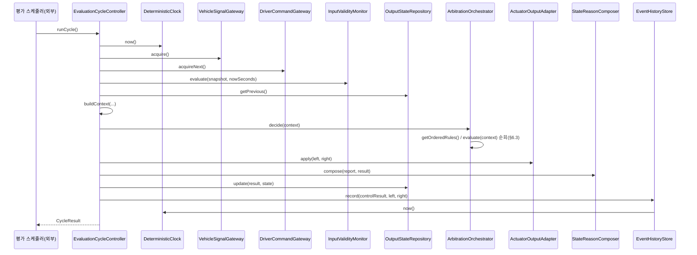
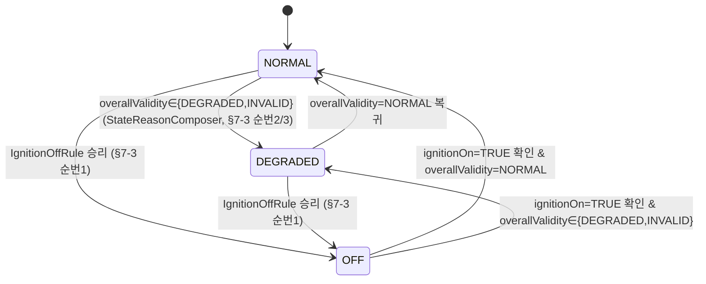
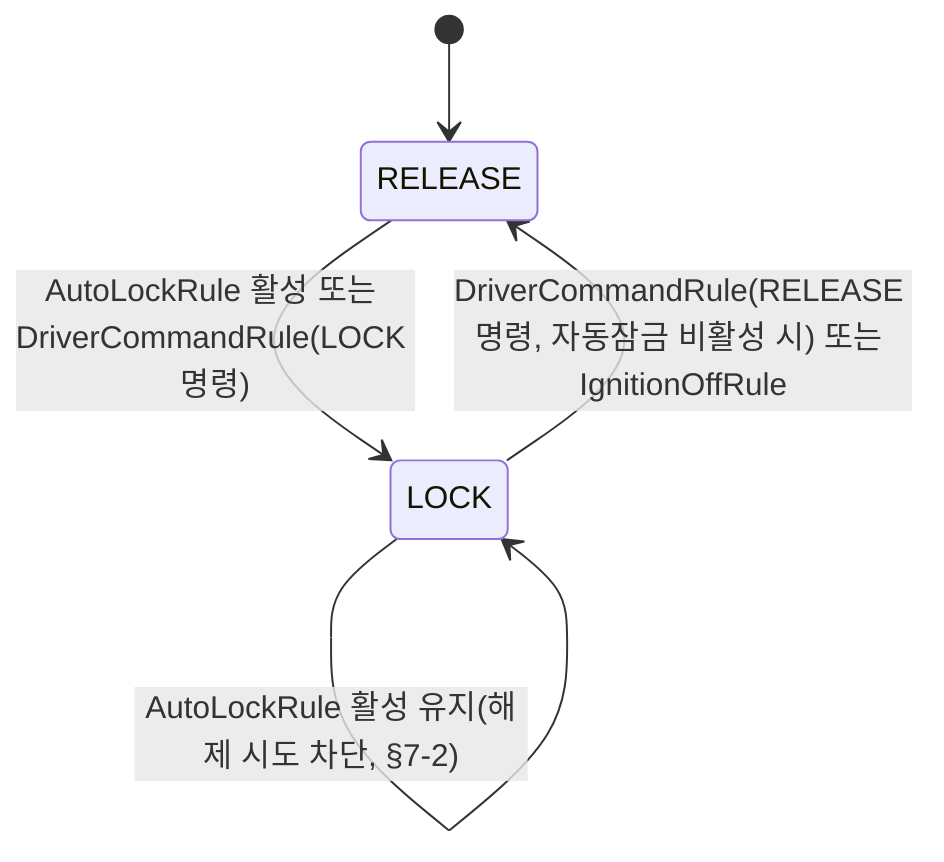

# SWD-001 SW 상세설계서 (Phase 1 — Core Input & Lock)

> ⚠️ 본 문서는 **교육용 가상 프로젝트 산출물**이다. 상위 입력인 `SWA-001_SW아키텍처설계서.md`
> (Rev 1.1), `SWR-001_SW요구사항명세서.md`(Rev 1.0), `UC-001_UseCase명세서.md`(Rev 1.0)를
> 근거로 작성되었으며, 실제 현대자동차·Tesla 또는 다른 제작사의 사양을 나타내지 않는다.
> HARA/ASIL 도출 근거를 재구성하지 않고, 준수·적합성평가·인증을 주장하지 않는다.
> **문서 상태: 미승인(Draft) — 실제 승인 미수행.**
>
> ⚠️ **공식 템플릿 저작권 고지**: 공식 상세설계서 템플릿(`WP_Templates/Engineering/
> SoftwareDetailedDesignAndUnitConstruction/TPL-SWE3-001_*.docx`)은 "SW 품질교육을 위한
> 교육용 샘플"이며 저작권이 Synetics에 있다. 이번 작업 지시는 Phase 종료 시 공식
> docx/xlsx/drawio로 변환하기로 확정한 기존 프로젝트 결정에 따라 `.md`로 작성하도록
> 명시적으로 지정했으므로 원본 템플릿 파일 자체는 수정/복제하지 않았다. 본 문서의 장 구조는
> `.claude/skills/detailed-design/references/detailed-design-template.md`가 요약한 15개 절
> 구조를 그대로 따른다(원본 템플릿 열람 없이 그 요약에 근거).

## 문서 통제

| 항목 | 값 |
|---|---|
| 문서 ID / 문서명 | SWD-001_SW상세설계서 |
| Revision | 1.0 (Phase 1 baseline) |
| 프로세스 | SWE.3 소프트웨어 상세설계 및 단위 구현 |
| 상위 입력 | SWA-001(Rev 1.1), SWR-001(Rev 1.0), UC-001(Rev 1.0), CLAUDE.md(구현 지침) |
| 베이스라인(목표) | BL-SWD-1.0 (G3 상세설계 게이트, 미도달) |
| 작성 조직 | Volsojoda(가상 공급자) 상세설계 담당 |
| 작성일 | 2026-09-18 |
| 문서 상태 | 교육 시나리오 초안 — 실제 승인 미수행 |
| 적용 범위 | Phase 1 완전 상세설계: DES-001~014, DES-016. Phase 2 통합 자리(무결정 스텁): DES-018~022. 제외(Phase 3): DES-015, DES-017 |

### 변경 이력

| 버전 | 일자 | 변경 내용 | 변경자 |
|---|---|---|---|
| 1.0 | 2026-09-18 | 최초 작성. Phase1 DES-001~014/016 완전 상세설계, DES-018~022 무결정 스텁 설계, DES-015/017 제외 | detailed-design 서브에이전트 |

### 작성-검토-승인 상태

| 역할 | 담당(가상) | 상태 |
|---|---|---|
| 작성 | detailed-design 서브에이전트 | 완료(초안) |
| 검토 | 미지정 | 미수행 |
| 승인 | OEM-A SW Requirements Owner(가상) | 미수행 |

---

## 1. 목적 및 적용범위

### 1.1 목적

`SWA-001`이 정의한 Phase1 대상 아키텍처 요소(DES-001~014, DES-016) 및 Phase2/3 통합 자리
(DES-018~022 스텁)를 구현 가능한 수준(모듈/클래스/함수, 호출관계, 함수 계약, 알고리즘,
상태전이, 오류처리)까지 구체화하여, 이어지는 `coding` 서브에이전트가 TDD(`tdd` 스킬,
`unittest`)로 그대로 구현할 수 있도록 한다.

### 1.2 적용 제품/컴포넌트/생명주기 단계

- 적용 제품: 전자식 차일드락 제어 SW(후석 좌/우), Phase 1(입력처리·기본 잠금/해제) 범위.
- 적용 생명주기 단계: SWE.3(본 문서) → 이후 SWE.4(단위검증, `coding`/`tdd` 스킬이 겸함).
- 실행 언어/환경: Python 3.14, 단일 프로세스, PC/SIL 참조 구현. RTOS/HIL/실차/타깃 ECU는
  범위 밖(SWA-001 §1.2 승계).

### 1.3 적용 경계 (포함/제외)

| 구분 | 대상 |
|---|---|
| **완전 상세설계** | DES-001 VehicleSignalGateway, DES-002 DriverCommandGateway, DES-003 InputValidityMonitor(ASIL B), DES-004 DeterministicClock(ASIL B 수준 개발), DES-005 OutputStateRepository, DES-006 RulePriorityRegistry, DES-007 IgnitionOffRule, DES-008 AutoLockRule, DES-009 DriverCommandRule, DES-010 HoldLastOutputRule, DES-011 ArbitrationOrchestrator, DES-012 ActuatorOutputAdapter, DES-013 StateReasonComposer, DES-014 EventHistoryStore, DES-016 EvaluationCycleController |
| **무결정(None) 스텁만** | DES-018 CollisionOverrideRule, DES-019 ApproachRiskSuppressionRule, DES-020 ForceReleaseRule, DES-021 ForceLockRule, DES-022 SensorFaultHoldRule — 모두 `IPriorityRule` 구현, `evaluate()`가 항상 `None` 반환. 로직은 Phase2 상세설계에서 채움(SWA-001 §9.2 통합순서 13단계 근거) |
| **이번 개정 제외(Phase3)** | DES-015 DisplayQueryService, DES-017 WebSimulatorAdapter — 본 문서에서 다루지 않음 |

### 1.4 CLAUDE.md 품질 지표 (본 문서 전반에 적용되는 설계 제약)

| 지표 | 기준 | 본 문서에서의 적용 |
|---|---|---|
| 함수 순수코드라인(NLOC) | ≤ 50 | §5 모든 함수 계약을 이 한도 내에서 구현 가능하도록 헬퍼 함수 단위로 분해(§2, §6) |
| 순환복잡도(CCN) | ≤ 10 (ASIL B 컴포넌트 DES-003/004는 자체 목표 CCN ≤ 4~6로 더 엄격히 관리 — §11) | 분기표/딕셔너리 디스패치로 if-elif 사슬을 최소화(§6) |
| 중복 코드 | 7라인까지 허용(8라인 이상 금지) | 신호별 검증·side 매핑 등 반복 패턴은 공통 헬퍼/딕셔너리로 추출(§4, §6) |
| Doxygen 주석 비율 | ≥ 20% | §5 함수 계약을 그대로 `@pre`/`@post`/`@throws` 주석으로 옮겨적음(§11) |
| 식별자 | 3글자 이상, camelCase(클래스는 PascalCase) | §2~§8 전체 식별자에 적용(§4 명명 규칙 결정 근거 포함) |

---

## 2. 모듈 분해

### 2.1 패키지 구조 및 근거

패키지명 `childlock`을 채택한다(도메인명 "전자식 차일드락 제어"를 그대로 반영, 프로젝트에
유사 명칭 충돌 없음을 `Glob`으로 확인). 하위 패키지는 `SWA-001` §3.1의 계층 구조(입력수집·
검증 → 판정 → 출력/발행, 횡단 관심사)를 그대로 반영해 응집도를 유지한다.

```
src/childlock/
├── common/
│   └── dataTypes.py            # UNIT-001: 공통 DTO/열거형
├── interfaces/
│   ├── acquisitionInterfaces.py  # UNIT-002: AIF-001/002/003
│   ├── decisionInterfaces.py     # UNIT-003: AIF-004/005/006/013/014
│   ├── outputInterfaces.py       # UNIT-004: AIF-007/008/009/010
│   ├── infraInterfaces.py        # UNIT-005: AIF-012/016
│   └── controlInterfaces.py      # UNIT-006: AIF-015
├── acquisition/
│   ├── vehicleSignalGateway.py    # UNIT-007 (DES-001)
│   ├── driverCommandGateway.py    # UNIT-008 (DES-002)
│   └── inputValidityMonitor.py    # UNIT-009 (DES-003, ASIL B)
├── infra/
│   ├── deterministicClock.py      # UNIT-010 (DES-004, ASIL B 수준 개발)
│   └── outputStateRepository.py   # UNIT-011 (DES-005)
├── decision/
│   ├── rulePriorityRegistry.py    # UNIT-012 (DES-006)
│   ├── arbitrationOrchestrator.py # UNIT-017 (DES-011)
│   └── rules/
│       ├── ignitionOffRule.py            # UNIT-013 (DES-007)
│       ├── autoLockRule.py               # UNIT-014 (DES-008)
│       ├── driverCommandRule.py          # UNIT-015 (DES-009)
│       ├── holdLastOutputRule.py         # UNIT-016 (DES-010)
│       ├── collisionOverrideRule.py      # UNIT-022 (DES-018, 스텁)
│       ├── approachRiskSuppressionRule.py# UNIT-023 (DES-019, 스텁)
│       ├── forceReleaseRule.py           # UNIT-024 (DES-020, 스텁)
│       ├── forceLockRule.py              # UNIT-025 (DES-021, 스텁)
│       └── sensorFaultHoldRule.py        # UNIT-026 (DES-022, 스텁)
├── output/
│   ├── actuatorOutputAdapter.py   # UNIT-018 (DES-012)
│   ├── stateReasonComposer.py     # UNIT-019 (DES-013)
│   └── eventHistoryStore.py       # UNIT-020 (DES-014)
└── control/
    └── evaluationCycleController.py # UNIT-021 (DES-016)
```

선정 근거:
- `decision/rules/` 하위에 규칙 파일을 모아 OCP를 물리적으로도 지원한다(Phase2 규칙 추가 시
  이 디렉터리에 새 파일만 추가하면 되고, `arbitrationOrchestrator.py`/`rulePriorityRegistry.py`는
  무수정).
- `interfaces/`를 별도 패키지로 분리해 DIP를 코드 구조로도 강제한다(상위 정책 모듈이
  `interfaces/*`만 import하고, 구체 구현은 조립 시점에만 참조).
- `common/dataTypes.py`를 단일 모듈로 유지한 이유: DTO 간 상호 참조(예: `ArbitrationResult`가
  `LockState`를 사용)가 많아 순환 import 위험을 원천 차단하기 위함(응집도보다 순환 방지를
  우선한 의도적 트레이드오프, §11에서 재확인).

### 2.2 조립(합성 루트) — 구현 경계 메모

`EvaluationCycleController`(DES-016) 자체는 "실행 순서 조율"만 책임지며, 각 구현 객체를
직접 생성하지 않는다(DIP). 실제 객체 그래프 조립(예: `VehicleSignalGateway()`,
`DeterministicClock(testModeEnabled=...)` 등을 생성해 `EvaluationCycleController`에 주입)은
`SWA-001`에 DES ID가 없는 애플리케이션 진입점 코드이며, 본 문서의 요구사항 배분 대상이
아니다(§13 구현 경계에서 재확인). 잠정 위치: `src/childlock/app/compositionRoot.py`
(테스트 하네스/향후 SIL 러너가 사용, UNIT ID 미부여 — 순수 배선 코드).

### 2.3 모듈 분해 표 (UNIT-nnn)

| UNIT ID | 클래스/모듈 | DES ID | 책임(단일 문장, SRP 근거) | 소스 위치 |
|---|---|---|---|---|
| UNIT-001 | 공통 DTO/열거형 모듈 | (공통, 전 DES 사용) | 전 컴포넌트가 공유하는 불변 데이터 구조·열거형만 정의(판단 로직 없음) | `src/childlock/common/dataTypes.py` |
| UNIT-002 | 입력수집 인터페이스(AIF-001/002/003) | (공통) | 입력수집 계층의 계약(ABC)만 정의 | `src/childlock/interfaces/acquisitionInterfaces.py` |
| UNIT-003 | 판정 인터페이스(AIF-004/005/006/013/014) | (공통) | 판정 계층의 계약만 정의 | `src/childlock/interfaces/decisionInterfaces.py` |
| UNIT-004 | 출력 인터페이스(AIF-007/008/009/010) | (공통) | 출력 계층의 계약만 정의 | `src/childlock/interfaces/outputInterfaces.py` |
| UNIT-005 | 인프라 인터페이스(AIF-012/016) | (공통) | 시계 계약만 정의 | `src/childlock/interfaces/infraInterfaces.py` |
| UNIT-006 | 제어 인터페이스(AIF-015) | (공통) | 평가주기 실행 계약만 정의 | `src/childlock/interfaces/controlInterfaces.py` |
| UNIT-007 | `VehicleSignalGateway` | DES-001 | Vehicle 원시 신호(외부 snake_case 계약)를 내부 `RawVehicleSnapshot`(camelCase)으로 어댑팅한다 | `src/childlock/acquisition/vehicleSignalGateway.py` |
| UNIT-008 | `DriverCommandGateway` | DES-002 | 4-source 명령을 큐잉·필드검증하여 `ValidatedCommand`/거절을 산출한다 | `src/childlock/acquisition/driverCommandGateway.py` |
| UNIT-009 | `InputValidityMonitor` | DES-003(ASIL B) | 대상 입력의 형식/범위/freshness를 무상태로 재검증해 `ValidityReport`를 산출한다 | `src/childlock/acquisition/inputValidityMonitor.py` |
| UNIT-010 | `DeterministicClock` | DES-004(ASIL B 수준 개발) | 단조 증가 시각 소스를 제공하고, 테스트 모드에서만 고정/전진을 허용한다 | `src/childlock/infra/deterministicClock.py` |
| UNIT-011 | `OutputStateRepository` | DES-005 | 직전 side별 출력/시스템 상태 및 규칙별 스크래치 상태를 보관한다(순수 저장소) | `src/childlock/infra/outputStateRepository.py` |
| UNIT-012 | `RulePriorityRegistry` | DES-006 | 등록된 규칙의 고정 순회 순서를 제공한다(우선순위 변경의 유일 지점) | `src/childlock/decision/rulePriorityRegistry.py` |
| UNIT-013 | `IgnitionOffRule` | DES-007 | ignition-off 시 좌/우 RELEASE·OFF를 결정한다 | `src/childlock/decision/rules/ignitionOffRule.py` |
| UNIT-014 | `AutoLockRule` | DES-008 | 속도≥3km/h 활성 조건에서 좌/우 LOCK을 강제하고 해제를 차단한다 | `src/childlock/decision/rules/autoLockRule.py` |
| UNIT-015 | `DriverCommandRule` | DES-009 | 유효 명령을 선택된 side에만 적용한다 | `src/childlock/decision/rules/driverCommandRule.py` |
| UNIT-016 | `HoldLastOutputRule` | DES-010 | 직전 출력을 반환해 체인을 종결한다(터미널 기본값) | `src/childlock/decision/rules/holdLastOutputRule.py` |
| UNIT-017 | `ArbitrationOrchestrator` | DES-011 | 등록된 규칙을 고정 순서로 순회해 side별 최종 결정을 합성한다 | `src/childlock/decision/arbitrationOrchestrator.py` |
| UNIT-018 | `ActuatorOutputAdapter` | DES-012 | 최종 결정을 외부 Actuator model 계약으로 출력한다 | `src/childlock/output/actuatorOutputAdapter.py` |
| UNIT-019 | `StateReasonComposer` | DES-013 | `ValidityReport`+`ArbitrationResult`를 공개 `ControlResultRecord`로 축약한다 | `src/childlock/output/stateReasonComposer.py` |
| UNIT-020 | `EventHistoryStore` | DES-014 | 제어결정을 최근 100건 순환 보존(허용 필드만, 휘발성)한다 | `src/childlock/output/eventHistoryStore.py` |
| UNIT-021 | `EvaluationCycleController` | DES-016 | 매 평가주기 각 계층을 고정 순서로 호출하는 합성 루트(중재자) | `src/childlock/control/evaluationCycleController.py` |
| UNIT-022 | `CollisionOverrideRule`(스텁) | DES-018 | 항상 `None` 반환(Phase2 자리) | `src/childlock/decision/rules/collisionOverrideRule.py` |
| UNIT-023 | `ApproachRiskSuppressionRule`(스텁) | DES-019 | 항상 `None` 반환(Phase2 자리) | `src/childlock/decision/rules/approachRiskSuppressionRule.py` |
| UNIT-024 | `ForceReleaseRule`(스텁) | DES-020 | 항상 `None` 반환(Phase2 자리) | `src/childlock/decision/rules/forceReleaseRule.py` |
| UNIT-025 | `ForceLockRule`(스텁) | DES-021 | 항상 `None` 반환(Phase2 자리) | `src/childlock/decision/rules/forceLockRule.py` |
| UNIT-026 | `SensorFaultHoldRule`(스텁) | DES-022 | 항상 `None` 반환(Phase2 자리) | `src/childlock/decision/rules/sensorFaultHoldRule.py` |

응집도/SOLID 재확인(단위 수준): 모든 UNIT이 `cohesion-coupling-solid.md` 체크리스트를
만족한다 — 각 클래스가 "변경 사유 1개"만 가지며(예: UNIT-019는 IF-006 스키마 변경에만
반응, UNIT-020은 저장 정책 변경에만 반응), 규칙 UNIT(013~016, 022~026)은 서로 참조하지
않고 `RuleEvaluationContext`만 참조하는 순수 함수형이다(SWA-001 §3.3 승계).

---

## 3. 상세 호출관계

### 3.1 클래스 다이어그램 (Mermaid 초안 — 공식 산출물은 §0 방침에 따라 `.md` 유지)

```mermaid
classDiagram
  class IVehicleSignalAcquisition { <<interface>> +ingest(payload) +acquire() RawVehicleSnapshot }
  class IDriverCommandAcquisition { <<interface>> +submit(payload) +acquireNext() ValidatedCommand }
  class IInputValidityEvaluation { <<interface>> +evaluate(snapshot, nowSeconds) ValidityReport }
  class IArbitrationDecision { <<interface>> +decide(context) ArbitrationResult }
  class IPriorityRule { <<interface>> +evaluate(context) RuleDecision }
  class IOutputStateAccess { <<interface>> +getPrevious() +update(result, state) }
  class IRuleStateStore { <<interface>> +get(ruleKey) +set(ruleKey, value) }
  class IActuatorOutputSink { <<interface>> +apply(left, right) Ack }
  class IControlResultComposition { <<interface>> +compose(report, result) ControlResultRecord }
  class IEventHistoryRecording { <<interface>> +record(result, left, right) int }
  class IEventHistoryQuery { <<interface>> +query(limit) List }
  class IClockSource { <<interface>> +now() float }
  class IClockControl { <<interface>> +setFixed(t) +advance(delta) }
  class IRulePriorityRegistry { <<interface>> +getOrderedRules() List }
  class IEvaluationCycleControl { <<interface>> +runCycle() CycleResult }

  VehicleSignalGateway ..|> IVehicleSignalAcquisition
  DriverCommandGateway ..|> IDriverCommandAcquisition
  InputValidityMonitor ..|> IInputValidityEvaluation
  ArbitrationOrchestrator ..|> IArbitrationDecision
  IgnitionOffRule ..|> IPriorityRule
  AutoLockRule ..|> IPriorityRule
  DriverCommandRule ..|> IPriorityRule
  HoldLastOutputRule ..|> IPriorityRule
  CollisionOverrideRule ..|> IPriorityRule
  ApproachRiskSuppressionRule ..|> IPriorityRule
  ForceReleaseRule ..|> IPriorityRule
  ForceLockRule ..|> IPriorityRule
  SensorFaultHoldRule ..|> IPriorityRule
  OutputStateRepository ..|> IOutputStateAccess
  OutputStateRepository ..|> IRuleStateStore
  ActuatorOutputAdapter ..|> IActuatorOutputSink
  StateReasonComposer ..|> IControlResultComposition
  EventHistoryStore ..|> IEventHistoryRecording
  EventHistoryStore ..|> IEventHistoryQuery
  DeterministicClock ..|> IClockSource
  DeterministicClock ..|> IClockControl
  RulePriorityRegistry ..|> IRulePriorityRegistry
  EvaluationCycleController ..|> IEvaluationCycleControl

  EvaluationCycleController --> IVehicleSignalAcquisition
  EvaluationCycleController --> IDriverCommandAcquisition
  EvaluationCycleController --> IInputValidityEvaluation
  EvaluationCycleController --> IArbitrationDecision
  EvaluationCycleController --> IActuatorOutputSink
  EvaluationCycleController --> IControlResultComposition
  EvaluationCycleController --> IOutputStateAccess
  EvaluationCycleController --> IEventHistoryRecording
  EvaluationCycleController --> IClockSource
  ArbitrationOrchestrator --> IRulePriorityRegistry
  ArbitrationOrchestrator --> IPriorityRule
  ArbitrationOrchestrator --> IOutputStateAccess
  InputValidityMonitor --> IClockSource : (nowSeconds 매개변수로 전달받음, 직접 의존 아님)
  EventHistoryStore --> IClockSource
```



이 다이어그램은 §4 인터페이스 표(AIF-nnn)와 1:1 대응하며, 인터페이스 없는 컴포넌트 간
직접 연결이 없음을 확인했다(`interface-design.md` 체크리스트 충족).

### 3.2 평가주기 호출 순서 (시퀀스, `EvaluationCycleController.runCycle()` 내부)



---

## 4. 공통 자료형 (`UNIT-001`, `src/childlock/common/dataTypes.py`)

### 4.1 명명 규칙 설계 결정 (확인 필요 아님 — 지시사항 4번 직접 근거)

CLAUDE.md 구현 지침은 "함수명·변수명은 3글자 이상 camelCase"를 요구하며, 이번 작업 지시
4번은 "Python 관례(snake_case)와 다르더라도 그대로 낙타표기법을 적용하라"고 명시적으로
확정했다. 따라서 **DTO 필드명도 camelCase로 통일**한다(`vehicle_speed_kph` → `vehicleSpeedKph`
등). 단, 외부 계약(OEM-IF-001~009, IF-004, IF-005)의 실제 필드명은 OEM이 정의한 값 그대로
snake_case이므로, **외부 경계(Gateway의 `ingest`/`submit` 입력, Adapter의 `apply` 출력
payload)에서만 snake_case 딕셔너리 키를 사용**하고, 그 즉시 내부 camelCase DTO로 어댑팅한다.
이 경계는 정확히 DES-001/002(입력)와 DES-012(출력)의 SRP("어댑팅"이 곧 이 책임)와 일치하므로
설계 일관성이 있다.

### 4.2 열거형

| 열거형 | 값 | 비고 |
|---|---|---|
| `Side` | `LEFT`, `RIGHT`, `ALL` | 명령의 대상 side(OEM-IF-004 값 left/right/all과 매핑) |
| `LockState` | `LOCK`, `RELEASE` | 명령 action 및 출력 결정에 공용 사용(OEM-IF-004 lock/unlock, OEM-IF-005 LOCK/RELEASE와 매핑) |
| `CommandSource` | `PHYSICAL_BUTTON`, `AVN`, `VOICE`, `MOBILE_APP` | OEM-IF-004 source 값과 매핑 |
| `SignalValidity` | `NORMAL`, `DEGRADED`, `INVALID` | 우선순위(최악값): `INVALID` > `DEGRADED` > `NORMAL` |
| `SystemState` | `NORMAL`, `DEGRADED`, `OFF`, `FAULT` | `FAULT`는 Phase2(`SensorFaultHoldRule`)가 실제 로직을 채우기 전까지 Phase1에서는 결코 산출되지 않음(스텁이 항상 `None` 반환하므로) |

### 4.3 DTO (모두 `@dataclass(frozen=True)` — 불변, `RuleEvaluationContext`에도 동일 원칙 적용)

| 타입 | 필드(camelCase) | 불변조건 |
|---|---|---|
| `RawVehicleSnapshot` | `vehicleSpeedKph: Optional[float]`, `gear: Optional[str]`, `crashStatus: Optional[str]`, `rearLeftApproachRisk: Optional[bool]`, `rearRightApproachRisk: Optional[bool]`, `fireDetected: Optional[bool]`, `overtemperatureDetected: Optional[bool]`, `adultPresent: Optional[bool]`, `isofixLeft: Optional[bool]`, `isofixRight: Optional[bool]`, `ignitionOn: Optional[bool]`, `sensorFault: Optional[bool]`, `sourceTimestampS: Optional[float]` | 모든 필드 원시값 그대로 보관(형식 정규화·판단 금지 — DES-003 책임과 분리) |
| `SignalValidity` | (열거형, §4.2) | — |
| `ValidityReport` | `perSignal: Mapping[str, SignalValidity]`(12개 신호명 키 고정), `staleSignalNames: Tuple[str, ...]`, `invalidSignalNames: Tuple[str, ...]`, `overallValidity: SignalValidity` | `perSignal`은 12개 키를 항상 모두 포함(누락 금지) |
| `RawDriverCommand` | `side: Optional[str]`, `action: Optional[str]`, `source: Optional[str]`, `timestampS: Optional[float]` | 검증 전 원시 문자열 그대로 |
| `ValidatedCommand` | `side: Side`, `action: LockState`, `source: CommandSource`, `timestampS: float` | 검증 통과분만 생성 가능(생성자 호출 자체가 유효성의 증거) |
| `CommandRejection` | `reasonCode: str`(="INVALID_COMMAND" 고정), `raw: RawDriverCommand` | — |
| `PreviousOutputSnapshot` | `leftState: LockState`, `rightState: LockState`, `systemState: SystemState` | `IOutputStateAccess.getPrevious()` 반환 타입 |
| `RuleEvaluationContext` | `validatedSnapshot: RawVehicleSnapshot`, `validityReport: ValidityReport`, `command: Optional[ValidatedCommand]`, `previousOutput: PreviousOutputSnapshot`, `nowSeconds: float`, `ruleState: IRuleStateStore` | 불변 DTO, 모든 규칙에 동일 인스턴스 전달, 규칙이 이 값을 변경하지 않음(순수함수 전제) |
| `RuleDecision` | `left: Optional[LockState]`, `right: Optional[LockState]`, `reasonCode: str`, `priorityReason: str` | `left`/`right` 모두 `None`이면 "이 규칙은 무관"(사실상 `evaluate()`가 `None` 자체를 반환하는 것과 동치이므로, 규칙 구현체는 완전 무관 시 `None`을 반환하고, `RuleDecision`을 반환할 때는 최소 한 쪽이 `non-None`이어야 한다 — 불변조건) |
| `ArbitrationResult` | `left: LockState`, `right: LockState`, `winningRuleLeft: str`, `winningRuleRight: str`, `reasonCode: str`, `priorityReason: str` | `left`/`right`는 항상 확정값(미결정 없음) |
| `ControlResultRecord` | `state: SystemState`, `priorityReason: str`, `reasonCode: str`, `inputValidity: SignalValidity` | OEM-IF-006 데이터 계약과 필드명 의미 1:1(단, 내부 표현은 camelCase, §4.1) |
| `EventRecord` | `eventId: int`, `timestampS: float`, `lockLeft: LockState`, `lockRight: LockState`, `state: SystemState`, `reasonCode: str`, `inputValidity: SignalValidity` | 정확히 7개 필드(SWR-011 허용 필드 목록과 의미 1:1) — 필드를 추가하면 SWR-011 위반이므로 코드 리뷰 체크리스트(§11)에 "EventRecord 필드 수=7 유지" 항목을 둔다 |
| `CycleResult` | `timestampSeconds: float`, `controlResult: ControlResultRecord`, `eventId: int` | `IEvaluationCycleControl.runCycle()` 반환 타입(SWA-001에 세부 필드 미정의 — 본 문서에서 상세화, §15 확인 필요 없음: 저위험 보완) |
| `Ack` | `accepted: bool` | `IActuatorOutputSink.apply()` 반환 타입(Phase1은 항상 `True` — 실제 피드백 없음, SWR-001 범위외 승계) |

### 4.4 예약된 `reasonCode` 값 (전 컴포넌트 공용 상수)

| 값 | 의미 | 산출 컴포넌트 | 근거 |
|---|---|---|---|
| `"ignition_off"` | ignition-off로 인한 강제 해제 | `IgnitionOffRule` | SWR-020 수용기준의 리터럴 값 |
| `"AUTO_LOCK_SPEED"` | 자동 잠금 활성(해제 명령 없음) | `AutoLockRule` | SWR-003 수용기준의 리터럴 값 |
| `"RELEASE_BLOCKED_AUTO_LOCK"` | 자동 잠금 중 해제 명령 차단 | `AutoLockRule` | SWR-004 수용기준의 리터럴 값 |
| `"DRIVER_COMMAND_APPLIED"` | 유효 운전자 명령 적용 | `DriverCommandRule` | SWR-002는 리터럴 값을 지정하지 않아 본 상세설계에서 신설 |
| `"HOLD_LAST_OUTPUT"` | 상위 규칙 미결정으로 직전 출력 유지 | `HoldLastOutputRule` | 본 상세설계 신설 |
| `"INVALID_COMMAND"` | 명령 필드 유효성 실패로 거절 | `DriverCommandGateway` | SWR-001 수용기준의 리터럴 값 |
| `"STALE_INPUT"` | 대상 입력 freshness 상실(DEGRADED) | `StateReasonComposer` | SWR-013a 수용기준의 리터럴 값 — §7 결정표 및 **확인 필요 #1** 참고 |
| `"INVALID_INPUT"` | 대상 입력 형식/범위 오류(INVALID) | `StateReasonComposer` | SWR-013b 취지 반영, 리터럴 값 자체는 본 상세설계 신설 |
| `"CYCLE_ERROR"` | 평가주기 파이프라인 내부 예외로 인한 안전 열화 | `EvaluationCycleController` | AIF-015 오류 처리 정책의 구체화 |
| `"RULE_EVAL_ERROR"` | 개별 규칙 평가 중 예외(무결정 처리, 진단 전용) | `ArbitrationOrchestrator` | AIF-004 오류 처리 정책의 구체화 |

### 4.5 인터페이스(ABC) 매핑 — AIF-nnn ↔ Python 추상 클래스

| AIF ID | 인터페이스명(Python ABC) | 오퍼레이션 |
|---|---|---|
| AIF-001 | `IVehicleSignalAcquisition` | `ingest(payload: dict) -> None`, `acquire() -> RawVehicleSnapshot` |
| AIF-002 | `IDriverCommandAcquisition` | `submit(payload: dict) -> None`, `acquireNext() -> Optional[ValidatedCommand]` |
| AIF-003 | `IInputValidityEvaluation` | `evaluate(snapshot: RawVehicleSnapshot, nowSeconds: float) -> ValidityReport` |
| AIF-004 | `IArbitrationDecision` | `decide(context: RuleEvaluationContext) -> ArbitrationResult` |
| AIF-005 | `IPriorityRule` | `evaluate(context: RuleEvaluationContext) -> Optional[RuleDecision]` |
| AIF-006 | `IOutputStateAccess` | `getPrevious() -> PreviousOutputSnapshot`, `update(result: ArbitrationResult, state: SystemState) -> None`(§4.6 인터페이스 상세화 참고) |
| AIF-007 | `IActuatorOutputSink` | `apply(left: LockState, right: LockState) -> Ack` |
| AIF-008 | `IControlResultComposition` | `compose(report: ValidityReport, result: ArbitrationResult) -> ControlResultRecord` |
| AIF-009 | `IEventHistoryRecording` | `record(result: ControlResultRecord, left: LockState, right: LockState) -> int`(§4.6 인터페이스 상세화 참고) |
| AIF-010 | `IEventHistoryQuery` | `query(limit: int) -> List[EventRecord]` |
| AIF-012 | `IClockSource` | `now() -> float` |
| AIF-013 | `IRuleStateStore` | `get(ruleKey: str) -> Any`, `set(ruleKey: str, value: Any) -> None` |
| AIF-014 | `IRulePriorityRegistry` | `getOrderedRules() -> List[IPriorityRule]` |
| AIF-015 | `IEvaluationCycleControl` | `runCycle() -> CycleResult` |
| AIF-016 | `IClockControl` | `setFixed(targetSeconds: float) -> None`, `advance(deltaSeconds: float) -> None` |

> AIF-011(`IControlResultQuery`, DES-015 Phase3)은 이번 개정 제외 대상이므로 본 문서에서
> 다루지 않는다(§1.3).

### 4.6 상세설계 단계에서 보완한 인터페이스 시그니처 (설계 보완 사항, "확인 필요" 아님)

`SWA-001`의 AIF-006/AIF-009 시그니처를 상세화하는 과정에서 두 가지 입력 누락을 발견해
아래와 같이 보완했다(값 자체가 아니라 **누가 이미 알고 있는 값을 한 번 더 전달하는** 배선
문제이므로 아키텍처 재설계가 아니라 SWE.3 수준의 보완으로 처리했다):

1. **`IOutputStateAccess.update`**: `SWA-001` §4.2는 `update(ArbitrationResult)`로만 정의했으나,
   `getPrevious()`가 반환해야 하는 `PreviousOutputSnapshot`에는 `systemState`도 포함되어
   있고(§4.1 `AIF-006` 정의), `ArbitrationResult`에는 `state` 필드가 없다(`state`는
   `StateReasonComposer`가 계산). 따라서 `update(result: ArbitrationResult, state: SystemState)`로
   매개변수를 추가했다. `EvaluationCycleController`는 `compose()` 호출 **이후**에 `update()`를
   호출하도록 순서를 확정한다(§3.2 시퀀스, §6.5).
2. **`IEventHistoryRecording.record`**: `SWA-001` §4.2는 `record(ControlResultRecord)`로만
   정의했으나, SWR-011의 허용 필드 목록에는 `lock_left`/`lock_right`가 포함되고
   `ControlResultRecord`(OEM-IF-006 계약)에는 그 필드가 없다. 따라서
   `record(result: ControlResultRecord, left: LockState, right: LockState) -> int`로
   매개변수를 추가했다.

> 이 두 보완 사항은 `SWA-001` 개정 시 §4.2 표에 반영할 것을 권고한다(문서 부채로 기록,
> 최종 보고 참고).

---

## 5. 핵심 함수 계약

이하 표는 클래스별 공개 오퍼레이션의 계약이다. 사전조건/사후조건은 `RuleEvaluationContext`
등 §4의 불변조건을 전제로 하며 중복 서술하지 않는다. 모든 함수는 CLAUDE.md 네이밍 규칙
(3글자 이상 camelCase)을 따르고, 비공개 헬퍼도 언더스코어 접두어를 쓰지 않는다(`.pylintrc`
정규식이 소문자 시작만 허용하므로 언더스코어 접두어와 충돌 — §11에서 재확인). 비공개 헬퍼는
"내부 전용(모듈 밖 호출 금지)"을 Doxygen 주석으로 표기하는 것으로 구분한다.

### 5.1 `VehicleSignalGateway` (UNIT-007, DES-001)

| 함수 | 사전조건 | 사후조건 | 부작용 | 예외 | 시간제약 |
|---|---|---|---|---|---|
| `ingest(payload: dict) -> None` | 없음(`payload`가 `None`이어도 허용 — 아래 `mapRawPayloadToSnapshot`이 방어) | 내부 `latestSnapshot`이 이번 `payload`로부터 매핑된 `RawVehicleSnapshot`으로 갱신됨(최신값만 유지, 이전 값 폐기) | 인스턴스 상태(`latestSnapshot`) 변경 | 없음(모든 키 누락/타입 불일치는 `None`으로 흡수) | 평가주기당 최대 1회 가정, O(13) |
| `acquire() -> RawVehicleSnapshot` | 없음(방어적으로 `ingest` 미호출 시에도 안전 반환) | `ingest`가 1회 이상 호출됐으면 그 결과 반환, 없으면 전 필드 `None`인 기본 `RawVehicleSnapshot` 반환(안전한 열화 — INVALID로 이어짐, §10) | 없음(읽기 전용) | 없음 | O(1) |
| `mapRawPayloadToSnapshot(payload: dict) -> RawVehicleSnapshot`(내부 전용) | 없음 | 외부 snake_case 키(§6.1 매핑표)를 내부 camelCase 필드로 변환, 누락/타입 불일치 키는 `None` | 없음 | 없음(타입 변환 실패는 `None`으로 대체, try/except로 흡수) | O(13) |

### 5.2 `DriverCommandGateway` (UNIT-008, DES-002)

| 함수 | 사전조건 | 사후조건 | 부작용 | 예외 | 시간제약 |
|---|---|---|---|---|---|
| `submit(payload: dict) -> None` | 없음 | `RawDriverCommand`로 어댑팅 후 스레드 안전 큐(`queue.Queue`, unbounded)에 적재 | 큐 상태 변경(여러 스레드에서 동시 호출 가능, `queue.Queue` 자체가 스레드 안전) | 없음 | 여러 채널 동시 호출 허용(AIF-002) |
| `acquireNext() -> Optional[ValidatedCommand]` | 없음 | 큐가 비어있으면 `None`. 큐에 항목이 있으면 정확히 1건을 꺼내 필드검증(§6.2) 후, 유효하면 `ValidatedCommand`, 무효면 `CommandRejection`을 내부 로그에 추가하고 `None` 반환 | 큐에서 1건 제거, `rejectionLog`(내부 진단 리스트, 최대 100건 순환) 갱신 가능 | 없음 | 평가주기당 최대 1회 호출 가정(SWR-002 "1개 명령/주기"와 일치), O(1) |
| `validateCommandFields(raw: RawDriverCommand) -> Optional[ValidatedCommand]`(내부 전용) | 없음 | 유효하면 `ValidatedCommand`, 무효(필드 누락/미등록 값)면 `None` | 없음 | 없음 | O(1), 딕셔너리 조회 기반 |
| `getRejectionLog() -> Tuple[CommandRejection, ...]`(§13 확장, AIF-002 계약 외 테스트 편의 메서드) | 없음 | 내부 로그의 읽기 전용 스냅샷(불변 튜플) 반환 | 없음 | 없음 | O(n), n≤100 |

### 5.3 `InputValidityMonitor` (UNIT-009, DES-003, **ASIL B**)

| 함수 | 사전조건 | 사후조건 | 부작용 | 예외 | 시간제약 |
|---|---|---|---|---|---|
| `evaluate(snapshot: RawVehicleSnapshot, nowSeconds: float) -> ValidityReport` | `nowSeconds`는 `IClockSource.now()`의 단조 증가 값(AIF-012 계약) | 12개 대상 신호 전부에 대해 `SignalValidity` 산출, `overallValidity`=최악값. **어떤 입력 조합에도 예외를 던지지 않음**(AIF-003 안전 계약) | 없음(무상태 재계산, SWA-001 §7.3 FFI 근거) | **없음(설계 불변)** — 내부적으로 형식 검증 실패는 모두 `INVALID` 판정으로 흡수 | 평가주기당 1회, O(12), CCN 목표 ≤6(ASIL B 자체 기준, §11) |
| `checkSignalFormat(signalName: str, rawValue: Any) -> bool`(내부 전용) | 없음 | `signalName`에 등록된 검증기(§6.1 디스패치 표)로 형식/범위 판정 | 없음 | 없음(검증기 내부 `try/except (TypeError, ValueError)`로 흡수, 실패 시 `False`) | O(1) |
| `checkSignalFreshness(nowSeconds: float, sourceTimestampS: Optional[float]) -> bool`(내부 전용) | 없음 | `sourceTimestampS`가 `None`이면 `False`(신선하지 않음), 아니면 `(nowSeconds - sourceTimestampS) * 1000.0 <= 200.0` 여부 반환 | 없음 | 없음 | O(1) |
| `computeOverallValidity(perSignal: Mapping[str, SignalValidity]) -> SignalValidity`(내부 전용) | `perSignal`이 12개 키 모두 포함 | `INVALID`>`DEGRADED`>`NORMAL` 우선순위로 최악값 반환 | 없음 | 없음 | O(12) |

### 5.4 `DeterministicClock` (UNIT-010, DES-004, ASIL B 수준 개발)

| 함수 | 사전조건 | 사후조건 | 부작용 | 예외 | 시간제약 |
|---|---|---|---|---|---|
| `now() -> float` | 없음 | `testModeEnabled=True`면 `fixedTimeSeconds` 반환, 아니면 `time.monotonic()` 반환. 두 경우 모두 이전 호출값 이상(단조 증가) | 없음(읽기 전용) | 없음 | O(1), CCN 목표 ≤3 |
| `setFixed(targetSeconds: float) -> None` | `testModeEnabled=True` | `fixedTimeSeconds = targetSeconds`(호출 전 값보다 작으면 거부) | 상태 변경 | `RuntimeError`(테스트 모드 아닐 때 — AIF-016 오용 방지 가드, §10), `ValueError`(단조성 위반: `targetSeconds < fixedTimeSeconds`) | 테스트 하네스 전용, 운영 경로 호출 금지(설계 규칙+런타임 가드 이중화) |
| `advance(deltaSeconds: float) -> None` | `testModeEnabled=True`, `deltaSeconds >= 0` | `fixedTimeSeconds += deltaSeconds` | 상태 변경 | `RuntimeError`(테스트 모드 아닐 때), `ValueError`(`deltaSeconds < 0`) | 상동 |

### 5.5 `OutputStateRepository` (UNIT-011, DES-005)

| 함수 | 사전조건 | 사후조건 | 부작용 | 예외 | 시간제약 |
|---|---|---|---|---|---|
| `getPrevious() -> PreviousOutputSnapshot` | 없음 | 최초 호출(초기 기동) 시 `leftState=RELEASE, rightState=RELEASE, systemState=NORMAL`(안전 초기값, §8). 이후는 마지막 `update()` 결과 | 없음(읽기 전용) | 없음 | O(1) |
| `update(result: ArbitrationResult, state: SystemState) -> None` | 없음(§4.6 인터페이스 보완) | 다음 `getPrevious()` 호출이 이번 값을 반영 | 상태 변경 | 없음 | O(1), 단일 스레드 순차 접근 가정(AIF-006) |
| `get(ruleKey: str) -> Any` | 없음 | `ruleKey`가 없으면 `None` 반환(기본값) | 없음(읽기 전용) | 없음 | O(1) |
| `set(ruleKey: str, value: Any) -> None` | 없음 | 이후 동일 `ruleKey`의 `get()`이 `value` 반환 | 상태 변경(규칙별 독립 키 공간, ISP) | 없음 | O(1). Phase1 규칙은 미사용(순수함수), Phase2 타이머형 규칙 대비 |

### 5.6 `RulePriorityRegistry` (UNIT-012, DES-006)

| 함수 | 사전조건 | 사후조건 | 부작용 | 예외 | 시간제약 |
|---|---|---|---|---|---|
| `__init__(orderedRules: Sequence[IPriorityRule])` | `orderedRules`에 최소 1개 이상의 `IPriorityRule` 구현체 | 내부에 순서를 불변 튜플로 고정 저장 | 없음 | `ValueError`(빈 시퀀스) | 조립 시점 1회 |
| `getOrderedRules() -> List[IPriorityRule]` | 없음 | 항상 동일 순서의 리스트(방어적 복사본) 반환 | 없음 | 없음 | O(n), n=9(Phase1+스텁) |

### 5.7 Phase1 규칙 4종 (UNIT-013~016, DES-007~010) — 모두 `evaluate(context) -> Optional[RuleDecision]`

| 클래스 | 사전조건 | 사후조건 | 부작용 | 예외 | 시간제약 |
|---|---|---|---|---|---|
| `IgnitionOffRule` | 없음 | §6.2 알고리즘 참고. `ignitionOn` 검증 실패/미결정 시 `None`(직전 상태 유지에 위임, UC-03 E1과 일치) | 없음(순수 함수) | 없음 | O(1), CCN ≤3 |
| `AutoLockRule` | 없음 | §6.3 알고리즘 참고 | 없음 | 없음 | O(1), CCN ≤5 |
| `DriverCommandRule` | 없음 | §6.4 알고리즘 참고 | 없음 | 없음 | O(1), CCN ≤4 |
| `HoldLastOutputRule` | 없음 | 항상 `RuleDecision(left=previousOutput.leftState, right=previousOutput.rightState, reasonCode="HOLD_LAST_OUTPUT", priorityReason="hold_last_output")` 반환(`None` 반환 없음 — 터미널 규칙) | 없음 | 없음 | O(1), CCN=1 |

### 5.8 Phase2 자리 스텁 5종 (UNIT-022~026, DES-018~022)

| 함수 | 사전조건 | 사후조건 | 부작용 | 예외 | 시간제약 |
|---|---|---|---|---|---|
| `evaluate(context: RuleEvaluationContext) -> None` | 없음 | 항상 `None` 반환(무결정) — Phase1 동작에 영향 없음(SWA-001 §9.2 통합순서 13단계 근거) | 없음 | 없음 | O(1), CCN=1, NLOC≈2 |

### 5.9 `ArbitrationOrchestrator` (UNIT-017, DES-011)

| 함수 | 사전조건 | 사후조건 | 부작용 | 예외 | 시간제약 |
|---|---|---|---|---|---|
| `decide(context: RuleEvaluationContext) -> ArbitrationResult` | `priorityRegistry.getOrderedRules()`가 1개 이상 반환 | 좌/우 모두 확정값(미결정 없음 — `HoldLastOutputRule`이 항상 종결). `winningRuleLeft`/`winningRuleRight`에 결정한 규칙의 클래스명 기록 | 없음(자체는 무상태, 단 개별 규칙 예외를 `ruleErrorLog`에 기록) | **없음(밖으로 전파되는 예외 없음)** — 개별 규칙의 모든 예외를 내부에서 흡수(§6.5, §10) | 평가주기당 1회, 등록 규칙 수(9)에 선형, 양쪽 side 조기 확정 시 단락(short-circuit) |
| `evaluateSide(...)`, `mergeSideDecision(...)`, `resolveRepresentativeReason(...)`(내부 전용, §6.5) | — | — | — | — | NLOC 분산으로 `decide()` 본체 ≤50라인 유지 |
| `getRuleErrorLog() -> Tuple[Tuple[str, str], ...]`(진단 편의 메서드, AIF-004 계약 외) | 없음 | (규칙 클래스명, 예외 메시지) 튜플의 읽기 전용 스냅샷 | 없음 | 없음 | O(n) |

### 5.10 `ActuatorOutputAdapter` (UNIT-018, DES-012)

| 함수 | 사전조건 | 사후조건 | 부작용 | 예외 | 시간제약 |
|---|---|---|---|---|---|
| `__init__(outputChannel: Optional[Callable[[dict], None]] = None)` | 없음 | `outputChannel` 미지정 시 아무 동작 안 하는 기본 채널 사용(Phase1 PC/SIL, 실제 Actuator 하드웨어 범위 밖) | 없음 | 없음 | 조립 시점 1회 |
| `apply(left: LockState, right: LockState) -> Ack` | 없음 | `{lock_left: "LOCK"/"RELEASE", lock_right: ...}` 형태로 외부 채널에 전달, `Ack(accepted=True)` 반환(Phase1은 피드백 없음, SWR-001 범위외 승계) | 외부 채널 호출(로깅 등) | 없음(채널 예외는 호출자에게 전파하지 않고 무시 — "외부 미응답은 로직 출력을 되돌리지 않음", §10) | 평가주기당 1회 |

### 5.11 `StateReasonComposer` (UNIT-019, DES-013)

| 함수 | 사전조건 | 사후조건 | 부작용 | 예외 | 시간제약 |
|---|---|---|---|---|---|
| `compose(report: ValidityReport, result: ArbitrationResult) -> ControlResultRecord` | 없음 | §7 결정표에 따라 `state`/`reasonCode`/`priorityReason`/`inputValidity` 확정(순수 변환) | 없음 | 없음 | O(1) |
| `resolveSystemState(result, report) -> SystemState`(내부 전용) | — | §7 결정표 우선순위(OFF > DEGRADED > NORMAL) | 없음 | 없음 | O(1), CCN ≤3 |
| `resolveReasonAndPriority(state, report, result) -> Tuple[str, str]`(내부 전용) | — | §7 결정표(§4.4 확인 필요 #1 반영) | 없음 | 없음 | O(1), CCN ≤4 |

### 5.12 `EventHistoryStore` (UNIT-020, DES-014)

| 함수 | 사전조건 | 사후조건 | 부작용 | 예외 | 시간제약 |
|---|---|---|---|---|---|
| `record(result: ControlResultRecord, left: LockState, right: LockState) -> int` | 없음(§4.6 인터페이스 보완) | 새 `EventRecord`를 `deque(maxlen=100)`에 append(100건 초과 시 최고령 자동 제거, FIFO). `eventId`는 단조 증가 정수 반환 | 인스턴스 상태 변경, `IClockSource.now()` 호출 | 없음 | 평가주기당 1회, O(1) 상각(`deque` 특성) |
| `query(limit: int) -> List[EventRecord]` | `limit >= 0` | 최신순(내림차순) 최대 `limit`건 반환(불변 스냅샷 복사본) | 없음(읽기 전용) | `ValueError`(`limit < 0`) | 동시 호출 안전(불변 객체만 반환) |

### 5.13 `EvaluationCycleController` (UNIT-021, DES-016)

| 함수 | 사전조건 | 사후조건 | 부작용 | 예외 | 시간제약 |
|---|---|---|---|---|---|
| `runCycle() -> CycleResult` | 조립 시점에 모든 의존 인터페이스가 주입됨 | 1회 호출 = 1 평가주기 완주(입력수집→판정→출력→발행→기록). 파이프라인 내부 예외는 안전 열화로 흡수(§6.6, §10) | 하위 전 컴포넌트 호출(§3.2) | **없음(밖으로 전파되는 예외 없음)** — `handleCycleFailure()`가 모두 흡수 | **20 ms 고정 주기 내 완료**(SWA-001 §7.5 확정치) |
| `buildContext(...)`, `handleCycleFailure(errorInfo) -> CycleResult`(내부 전용, §6.6) | — | — | — | — | `runCycle()` 본체를 ≤50라인으로 유지하기 위한 분해 |

---

## 6. 핵심 알고리즘

### 6.1 `VehicleSignalGateway.mapRawPayloadToSnapshot` — 외부→내부 필드 매핑표

| 외부 키(payload, snake_case) | 내부 필드(camelCase) | 타입 |
|---|---|---|
| `vehicle_speed_kph` | `vehicleSpeedKph` | float |
| `gear` | `gear` | str |
| `source_timestamp_s` | `sourceTimestampS` | float |
| `crash_status` | `crashStatus` | str |
| `rear_left_approach_risk` | `rearLeftApproachRisk` | bool |
| `rear_right_approach_risk` | `rearRightApproachRisk` | bool |
| `fire_detected` | `fireDetected` | bool |
| `overtemperature_detected` | `overtemperatureDetected` | bool |
| `adult_present` | `adultPresent` | bool |
| `isofix_left` | `isofixLeft` | bool |
| `isofix_right` | `isofixRight` | bool |
| `ignition_on` | `ignitionOn` | bool |
| `sensor_fault` | `sensorFault` | bool |

의사코드:
```
function mapRawPayloadToSnapshot(payload):
    if payload is None:
        payload = {}
    values = {}
    for externalKey, internalName in FIELD_MAP.items():   # 위 표, 모듈 상수 딕셔너리
        values[internalName] = payload.get(externalKey)   # 없으면 None, 판단 없음
    return RawVehicleSnapshot(**values)
```
분기 없이 딕셔너리 순회만 사용(CCN=1) — "파싱/어댑팅만 수행, 판단 로직 없음"(DES-001 SRP)을
코드 구조로도 강제한다.

### 6.2 `DriverCommandGateway.validateCommandFields` — SWR-001 필드 검증

경계값/등가분할: `side`∈{"left","right","all"}, `action`∈{"lock","unlock"}(내부 `LockState.LOCK`/
`RELEASE`로 매핑), `source`∈{"physical_button","avn","voice","mobile_app"}. 4개 필드 중 하나라도
누락(`None`)이거나 위 집합에 없으면 무효.

```
function validateCommandFields(raw):
    if raw.side not in SIDE_MAP or raw.action not in ACTION_MAP
       or raw.source not in SOURCE_MAP or raw.timestampS is None:
        return None   # 무효 — 호출자가 CommandRejection 기록
    return ValidatedCommand(
        side=SIDE_MAP[raw.side], action=ACTION_MAP[raw.action],
        source=SOURCE_MAP[raw.source], timestampS=raw.timestampS)
```
정상 조합 4(source)×2(action)×3(side)=24가지, 오류주입 케이스(필드별 누락/미등록 값)는
SWR-001 검증 방법과 1:1 대응. 딕셔너리 기반 판정으로 CCN=2(단일 `if`) 유지.

### 6.3 `InputValidityMonitor.evaluate` — 신호별 형식/freshness 판정

**모니터링 대상 신호 12개**: `vehicleSpeedKph, gear, crashStatus, rearLeftApproachRisk,
rearRightApproachRisk, fireDetected, overtemperatureDetected, adultPresent, isofixLeft,
isofixRight, ignitionOn, sensorFault`(SWR-001 §5 데이터 사전 "freshness 규칙: SWR-013a
적용 대상"으로 명시된 신호 전량). **주의(확인 필요 #2)**: `SWA-001` §8.1은 이 신호 수를
"9"로 기재했으나 SWR-001 §5 데이터 사전을 직접 나열하면 12개다 — 본 상세설계는 상위
요구사항 문서(SWR-001)가 규범적이라고 판단해 **12개 전량**을 구현 대상으로 확정했다
(수치 불일치는 최종 보고 확인 필요 목록에 등재, 아키텍처 문서 정정 권고).

freshness 판정은 스냅샷 전체가 공유하는 단일 `sourceTimestampS` 하나만 사용한다(`SWA-001`
§4.1 `RawVehicleSnapshot` DTO가 신호별 개별 타임스탬프가 아니라 스냅샷당 1개의
`source_timestamp_s`만 정의하기 때문 — 이 설계 제약으로 인해 "입력 소스별 개별 정지
시나리오"는 Phase1 DTO 구조상 서로 다른 결과를 낼 수 없다. **확인 필요 #3**로 등재).

의사코드:
```
function evaluate(snapshot, nowSeconds):
    perSignal = {}
    for signalName in MONITORED_SIGNALS:                       # 12개, 상수 리스트
        rawValue = getattr(snapshot, signalName)
        formatOk = checkSignalFormat(signalName, rawValue)
        if not formatOk:
            perSignal[signalName] = INVALID
            continue
        freshOk = checkSignalFreshness(nowSeconds, snapshot.sourceTimestampS)
        perSignal[signalName] = NORMAL if freshOk else DEGRADED
    staleNames = [name for name, v in perSignal.items() if v == DEGRADED]
    invalidNames = [name for name, v in perSignal.items() if v == INVALID]
    overall = computeOverallValidity(perSignal)
    return ValidityReport(perSignal, tuple(staleNames), tuple(invalidNames), overall)
```

**경계값 처리 근거(SWR-013a 199/200/201/300/301ms)**: `checkSignalFreshness`는
`elapsedMs = (nowSeconds - sourceTimestampS) * 1000.0`을 계산해 `elapsedMs <= 200.0`이면
신선(NORMAL 후보), `> 200.0`이면 **그 즉시** DEGRADED로 판정한다(지연 없는 즉시 전이 전략).
이 전략은 "200ms 초과 후 100ms 이내 전이" 요구를 **최대 안전 여유**로 만족한다 — 검출과
동시에 전이하므로 지연은 항상 0에 가깝고(다음 20ms tick 이내), 100ms 예산을 절대 넘지
않는다. 경계 검증: 199ms→NORMAL, 200ms→NORMAL(`<=` 경계 포함, "초과"가 아니므로), 201ms→
DEGRADED, 300ms/301ms→DEGRADED(이미 전이됨). 이 전략은 타이머/래치 상태가 불필요해
`InputValidityMonitor`의 "무상태 재계산" 원칙(SWA-001 §7.3)과 정확히 부합한다.

`checkSignalFormat`은 신호명별 검증기 딕셔너리(예: `vehicleSpeedKph`→범위 0.0~300.0 float,
`gear`→{P,N,D,R}, `ignitionOn`/`sensorFault`/boolean류→`isinstance(v, bool)`,
`crashStatus`→{NONE,PENDING,CONFIRMED})로 디스패치해 긴 `if-elif` 사슬을 제거한다
(CCN 관리, §11).

### 6.4 `AutoLockRule.evaluate` — 활성조건 및 해제차단

```
function evaluate(context):
    validity = context.validityReport.perSignal["vehicleSpeedKph"]
    speed = context.validatedSnapshot.vehicleSpeedKph
    if validity != NORMAL or speed is None:
        return None   # 신뢰 불가 값으로는 활성 여부를 판단하지 않음(UC-04 E1, §7 결정표)
    if speed < 3.0:
        return None   # 자동 잠금 비활성
    blockingRelease = (context.command is not None
                        and context.command.action == LockState.RELEASE)
    reasonCode = "RELEASE_BLOCKED_AUTO_LOCK" if blockingRelease else "AUTO_LOCK_SPEED"
    return RuleDecision(left=LOCK, right=LOCK, reasonCode=reasonCode,
                         priorityReason="auto_lock_active")
```

- **경계값**: `speed == 3.0` → 활성(3km/h "이상"이므로 포함). `speed == 2.999...` → 비활성.
- **해제차단 판정 근거(SWR-004)**: 우선순위상 `AutoLockRule`이 `DriverCommandRule`보다
  먼저 평가되어(§7 표 7-1) 항상 양쪽 side를 LOCK으로 선점하므로, `DriverCommandRule`은
  이 평가주기에 호출되더라도 이미 결정된 side에 대해서는 오케스트레이터가 그 결과를 채택하지
  않는다(§6.5 병합 규칙, "선-결정 우선"). 이때 사유코드가 "해제 시도가 있었는지"를 반영하도록
  `context.command`를 직접 조회해 `RELEASE_BLOCKED_AUTO_LOCK`/`AUTO_LOCK_SPEED`를 구분한다
  (SWR-003과 SWR-004 수용기준을 모두 만족시키기 위한 설계 결정, §5.7 CCN ≤5로 검증 가능).

### 6.5 `ArbitrationOrchestrator.decide` — 규칙 순회/단락(short-circuit) 로직

```
function decide(context):
    orderedRules = priorityRegistry.getOrderedRules()
    leftDecision = None; rightDecision = None
    leftWinner = None; rightWinner = None
    leftReason = None; rightReason = None     # (reasonCode, priorityReason) 튜플
    leftRank = None; rightRank = None         # 결정한 규칙의 순회 인덱스(우선순위 비교용)

    for rank, rule in enumerate(orderedRules):
        if leftDecision is not None and rightDecision is not None:
            break                              # 단락: 양쪽 확정되면 이후 규칙 미호출
        decision = evaluateSide(rule, context)  # 예외 흡수 포함, §6.5.1
        if decision is None:
            continue
        if leftDecision is None and decision.left is not None:
            leftDecision, leftWinner, leftReason, leftRank = (
                decision.left, rule.__class__.__name__,
                (decision.reasonCode, decision.priorityReason), rank)
        if rightDecision is None and decision.right is not None:
            rightDecision, rightWinner, rightReason, rightRank = (
                decision.right, rule.__class__.__name__,
                (decision.reasonCode, decision.priorityReason), rank)

    # HoldLastOutputRule이 항상 마지막에 양쪽을 결정하므로 아래는 방어적 안전망(정상 경로 미도달)
    if leftDecision is None:
        leftDecision = context.previousOutput.leftState
        leftWinner = "FallbackHold"; leftReason = ("HOLD_LAST_OUTPUT", "hold_last_output")
    if rightDecision is None:
        rightDecision = context.previousOutput.rightState
        rightWinner = "FallbackHold"; rightReason = ("HOLD_LAST_OUTPUT", "hold_last_output")

    reasonCode, priorityReason = resolveRepresentativeReason(
        leftRank, rightRank, leftReason, rightReason)
    return ArbitrationResult(leftDecision, rightDecision, leftWinner, rightWinner,
                              reasonCode, priorityReason)
```

```
function evaluateSide(rule, context):     # 내부 전용, 예외 흡수(AIF-004 오류 처리)
    try:
        return rule.evaluate(context)
    except Exception as errorInfo:
        recordRuleError(rule.__class__.__name__, str(errorInfo))  # 진단 로그, reasonCode 미사용
        return None                       # "무결정"으로 간주, 다음 규칙 계속

function resolveRepresentativeReason(leftRank, rightRank, leftReason, rightReason):
    if leftRank is None: return rightReason
    if rightRank is None: return leftReason
    if leftRank <= rightRank: return leftReason   # 동률(같은 규칙이 양쪽 결정) 시 좌측 대표
    return rightReason
```

- **단락(short-circuit) 근거**: SWR-016(결정론적 재생)은 "순회 순서가 고정"되기만 하면
  만족되며, 조기 종료는 순서 자체를 바꾸지 않으므로 재현성을 해치지 않는다. 또한 §5.9 시간
  제약(20ms 예산의 일부)을 절약해 자원 여유를 키운다(SWA-001 §7.5 여유 배수와 정합).
  `SWA-001` §5.2 시퀀스 다이어그램(UC-03 사례)이 이미 이 단락 동작을 전제로 그려져 있다.
- **`resolveRepresentativeReason` 근거**: `SWA-001` §4.3은 "좌/우 중 더 높은 우선순위 규칙이
  승리한 쪽의 reason"을 `StateReasonComposer`의 축약 규칙으로 서술했으나, `ArbitrationResult`
  DTO 자체가 이미 단일 `reasonCode`/`priorityReason` 필드를 갖도록 정의되어 있어(§4.1),
  본 상세설계는 이 계산을 `ArbitrationOrchestrator`가 수행(우선순위 순서를 직접 알고 있는
  유일한 컴포넌트이므로)하고 `StateReasonComposer`는 그 값을 그대로 전달만 하는 것으로
  해석을 확정했다. 동률(같은 규칙이 양쪽을 동시에 결정, 예: `IgnitionOffRule`,
  `HoldLastOutputRule`)일 때는 결정론적 재현성을 위해 좌측을 대표로 채택한다(임의 규칙,
  근거는 재현성 확보 목적뿐).

### 6.6 `EvaluationCycleController.runCycle` — 파이프라인 및 예외 흡수

```
function runCycle():
    try:
        nowSeconds = clockSource.now()
        snapshot = vehicleGateway.acquire()
        command = commandGateway.acquireNext()
        report = validityMonitor.evaluate(snapshot, nowSeconds)
        previous = outputRepository.getPrevious()
        context = buildContext(snapshot, report, command, previous, nowSeconds)
        result = orchestrator.decide(context)
        actuatorAdapter.apply(result.left, result.right)
        controlResult = composer.compose(report, result)
        outputRepository.update(result, controlResult.state)
        eventId = eventStore.record(controlResult, result.left, result.right)
        return CycleResult(nowSeconds, controlResult, eventId)
    except Exception as errorInfo:
        return handleCycleFailure(errorInfo)

function buildContext(snapshot, report, command, previous, nowSeconds):
    return RuleEvaluationContext(snapshot, report, command, previous, nowSeconds,
                                  ruleState=outputRepository)   # IRuleStateStore 파사드

function handleCycleFailure(errorInfo):    # §10 오류 처리
    previous = outputRepository.getPrevious()     # 재조회 실패 가능성은 낮음(순수 저장소)
    fallbackResult = ControlResultRecord(state=DEGRADED, priorityReason=str(errorInfo),
                                          reasonCode="CYCLE_ERROR",
                                          inputValidity=DEGRADED)
    try:
        eventId = eventStore.record(fallbackResult, previous.leftState, previous.rightState)
    except Exception:
        eventId = -1        # 최후 방어선: 기록조차 실패해도 상위로 예외를 전파하지 않음
    return CycleResult(0.0, fallbackResult, eventId)
```

---

## 7. 정책 의사결정표

### 7-1. 평가주기 판정 우선순위 (SWR-001 §4.0 흐름도의 상세화, side별 독립 적용)

| 순번 | 조건(해당 side 기준) | 우선순위 | 기대 동작 | 충돌 시 해결 규칙 |
|---|---|---|---|---|
| 1 | `ignitionOn` 검증=NORMAL & 값=FALSE | 1(최상위) | 좌·우 모두 RELEASE, `reasonCode="ignition_off"` | SWR-020이 다른 모든 조건보다 우선(무조건) |
| 2 | (1 거짓) `vehicleSpeedKph` 검증=NORMAL & 값≥3km/h | 2 | 좌·우 모두 LOCK, `reasonCode`는 §6.4 참고 | 자동 잠금이 운전자 명령보다 우선(SWR-004) |
| 3 | (1,2 거짓) 유효 운전자 명령 존재(해당 side) | 3 | 선택 side만 명령 적용, `reasonCode="DRIVER_COMMAND_APPLIED"` | 선택되지 않은 side는 규칙 4로 이월 |
| 4 | (1,2,3 모두 거짓 또는 3에서 미선택 side) | 4(최하위, 항상 도달) | 직전 출력 유지, `reasonCode="HOLD_LAST_OUTPUT"` | 없음(터미널) |

**빠짐/모순 점검**: 4개 조건이 각 side에 대해 상호 배타적으로 전체 공간을 분할하며(1→2→3→4
순서로 소거), 4번이 모든 잔여 경우를 포괄하므로 정의되지 않은 조합이 없다. 서로 다른 행이
동일 조합에 다른 동작을 요구하는 모순도 없다(순번 자체가 우선순위이며 §6.5의 "선-결정
우선" 병합 규칙으로 실행 시에도 동일하게 보장됨).

### 7-2. `AutoLockRule` reasonCode 세부 결정

| 조건: `context.command`가 RELEASE를 요청 | 기대 `reasonCode` | 근거 |
|---|---|---|
| 예 | `RELEASE_BLOCKED_AUTO_LOCK` | SWR-004 수용기준 |
| 아니오(명령 없음 또는 LOCK 명령) | `AUTO_LOCK_SPEED` | SWR-003 수용기준 |

빠짐 없음(이진 조건, 2행으로 전체 공간 포괄).

### 7-3. `StateReasonComposer` state/reasonCode 결정 (**확인 필요 #1** 포함)

| 순번 | 조건 | 우선순위 | `state` | `reasonCode`/`priorityReason` |
|---|---|---|---|---|
| 1 | 승리 규칙(`winningRuleLeft` 또는 `winningRuleRight`) == `IgnitionOffRule` | 1 | `OFF` | `ArbitrationResult.reasonCode`/`priorityReason` 그대로(="ignition_off") |
| 2 | (1 거짓) `overallValidity == DEGRADED` | 2 | `DEGRADED` | `"STALE_INPUT"` / `",".join(staleSignalNames)` — **확인 필요 #1**(아래) |
| 3 | (1,2 거짓) `overallValidity == INVALID` | 3 | `DEGRADED`(SWR-001 §4.3 상태 머신에 INVALID 전용 상태가 없어 DEGRADED에 포함) | `"INVALID_INPUT"` / `",".join(invalidSignalNames)` |
| 4 | (1,2,3 모두 거짓, 즉 `overallValidity == NORMAL`) | 4 | `NORMAL` | `ArbitrationResult.reasonCode`/`priorityReason` 그대로 |

**빠짐/모순 점검**: `state`는 "OFF 여부"×"validity 3값" 조합(총 6가지)을 4행으로 포괄하되,
OFF 우선순위가 최상위이므로 OFF일 때는 validity 값과 무관하게 1행으로 수렴한다(중복이지
모순은 아님 — SWR-001 §4.3 상태 머신이 `DEGRADED→OFF` 전이를 명시적으로 허용하므로 정합).

> **확인 필요 #1(최우선)**: `SWA-001` §4.3은 "`reason_code`/`priority_reason`은 항상
> `ArbitrationResult`(즉 승리한 규칙)의 값"이라고 명시했으나, `SWR-013a`의 수용기준은
> "state=DEGRADED로 전이하고 **reason_code=STALE_INPUT**과 대상 입력명이 기록된다"를
> 명시적으로 요구한다. 두 상위 문서가 서로 다른 소스에서 `reasonCode`를 가져오라고
> 요구하는 **문서 간 불일치**이며, 본 상세설계는 SWR-013a의 리터럴 수용기준을 우선해
> 위 표 순번 2/3(검증 실패 시 STALE_INPUT/INVALID_INPUT으로 재정의)로 잠정 구현했다.
> **`SWA-001` 개정 또는 사용자 확정이 필요**하다(최종 보고 확인 필요 목록 참고).

---

## 8. 상태전이 상세

### 8.1 시스템 상태(`SystemState`) 머신

- **저장 위치**: `OutputStateRepository.systemState`(private 필드), `getPrevious()`로 조회.
- **전이 함수**: `StateReasonComposer.resolveSystemState()`(§5.11, §7-3)가 매 평가주기 새 상태를
  계산하고, `EvaluationCycleController.runCycle()`이 `outputRepository.update(result, state)`로
  반영한다(다음 주기의 `getPrevious()`에 즉시 반영, 지연 없음).
- **이벤트/가드**: §7-3 결정표(1~4행)가 가드 조건이며, 별도 이벤트 객체 없이 매 평가주기
  전량 재계산한다(타이머 래치 없음 — §6.3의 "즉시 전이" 전략과 일관).
- **타이머**: 없음(Phase1). Phase2(`ApproachRiskSuppressionRule`의 10초 override 등)에서
  `IRuleStateStore`(AIF-013)를 통해 타이머형 상태를 도입할 예정(SWA-001 §7.5 마지막 단락,
  스텁 단계에서는 미사용).
- **초기화**: 프로세스 기동 시 `OutputStateRepository.__init__()`이 `systemState=NORMAL`로
  초기화한다(안전 초기값 — 최초 평가주기 종료 즉시 실제 값으로 재계산되므로 임시값의
  안전 영향은 없음).



### 8.2 side별 잠금 상태(`LockState`) 머신 (좌/우 독립, 동일 구조)

- **저장 위치**: `OutputStateRepository.leftState`/`rightState`.
- **전이 함수**: `ArbitrationOrchestrator.decide()`(§6.5)가 계산, `EvaluationCycleController`가
  `outputRepository.update()`로 반영.
- **가드**: §7-1 결정표.
- **초기화**: `RELEASE`(안전 초기 상태, SWA-001 §4.2 AIF-006 postcondition 승계).



---

## 9. Web 및 API 상세

**해당 없음.** Phase1 상세설계 대상(DES-001~014, DES-016)에는 Web/HTTP API가 없다.
`DisplayQueryService`(DES-015)와 `WebSimulatorAdapter`(DES-017)가 API 경계를 제공할
예정이나 둘 다 Phase3 대상으로 본 개정에서 제외했다(§1.3).

---

## 10. 오류와 방어 동작

| 오류/실패 유형 | 발생 위치 | 검출 | 처리 | 기록 | 복구 |
|---|---|---|---|---|---|
| 명령 필드 유효성 실패(AIF-002) | `DriverCommandGateway.acquireNext` | §6.2 딕셔너리 조회 실패 | 해당 명령 폐기, `None` 반환(호출자는 "명령 없음"으로 처리 — 정상 경로와 동일하게 취급, 예외 없음) | `getRejectionLog()`에 `CommandRejection(reasonCode="INVALID_COMMAND", raw)` 추가 | 다음 평가주기 다음 큐 항목으로 자동 진행 |
| 입력 형식/범위 오류(AIF-003, SWR-013b) | `InputValidityMonitor.checkSignalFormat` | 신호별 검증기, `try/except (TypeError, ValueError)`로 타입 불일치도 흡수 | 해당 신호 `INVALID`로 표시, **예외를 던지지 않음**(AIF-003 설계 불변) | `ValidityReport.invalidSignalNames`에 포함 | 다음 평가주기 재검사(무상태) |
| 입력 freshness 상실(AIF-003, SWR-013a) | `InputValidityMonitor.checkSignalFreshness` | 경과시간 계산 | 해당 신호 `DEGRADED`, 시스템 `state=DEGRADED`로 즉시 전이(§6.3) | `ValidityReport.staleSignalNames`, `reasonCode="STALE_INPUT"` | 갱신 재개 시 다음 평가주기 `NORMAL` 복귀 |
| 개별 규칙 평가 중 예외(AIF-004) | `ArbitrationOrchestrator.evaluateSide` | `try/except Exception`(의도적으로 넓은 캐치 — 안전 열화가 개별 규칙 버그로 전체 정지되는 것을 방지하는 것이 목적이므로 예외 타입을 좁히지 않음, ISO26262 안전 메커니즘 취지) | 해당 규칙을 "무결정"(`None`)으로 간주, 다음 규칙 계속 | `getRuleErrorLog()`에 (규칙명, 메시지) 추가(공개 `reasonCode`에는 노출하지 않음 — 진단 전용) | 다른 규칙(특히 `HoldLastOutputRule`)이 항상 종결 보장 |
| 평가주기 파이프라인 예외(AIF-015) | `EvaluationCycleController.runCycle` | `try/except Exception`(최상위 방어선) | `handleCycleFailure()`: 직전 출력 유지 전제로 `state=DEGRADED, reasonCode="CYCLE_ERROR"` 레코드 구성 | `EventHistoryStore.record()` 시도(그 자체 실패 시에도 `eventId=-1`로 무시하고 상위 전파 금지) | 다음 평가주기부터 정상 파이프라인 재시도(상태 유지, 프로세스 재시작 불필요) |
| `IClockControl` 운영 경로 오용(AIF-016, SWA-001 §12 항목5) | `DeterministicClock.setFixed`/`advance` | `testModeEnabled` 플래그 확인 | `RuntimeError` 발생(호출자가 즉시 알아차리도록 — 테스트 코드에서만 호출되어야 하므로 조용히 무시하지 않고 실패시킴) | 없음(코드 리뷰 체크리스트 §11에도 등재해 이중 방어) | 해당 없음(설계상 발생해선 안 되는 경로) |
| 외부 Actuator 미응답(AIF-007) | `ActuatorOutputAdapter.apply` | 외부 채널 호출 예외 | 예외를 삼키고 `Ack(accepted=True)` 유지(로직 출력을 되돌리지 않음, SWR-001 범위외 승계) | 없음(Phase1 범위 밖) | 다음 평가주기 재출력 |
| `EventRecord` 화이트리스트 위반 방지(SWR-011) | `EventHistoryStore.record` | 설계 시점 구조적 방지: `EventRecord`를 정확히 7개 필드의 `frozen dataclass`로 고정(런타임 딕셔너리 키 필터링이 아니라 **타입 시스템으로 원천 차단**) | 해당 없음(구조적으로 초과 필드 생성 자체가 불가능) | 단위시험으로 `dataclasses.fields(EventRecord)` 개수·이름 검증(§11) | 해당 없음 |

---

## 11. 코딩 및 검증 규칙

### 11.1 코딩 표준 (CLAUDE.md 인용, 그대로 적용)

- 언어: Python 3.14. 테스트: `unittest`(TDD, `tdd` 스킬).
- 함수 순수코드라인(NLOC) ≤ 50, 순환복잡도(CCN) ≤ 10 — 측정 도구 `lizard`
  (`coding` 스킬 `references/quality-metrics-tools.md` §1, 프로젝트 CI가 동일 명령 재검증).
  **ASIL B 컴포넌트(DES-003 `InputValidityMonitor`, DES-004 `DeterministicClock`)는
  자체적으로 더 엄격한 목표**(CCN ≤ 4~6, §5.3/§5.4 표기)를 적용한다 — SWA-001 §7.3이
  요구한 "분기 없는 단순 로직"을 코드 복잡도 수치로 구체화한 것.
- 중복 코드 7라인까지 허용(8라인 이상 금지) — `.pylintrc`(`min-similarity-lines=8`, 이미
  프로젝트 루트에 존재, 신규 생성 금지) 그대로 사용. 신호별 검증기(§6.3)나 side 매핑(§6.4)
  등 반복 패턴은 딕셔너리 상수로 추출해 애초에 중복이 발생하지 않도록 설계했다.
- Doxygen 주석 비율 ≥ 20% — `radon raw` 기준(`quality-metrics-tools.md` §3). 모든 공개
  함수/클래스는 `coding` 스킬 `references/doxygen-comments.md` 방식 A(독스트링)로
  `@brief/@param/@return/@throws/@pre/@post`를 작성하고, 본 문서 §5의 계약 내용을
  그대로 옮긴다(계약과 주석 불일치 금지).
- 식별자 3글자 이상 camelCase(클래스는 PascalCase) — `.pylintrc`(`function-rgx` 등, 이미
  존재) 그대로 사용. **비공개 헬퍼 메서드에 언더스코어 접두어(`_foo`)를 쓰지 않는다** —
  `.pylintrc` 정규식(`^[a-z][a-zA-Z0-9]{2,}$`)이 소문자 시작만 허용해 언더스코어 접두어와
  충돌하기 때문이다(본 문서 §5의 모든 "내부 전용" 함수가 이미 이 규칙을 따름). 반복문
  인덱스 `i,j,k`만 `.pylintrc`의 `good-names`로 예외 허용(이미 등록됨).

### 11.2 정적분석

- `lizard <경로> -l python -C 10 -L 50` — 함수 크기/복잡도.
- `pylint <경로>` — 네이밍(`C0103`), 중복(`R0801`).
- `radon raw -s <파일>` — 주석 비율.
- 안전 관련(DES-003, DES-004) 추가 점검: 코드 리뷰 시 "분기 없는 단순 로직" 여부를
  체크리스트 항목으로 명시(§11.4).

### 11.3 단위검증 기준 (SWE.4로 실행, `coding`/`tdd` 스킬이 겸함)

- 커버리지 목표: **Branch 커버리지 100%**(CLAUDE.md "단위 테스트 지침"), `coverage run
  --branch` + `--fail-under=100`(이미 CI에 구성됨).
- §5 함수 계약의 사전/사후조건을 각각 최소 1개의 정상 케이스 + 위반/경계 케이스로 매핑한다.
  특히:
  - `InputValidityMonitor`: 199/200/201/300/301ms 경계값 5종(SWR-013a 검증방법 그대로).
  - `DriverCommandGateway`: 정상 조합 24종 + source/side/action별 오류주입 최소 1건씩.
  - `AutoLockRule`: 속도 2.9/3.0/3.1km/h 경계 + 명령유무 2종(§7-2) 조합.
  - `EventHistoryStore`: 101건 순차 적재 후 최신 100건·순서 검증(SWR-010 그대로).
  - `ArbitrationOrchestrator`: 규칙이 예외를 던지는 인위적 mock으로 흡수 여부 검증(AIF-004).
- ASIL B 단위(DES-003, DES-004)는 위 100% 분기 커버리지에 더해, 경계값 테스트를 반드시
  포함해야 "완료"로 표시한다(추가 MC/DC 수준 요구는 Safety Plan 부재로 "확인 필요"이나,
  본 프로젝트는 이미 CLAUDE.md가 전 단위에 Branch 100%를 요구하므로 실질적 격차는 작다).

### 11.4 리뷰 기준

- 체크리스트: (1) §5 함수 계약과 실제 시그니처/예외 일치, (2) CLAUDE.md 5개 품질 지표 통과,
  (3) `IClockControl`이 운영 코드 경로에서 호출되지 않음(정적 검토, SWA-001 §12 항목5),
  (4) `EventRecord` 필드가 정확히 7개(SWR-011), (5) ASIL B 단위(DES-003/004)의 분기
  단순성.
- 리뷰 기록 위치: 각 UNIT의 PR 설명 + `aspice-auditor` PA2.2 관점의 추적을 위해 커밋
  메시지에 `UNIT-nnn` ID를 포함한다(예: `feat(UNIT-009): InputValidityMonitor evaluate 구현`).

---

## 12. 단위와 요구사항 할당

| UNIT ID | DES ID | 배분 SWR/OEM | 예정 단위시험(SWE.4) |
|---|---|---|---|
| UNIT-001 | (공통) | 전체(DTO 스키마 오류 시 전 SWR 영향) | `test_dataTypes.py` — 불변성/필드수 검증 |
| UNIT-007 | DES-001 | OEM-IF-001/002/003/007/008/009 | `test_vehicleSignalGateway.py` |
| UNIT-008 | DES-002 | SWR-001, OEM-IF-004 | `test_driverCommandGateway.py` |
| UNIT-009 | DES-003 | SWR-013a, SWR-013b(ASIL B) | `test_inputValidityMonitor.py`(경계값 199~301ms 필수) |
| UNIT-010 | DES-004 | SWR-016(ASIL B 수준 개발) | `test_deterministicClock.py`(오용 가드 `RuntimeError` 포함) |
| UNIT-011 | DES-005 | SWR-001 §4.0 파생(전용 SWR ID 없음) | `test_outputStateRepository.py` |
| UNIT-012 | DES-006 | SWR-001 §4.0 파생 | `test_rulePriorityRegistry.py` |
| UNIT-013 | DES-007 | SWR-020 | `test_ignitionOffRule.py` |
| UNIT-014 | DES-008 | SWR-003, SWR-004 | `test_autoLockRule.py` |
| UNIT-015 | DES-009 | SWR-002 | `test_driverCommandRule.py` |
| UNIT-016 | DES-010 | SWR-001 §4.0 파생 | `test_holdLastOutputRule.py` |
| UNIT-017 | DES-011 | SWR-001 §4.0 파생(전체 흐름) | `test_arbitrationOrchestrator.py`(예외 흡수 포함) |
| UNIT-018 | DES-012 | OEM-IF-005, SWR-002/003/004/020 | `test_actuatorOutputAdapter.py` |
| UNIT-019 | DES-013 | OEM-IF-006(생성), SWR-003/004/013a/013b/020 | `test_stateReasonComposer.py`(§7-3 결정표 4행 전량) |
| UNIT-020 | DES-014 | SWR-010, SWR-011, SWR-012 | `test_eventHistoryStore.py`(101건 시나리오) |
| UNIT-021 | DES-016 | SWR-016(실행 순서) | `test_evaluationCycleController.py`(파이프라인 예외 주입 포함) |
| UNIT-022~026 | DES-018~022 | OEM-SR-001/002/004, OEM-FR-003/005/006(Phase2 예정, 자리만) | `test_ruleStubs.py` — 항상 `None` 반환만 검증 |

---

## 13. 구현 경계

| 구분 | 내용 |
|---|---|
| 생성 코드 | 없음(전량 수기 구현 대상) |
| 외부 라이브러리 | **없음(표준 라이브러리만 사용)** — 근거는 `SBOM-001_Python의존성SBOM.md` 참고. 계획된 표준 라이브러리: `dataclasses`, `enum`, `typing`, `abc`, `collections.deque`, `queue.Queue`, `time.monotonic` |
| 플랫폼 종속부 | `time.monotonic()`(OS가 제공하는 단조 시계, 표준 라이브러리로 이식성 보장) 외 없음. RTOS/HIL 종속 코드 없음(PC/SIL 전용, SWA-001 §1.2 승계) |
| 합성 루트(조립 코드) | `src/childlock/app/compositionRoot.py`(잠정, §2.2) — DES ID 미부여, SWR 매핑 대상 아님(순수 배선) |
| 이번 개정에서 구현하지 않는 범위 | DES-015 `DisplayQueryService`, DES-017 `WebSimulatorAdapter`(Phase3), DES-018~022의 **실제 판정 로직**(Phase2, 현재는 항상 `None`), 실제 Actuator 하드웨어 연동, Web API, 영속 저장소 |
| 알려진 설계 한계(§6.3에서 이미 언급) | `RawVehicleSnapshot`의 단일 공유 타임스탬프 구조상 신호별 개별 staleness 시나리오를 독립적으로 재현할 수 없음(확인 필요 #3) |

---

## 14. 추적성

### 14.1 공식 매트릭스 갱신

`WorkProducts/Traceability/TRC-001_추적성매트릭스.md`의 기존 행(A절 11행, A.1절 9행, B절
8행)에 **새 행 추가 없이** `Detailed Design`(`UNIT-nnn`)과 `Code`(예정 소스 경로) 컬럼을
채웠다(Rev 1.2, 변경 이력 별도 기록). 상세는 해당 파일 참고.

### 14.2 파생 컴포넌트(전용 SWR 행 없음) 비고

`OutputStateRepository`(UNIT-011), `RulePriorityRegistry`(UNIT-012),
`HoldLastOutputRule`(UNIT-016), `ArbitrationOrchestrator`(UNIT-017)는 `SWA-001` §8.2가 이미
"파생 — 상위 SWR ID 없음"으로 표기한 컴포넌트이므로, `TRC-001`에 전용 행을 새로 만들지
않고 본 문서 §12 표와 §2.3 모듈 분해 표로만 추적한다(상위 문서와 동일한 처리 방식 유지,
근거는 `TRC-001` 자체 규칙 "새 행 추가 없이 기존 행만 채움").

---

## 15. 참고자료

| 식별자 | 참고 목적 |
|---|---|
| SWA-001 | 본 문서의 상위 아키텍처 설계서(DES-nnn, AIF-nnn 정의 출처) |
| SWR-001 | 요구사항 원문(수용기준 리터럴 값, 데이터 사전) |
| UC-001 | 예외 흐름 근거(특히 UC-03 E1, UC-04 E1의 "직전 상태 유지" 패턴) |
| TRC-001 | 양방향 추적성(본 개정에서 Detailed Design/Code 열 갱신) |
| CLAUDE.md | 구현 지침(품질 지표, 언어/테스트 프레임워크) |
| `.claude/skills/detailed-design/references/*.md` | 본 문서 작성 절차·체크리스트 |
| `.claude/skills/coding/references/*.md` | 네이밍/Doxygen/품질도구 상세(§11에서 인용) |
| `.claude/skills/architecture-design/references/*.md` | 응집도/SOLID/인터페이스 체크리스트 재사용 근거 |
| `.pylintrc`, `.github/workflows/ci.yml` | 프로젝트에 이미 구성된 정적분석/CI 게이트(§11) |
| `SBOM-001_Python의존성SBOM.md` | 본 문서와 함께 작성한 SBOM/FOSS 점검 결과 |

---

## 16. 최종 확인 필요 목록 (사용자 확인 완료, 2026-09-18)

1. **`reasonCode` 산출 소스 불일치** — **해소: SWR-013a 우선 방식 확정 채택**(본 문서 §7-3
   구현 그대로 유지). `SWA-001` §4.3은 후속 개정에서 이 예외(검증 실패 시 리터럴
   `STALE_INPUT`)를 반영하도록 문서 부채로 남긴다.
2. **`InputValidityMonitor` 모니터링 신호 수 불일치** — **해소: `SWR-001` 기준 12개로 확정**
   (본 문서 구현 그대로 유지). `SWA-001` §8.1의 "9개" 표기는 후속 개정에서 정정한다(문서 부채).
3. **`RawVehicleSnapshot` 단일 공유 타임스탬프 한계** — **해소: Phase1은 현행(단일 타임스탬프)
   유지**. DTO 확장 여부는 Phase2 상세설계 착수 시 재검토한다.
4. **`SWA-001` §4.2 인터페이스 시그니처 보완(AIF-006/AIF-009)** — **해소: 승인**. 본 문서의
   보완(§4.6)을 그대로 유지하고, `SWA-001` 본문 정정은 Phase 종료 시 공식 문서 변환과 함께
   일괄 반영한다(문서 부채로 관리).
5. (상위 문서에서 이미 등재되어 그대로 승계, 변경 없음) `SWA-001` §12 항목1(Phase2 규칙 간
   상대 우선순위 잠정안), 항목3(ASIL B 논리적 FFI의 표준 정합성), 항목6(OEM-IF-006
   `reason_code`의 side별 세분화 여부) — 본 문서는 기존 잠정안을 그대로 채택했을 뿐 새로
   해소하지 않았다.

> **문서 부채(Documentation Debt) 등록**: 항목 1·2·4로 인해 `SWA-001`(§4.3, §8.1, §4.2)에
> 정정이 필요하다. Phase 1 PR 병합 전, `.md` → 공식 docx 변환 작업과 함께 `SWA-001`을
> Rev 1.2로 일괄 정정하는 것을 후속 작업으로 계획한다.
